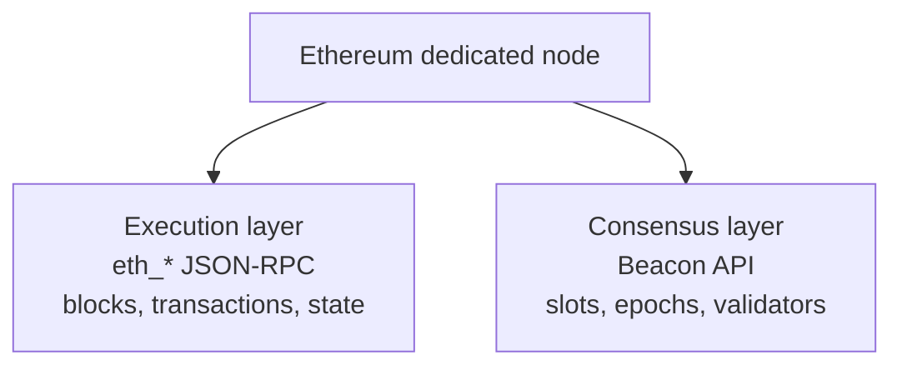

# Beacon API

The Beacon API opens access to the Ethereum consensus layer — the Proof-of-Stake side of the network. This is a different layer from the one the standard `eth_*` JSON-RPC serves, and it exposes data that the execution layer simply does not hold.

Since the Merge, an Ethereum node runs as two coupled clients. The execution layer processes transactions and smart-contract state; you read it through the familiar `eth_*` methods. The consensus layer runs Proof-of-Stake: it manages validators, organizes time into slots and epochs, and decides finality. Each layer answers a different kind of question, and each has its own API.

A standard node gives you the execution layer. The Beacon API add-on gives you the consensus layer alongside it, so a single dedicated node answers both.

### What it exposes

The Beacon API returns data that the `eth_*` API does not:

* **Chain timing and finality** — slots, epochs, and finalization status.
* **Validators** — balances, statuses, entry and exit queues, and effectiveness.
* **Consensus duties** — attestations, sync committees, and block proposals.
* **Staking data** — the information that validator monitoring and staking dashboards depend on.

For example, when you query a validator by its index, the response returns the validator's status, its balance, and its position in any activation or exit queue. There is no execution-layer method that can answer this, because the execution layer has no concept of a validator.

### Benefits

* **A complete view of the chain:** You read both the execution and consensus layers from one dedicated node.
* **Direct staking data:** You track finalization, validator effectiveness, and queue position without a separate service in the path.
* **Live monitoring:** You watch validator status and attestation performance as it changes.

### When to use it

* You run a staking provider and monitor validator health.
* You build a validator dashboard or a Proof-of-Stake analytics tool.
* You need finalization status or sync-committee data for your product.
