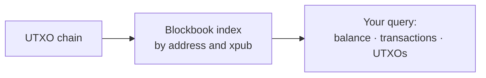

# Blockbook

Blockbook is an indexer for UTXO chains. It answers questions about an address or a whole wallet — balances, transaction history, and unspent outputs — that a standard Bitcoin node cannot answer on its own.

A Bitcoin node tracks the set of unspent transaction outputs (UTXOs), but it does not organize them by address. Ask a plain node for the balance of an address and it has no direct way to reply, because it was never built to look up history that way. Anyone who needs address-level data has to build a separate index over the chain.

Blockbook, built by Trezor, is that index. It reads the chain and maintains an address-indexed and xpub-indexed view on top of it. You query an address or a wallet, and Blockbook returns the answer from its index.

### What it does

* **Address queries:** Ask for the balance, the transaction history, or the unspent outputs of a single address.
* **Wallet queries:** Ask for a whole wallet at once with an xpub or an output descriptor. Blockbook derives the addresses and returns the combined result, so you do not track each address yourself.
* **Derivation support:** The add-on covers the BIP44, BIP49, BIP84, and BIP86 (Taproot) schemes, so it reads legacy, SegWit, native SegWit, and Taproot wallets.
* **Filtering and paging:** Page through large result sets and filter transactions by block-height range.

An xpub query, for instance, returns the balance for the entire wallet, the derived addresses, and the transactions, sorted by block height with the newest first.

### Benefits

* **Wallet-level answers:** One xpub call returns a full wallet, instead of many per-address calls.
* **No indexer to build:** You skip building and operating an address index next to your node.
* **Direct UTXO access:** You read unspent outputs, which you need to construct a spending transaction.
* **Broad wallet coverage:** Legacy through Taproot wallets are all supported.

### When to use it

* You build a Bitcoin wallet or a portfolio tracker.
* You need address balances or transaction history on a UTXO chain.
* You construct transactions and need the UTXOs behind an address.

### Limitations

* Blockbook serves UTXO (Bitcoin-type) chains. It does not apply to account-based chains such as Ethereum.
* The interface serves many coins through a shared schema, so some fields apply only to specific chains.
