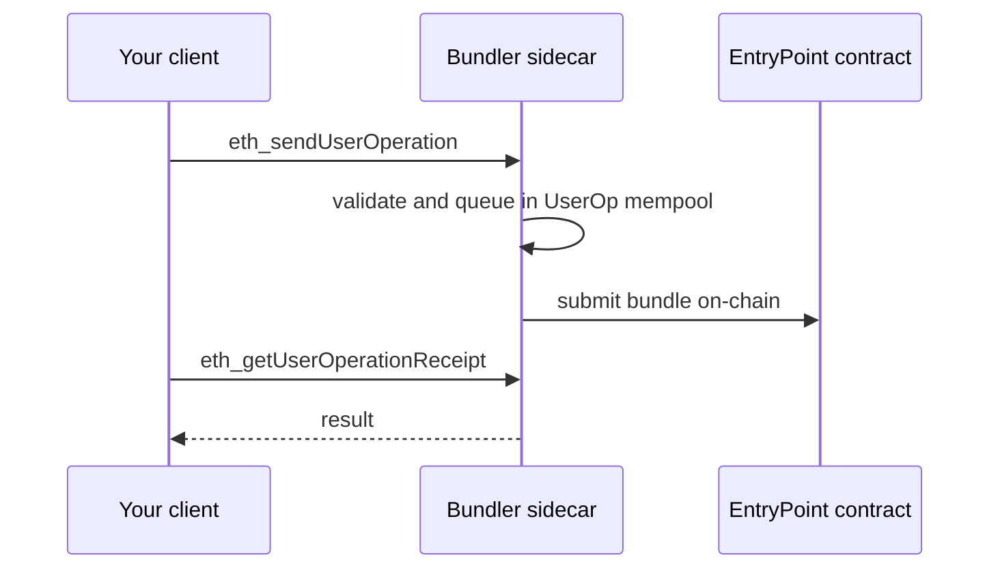

# ERC-4337

This add-on adds the account-abstraction methods defined by ERC-4337. Account abstraction lets a smart contract act as a wallet, enabling transactions without native ETH for gas, third-party gas sponsorship, and custom validation logic.

Account abstraction does not change the base protocol. It works through a separate transaction-like object, the UserOperation, and a set of off-chain roles that process it. The `geth` and `reth` clients do not know about UserOperations, so they cannot serve the ERC-4337 methods on their own.

To close that gap, GetBlock runs a bundler as a sidecar next to your node. The bundler is the component that understands UserOperations. It exposes the full ERC-4337 RPC to your client and settles the operations on-chain through the EntryPoint contract.

### How a UserOperation flows

A UserOperation describes an action for a smart-contract wallet. Your client submits it to the bundler rather than to the chain directly. The bundler validates it, holds it in its own mempool, groups several operations together, and submits the bundle to the EntryPoint contract, which executes each one against its target wallet.

### The methods

| Method                         | Purpose                                            |
| ------------------------------ | -------------------------------------------------- |
| `eth_sendUserOperation`        | Submit a UserOperation to the bundler mempool      |
| `eth_estimateUserOperationGas` | Estimate the gas a UserOperation needs             |
| `eth_getUserOperationByHash`   | Fetch a UserOperation by its hash                  |
| `eth_getUserOperationReceipt`  | Get the receipt for a UserOperation                |
| `eth_supportedEntryPoints`     | List the EntryPoint contracts the bundler supports |

### Benefits

* **Native ERC-4337 support:** You get the full account-abstraction RPC on a node that does not provide it by default.
* **Gasless transactions:** With a paymaster, your users transact without holding native ETH, because the paymaster sponsors the gas.
* **No bundler to run:** You build on smart-contract wallets without operating and maintaining your own bundler.

### When to use it

* You build a product around smart-contract wallets.
* You run a paymaster or a gas-sponsorship flow.
* You build account-abstraction infrastructure and need a reliable bundler RPC.

