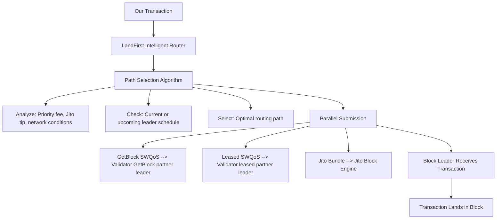

# LandFirst

LandFirst is GetBlock's intelligent transaction-routing technology for processing faster transactions on Solana. It works by routing your transactions through multiple optimized delivery paths, including GetBlock’s Stake-Weighted Quality of Service (SWQoS) connections and the Jito auction mechanism.

_**Interested in building on Solana with LandFirst?**_ [_**Reach us**_](https://getblock.io/contact) _**for more information.**_

#### Core Technology Stack

LandFirst automatically routes transactions through three complementary delivery mechanisms:

1. **GetBlock's Own SWQoS Connections**
   1. Direct partnerships with high-stakes Solana validators
   2. Guaranteed priority capacity through stake-weighted allocation
   3. GetBlock-operated infrastructure with validator peering
2. **Leased SWQoS Connections**
   1. Higher priority than unstaked RPC traffic, ensuring transactions cut ahead during congestion
   2. Reserve priority bandwidth specifically for LandFirst traffic
3. **Jito Block Engine Integration**
   1. MEV-aware auction mechanism for guaranteed inclusion
   2. Bundle support for atomic multi-transaction operations
   3. Priority placement through competitive tipping

By combining all three paths, LandFirst provides the highest probability of fast transaction inclusion on Solana.

### Technical Architecture

#### How It Works

LandFirst maximizes transaction inclusion by combining SWQoS priority routing, low-latency leader targeting, and parallel Jito submission. When a user sends a transaction, LandFirst checks the current leader schedule and picks the fastest path through our and our partners’ staked SWQoS validators, using private, low-hop connections to deliver the transaction directly to the upcoming leader with priority TPU capacity. At the same time, the transaction is also sent to Jito, where it enters the tip auction for guaranteed execution if the bundle wins. Whichever path lands first becomes the confirmed transaction, ensuring the highest possible probability of fast, next-block inclusion even under heavy network congestion.

#### Routing Intelligence:

LandFirst analyzes each transaction and selects the optimal delivery path based on:

* Leader Schedule: Which validator is currently/soon producing blocks
* Network Conditions: Current congestion and validator responsiveness
* Transaction Priority: Priority fee amount and urgency
* Geographic Location: network topology that defines the lowest-path latency to the current leader.

#### Use Cases

1. **HFT & Arbitrage**

Fast, reliable execution for high-frequency trading, arbitrage, market-making, and position rebalancing — especially when every millisecond counts.

2. **MEV & Keeper / Liquidation Bots**

Ensures deterministic transaction landing for backruns, front-runs, liquidation races, and other MEV or keeper-bot strategies.

3. **NFT Sniping & High-Demand Mints**

Gives an edge for time-sensitive NFT events such as limited-supply mints, snipes, and competitive auctions.

4. **Critical Time-Sensitive Transactions**

For urgent or large-value moves — e.g. multi-sig operations, time-bound transfers, or high-stakes governance — where failure or delay is too costly.

### Different Between Multi-Path Routing Advantage vs. Standard RPC Transaction Submission

Standard RPC nodes submit transactions via single, unstaked TPU connections. During congestion, these transactions are deprioritized or dropped entirely.

| Aspect              | Standard RPC    | LandFirst                  |
| ------------------- | --------------- | -------------------------- |
| Routing paths       | Single path     | Three paths (SWQoS + Jito) |
| Validator priority  | None (unstaked) | High (stake-weighted)      |
| Congestion handling | Fails or delays | Adaptive routing           |
| Bundle support      | No              | Yes (via Jito)             |
| MEV protection      | No              | Yes (via Jito)             |
| Landing probability | 60-90% (varies) | 95%+ (measured)            |

### Available to Everyone

LandFirst is available on:

✅ Shared Node Plans - All shared RPC users benefit automatically\
✅ Dedicated Node Plans - Enhanced monitoring and configuration available\
✅ No Additional Fee - Included in standard RPC access (tips are optional)

***

For consultation on optimal deployment architecture for your specific use case, contact [GetBlock support team](https://getblock.io/contact/)

 
