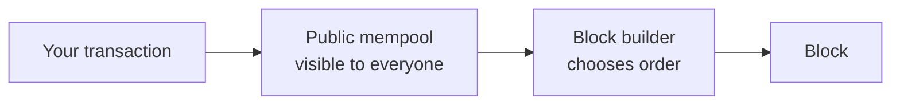
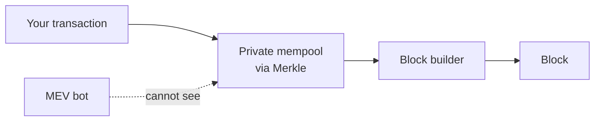

# MEV Protection

MEV Protection routes your transactions through a private mempool so that MEV bots never see them. This stops front-running and sandwich attacks before they can happen. You enable it at the endpoint level, and your application code does not change.

When you send a transaction, your node validates it and places it in the mempool. The mempool is a public holding area for transactions that are not yet confirmed. The node then broadcasts the transaction to its peers, so the pending transaction is visible across the network while it waits.

Block builders — the validators and searchers who assemble the next block — read the mempool and choose which transactions to include and in what order. That power to order, insert, and exclude transactions is where the risk begins.

### What MEV is

MEV — Maximal Extractable Value — is the value that a block builder can extract purely by controlling transaction order. Most of this value is not found by the builders themselves. It is found by searchers: third parties who run bots that watch the public mempool and calculate which ordering earns them a profit. The profit usually comes at the expense of an ordinary user whose pending transaction sits in the open.

### How the attacks work

1. **Front-running:** A searcher sees your large trade waiting in the mempool. It submits its own buy with a higher fee, so the builder places it ahead of yours. The searcher buys at the lower price, your trade then pushes the price up, and the searcher profits.
2. **Sandwiching:** The searcher places one transaction before yours and one after. The first rides the price up ahead of you; the second sells into the price move your trade caused. Your trade is the filling in the sandwich, and you get the worst price.
3. **Back-running:** The searcher positions its transaction right after yours to capture a price gap your trade opened, for example between two exchanges.

The common thread is visibility. Every one of these attacks depends on the searcher seeing your transaction while it waits in the public mempool.

### How MEV Protection works

MEV Protection removes your transaction from that public view. Instead of the public mempool, GetBlock routes it through a private mempool in partnership with Merkle, which acts as a trusted private builder. The transaction travels straight to the builder without being broadcast, so a searcher never sees it and has nothing to attack.

The protection lives at the RPC endpoint layer. You select the MEV-protected endpoint and send transactions exactly as you do today. There is no in-app defense to build and no change to your transaction code.

### Benefits

* **No in-app defenses to build:** The protection sits in the endpoint, which lowers your cost and complexity.
* **Protection against front-running and sandwiching:**  A bot cannot attack a transaction it cannot see.
* **The same integration:** You keep your existing code and only change the endpoint URL.
* **Better outcomes for users:** Your users keep the value that a searcher would otherwise take from their trades.

### When to use it

Not every transaction needs protection. A plain transfer of ETH, an NFT, or a token exposes no arbitrage, so a bot has no reason to touch it. Protection matters when a transaction moves value in a way a searcher can exploit: a token swap on a DEX, an NFT mint, an auction, or activity in a lending protocol. If your users trade, protect their transactions.
