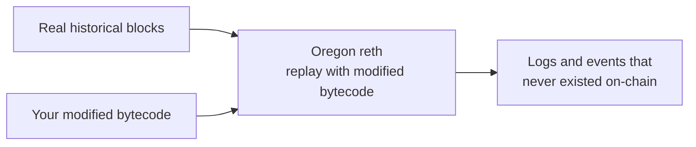

# Overlay Methods

Overlay methods let you replay chain history as if a contract had run different code. You change a contract's bytecode — or its balance, nonce, or storage — and re-run past blocks to see the logs and events it would have produced. Nothing is deployed on-chain, and no real transaction is sent.


This is not a plugin on top of a standard node. It is a separate custom `reth` build (Oregon) that replaces the standard dedicated node. The catalog lists it as an add-on for consistency


A contract only emits the events its code was written to emit. If a contract shipped without an event you now need — a missing `Transfer` log, an unindexed state change — that data does not exist on-chain, and no normal query can recover it. Re-deploying a fixed contract does not help either, because it cannot rewrite the past.

Overlay methods approach this from the other direction. They take the real historical state and replay it through _your_ version of the contract. The chain's inputs stay real; only the contract logic changes. The result is the data the original contract would have emitted if it had carried your code.

This mirrors how `state-override` works in `eth_call`, extended across a range of historical blocks rather than a single call.

### What you can do

* **Trace a block range (`debug`/`trace` block-by-range).** Process history in bulk instead of sending one request per block.
* **`overlay_getLogs`.** Replay a block range with modified bytecode and pull logs that never existed on the real chain.
* **`overlay_callConstructor`.** See how a contract would have initialized under different deployment logic.

### Benefits

* **Reconstruct missing events:** Recover data the original contract never logged.
* **Bulk history processing:** Block-range tracing removes the per-block request overhead of a normal node.
* **Safe experimentation:** Test modified logic against real history with no deployment and no risk to on-chain state.

### When to use it

* You run on-chain analytics and need events a contract never emitted.
* You reverse-engineer contract behavior.
* You reconstruct historical data for indexing or audit.

