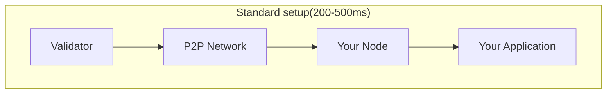
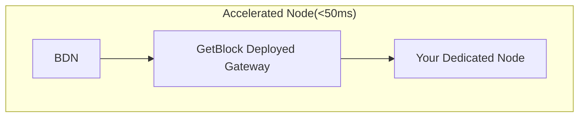

# BSC Chain Accelerated Dedicated Node

A BSC Chain accelerated node is a high-performance dedicated node deployed on top of high-speed networking layers via the Blockchain Distributed Network (BDN) via a reliable gateway, BloxRoute. It observes state changes, mempool activity, and block production events significantly faster than standard peer-to-peer setups, serving traders, validators, dApps, and more with low latency and strong security.

_**Interested in building on BSC using an Accelerated Dedicated Node?**_ [_**Reach us**_](https://getblock.io/contact) _**for more information.**_

### How It Works

In a standard setup, your node receives data through the BSC peer-to-peer gossip network:

With BDN Gateway acceleration, your node receives data through two channels simultaneously:

The Gateway merges data from both the BDN fast path and the standard P2P layer, ensuring your node always has the freshest state available.

### What Gets Accelerated

The BDN Gateway improves the delivery speed of:

| Data Type             | Description                    | Impact                        |
| --------------------- | ------------------------------ | ----------------------------- |
| **New Blocks**        | Block headers and transactions | React to state changes faster |
| **Mempool Updates**   | Pending transactions           | See opportunities earlier     |
| **State Transitions** | Account and contract state     | Fresher data for decisions    |

### Performance Comparison

| Metric             | Standard P2P | With BDN Gateway |
| ------------------ | ------------ | ---------------- |
| Block propagation  | 200-500ms    | <50ms            |
| Mempool visibility | Variable     | Near-instant     |
| State freshness    | Delayed      | Real-time        |

### Architecture Details

GetBlock manages the entire Gateway infrastructure on your behalf:

1. **Deployment**: We deploy a bloxRoute Gateway in the same data center as your dedicated node, minimizing network hops.
2. **Connection**: Our DevOps team connects the Gateway directly to your node's P2P interface.
3. **Data Flow:** The node receives transactions and blocks from both the standard P2P layer and the BDN propagation network.
4. **Automatic Selection:** Your node automatically uses the first source to deliver data.

### Benefits for Your Workloads

Node acceleration directly benefits latency-sensitive applications:

* Trading Bots: React to price movements and arbitrage opportunities faster
* Liquidation Systems: Monitor positions with fresher state data
* Analytics Pipelines: Process blocks and transactions with minimal delay
* MEV Strategies: Observe mempool activity before competitors


No Action Required

* Automatic: Enabled when you provision an accelerated dedicated node
* Transparent: Your existing RPC calls work unchanged
* Managed: GetBlock handles all Gateway maintenance and updates

Your application code remains the same. The improvement happens at the infrastructure layer, giving you faster data without code changes.


### What to do With Accerelated Node

While node acceleration improves data reception passively, you can further improve your dApp or workflow by:

* [Subscribing to real-time streams](how-to-subscribe-to-stream.md) for direct access to BDN data
* [Submitting transactions via the public mempool ](how-to-submit-transactions-to-public-mempool.md)with accelerated propagation
* Using private transactions for [MEV protection ](sending-private-transactions-priority-fee/)or [without MEV Protection](how-to-submit-private-transactions-without-tips.md)
