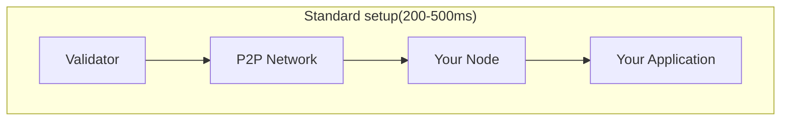
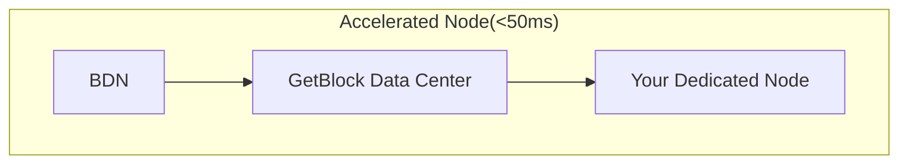

# BSC Accelerated Dedicated Node

BSC accelerated node is a high-performance dedicated node deployed on top of high-speed networking layers via the Blockchain Distributed Network (BDN). It observes state changes, mempool activity, and block production events significantly faster than standard peer-to-peer setups, serving traders, validators, dApps, and more with low latency.

_**Interested in building on BSC using an Accelerated Dedicated Node?**_ [_**Reach us**_](https://getblock.io/contact) _**for more information.**_

### How It Works

In a standard setup, your node receives data through the BSC peer-to-peer gossip network:

```mermaid
graph TD
   subgraph "Standard setup(200-500ms)"
      A[Validator] --> B[P2P Network]
      B --> C[Your Node]
      C --> D[Your Application]
   end
```

With BDN Gateway acceleration, your node receives data through two channels simultaneously:

```mermaid
graph TD
   subgraph "Accelerated Node(<50ms)"
      A[BDN] --> B[GetBlock Data Center]
      B --> C[Your Dedicated Node]

   end
```

Your dedicated node receives data from both the BDN fast path and the standard P2P layer, ensuring it always has the freshest state available.

### Architecture Details

1. **Connection**: We connect your dedicated node's P2P interface to the GetBlock Data center.
2. **Data Flow:** The node receives transactions and blocks from both the standard P2P layer and the BDN propagation network.
3. **Automatic Selection:** Your node automatically uses the first source to deliver data.

### What Accelerated Node Gets:

The BDN Gateway improves the delivery speed of:

| Data Type             | Description                    | Impact                                                                 |
| --------------------- | ------------------------------ | ---------------------------------------------------------------------- |
| **New Blocks**        | Block headers and transactions | React to state changes faster                                          |
| **Mempool Updates**   | Pending transactions           | See opportunities earlier                                              |
| **State Transitions** | Account and contract state     | Fresher data for decisions                                             |
| **Transaction**       | Submiting Trsanction           | Submit single transactions or bundles with optimized propagation paths |

### Who is this for:

1. **Traders**: To buy and sell tokens faster and submit transactions
2. **Developers**: To build a lower-latency dApp, access fresher data, and deliver more responsive user experiences
3. **Validators**: To receive transactions and block earlier than other validators and improve participation and rewards.

### Benefits for Your Workloads

Node acceleration directly benefits latency-sensitive applications:

* Trading Bots: React to price movements and arbitrage opportunities faster
* Liquidation Systems: Monitor positions with fresher state data
* Analytics Pipelines: Process blocks and transactions with minimal delay
* MEV Strategies: Observe mempool activity before competitors


No Action Required

* **Automatic**: Enabled when you provision an accelerated dedicated node
* **Transparent**: Your existing RPC calls work unchanged
* **Managed**: GetBlock handles all Gateway maintenance and updates

Your application code remains the same. The improvement happens at the infrastructure layer, giving you faster data without code changes.


### What to do With Accerelated Node

While node acceleration improves data reception passively, you can further improve your dApp or workflow by:

* [Subscribing to real-time streams](how-to-subscribe-to-stream.md) for direct access to BDN data
* [Submitting transactions to public mempool ](how-to-submit-transactions-to-public-mempool.md)with accelerated propagation
* Using private transactions for [MEV protection ](../bsc-accelerated-dedicated-node/sending-transactions-to-private-mempool-priority-fee/)or [without MEV Protection](../bsc-accelerated-dedicated-node/how-to-submit-transaction-to-private-mempool.md)
