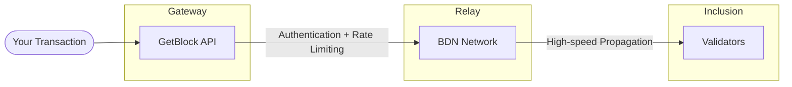

# How to Submit Transactions to Public Mempool

This process involves submitting transactions to the BNB Chain public mempool via GetBlock's BDN fast path. Your transaction propagates to validators significantly faster than through standard P2P gossip, increasing the probability of earlier block inclusion.

## How It Works

When you submit a transaction via GetBlock's MEV endpoint:



Your transaction reaches a large portion of validators before it would via classical P2P, improving execution consistency.


Note: Final inclusion still depends on the gas price you attach. Earlier propagation improves timing and visibility but doesn't override fee-based ordering.


## When to Use Public Mempool

Use public mempool submission when:

* You want faster propagation without hiding your transaction
* MEV exposure is acceptable for your use case
* You're competing on speed rather than privacy
* You need broad validator visibility quickly

_For MEV-sensitive transactions, see_ [_Private Transactions_](sending-private-transactions-priority-fee/) _instead._

## API Reference



```bash
wss://bsc.getblock.io/mev/ws?api_key=YOUR_API_KEY
```



```bash
eth_sendRawTransaction
```



| Parameter  | Type   | Required | Description                        |
| ---------- | ------ | -------- | ---------------------------------- |
| `nonce`    | int    | Yes      | Transaction count for your address |
| `to`       | string | Yes      | Recipient address                  |
| `value`    | BigInt | Yes      | Amount in wei                      |
| `gasPrice` | BigInt | Yes      | Gas price (minimum 3 gwei)         |
| `gasLimit` | int    | Yes      | Gas limit for execution            |
| `data`     | string | No       | Calldata for contract calls        |
| `chainId`  | int    | Yes      | `56` for BSC Mainnet               |



```json
{
  "jsonrpc": "2.0",
  "id": 1,
  "method": "eth_sendRawTransaction",
  "params": ["0x<signed_transaction_hex>"]
}
```



```json
{
  "jsonrpc": "2.0",
  "id": 1,
  "result": "0x<transaction_hash>"
}
```



### Quickstart



Set up the project



```bash
mkdir multicall3-example
cd multicall3-example
npm init -y
npm install ws ethers dotenv
```



```bash
mkdir multicall3-example
cd multicall3-example
yarn init -y
yarn ws ethers
```





Create a new file named `index.js`. This is where you will make your first call.



Set the ES module `"type": "module"` in your `package.json`.



Add the following code to `index.js`:



```javascript
const WebSocket = require('ws');
const { ethers } = require('ethers');

const API_KEY = 'YOUR_API_KEY';
const PRIVATE_KEY = 'YOUR_PRIVATE_KEY';
const RPC_URL = 'https://bsc-dataseed.binance.org';
```



Create and Sign Your Transaction

```javascript
const provider = new ethers.JsonRpcProvider(RPC_URL);
const wallet = new ethers.Wallet(PRIVATE_KEY, provider);

// Get current nonce
const nonce = await provider.getTransactionCount(wallet.address);

// Build transaction
const tx = {
  nonce: nonce,
  to: '0xRECIPIENT_ADDRESS',
  value: ethers.parseEther('0.1'),
  gasPrice: ethers.parseUnits('3', 'gwei'),  // Minimum 3 gwei for BSC
  gasLimit: 21000,
  chainId: 56  // BSC Mainnet
};

// Sign transaction
const signedTx = await wallet.signTransaction(tx);
```



Submit via WebSocket

```javascript
const ws = new WebSocket(`wss://bsc.getblock.io/mev/ws?api_key=${API_KEY}`);

ws.on('open', () => {
  ws.send(JSON.stringify({
    jsonrpc: '2.0',
    id: 1,
    method: 'eth_sendRawTransaction',
    params: [signedTx]
  }));
});

ws.on('message', (data) => {
  const response = JSON.parse(data);
  
  if (response.result) {
    console.log('✅ Transaction submitted!');
    console.log('TX Hash:', response.result);
    console.log('BSCScan:', `https://bscscan.com/tx/${response.result}`);
  } else if (response.error) {
    console.error('❌ Error:', response.error.message);
  }
  
  ws.close();
});
```



Response

```
```



<details>

<summary>Complete Example: BNB Transfer</summary>

```javascript
const WebSocket = require('ws');
const { ethers } = require('ethers');

const API_KEY = 'YOUR_API_KEY';
const PRIVATE_KEY = 'YOUR_PRIVATE_KEY';
const RPC_URL = 'https://bsc-dataseed.binance.org';

async function sendPublicTransaction(recipient, amountBNB) {
  const provider = new ethers.JsonRpcProvider(RPC_URL);
  const wallet = new ethers.Wallet(PRIVATE_KEY, provider);
  
  console.log('Wallet:', wallet.address);
  console.log('Recipient:', recipient);
  console.log('Amount:', amountBNB, 'BNB');
  
  // Get nonce
  const nonce = await provider.getTransactionCount(wallet.address);
  
  // Build transaction
  const tx = {
    nonce: nonce,
    to: recipient,
    value: ethers.parseEther(amountBNB),
    gasPrice: ethers.parseUnits('3', 'gwei'),
    gasLimit: 21000,
    chainId: 56
  };
  
  // Sign transaction
  const signedTx = await wallet.signTransaction(tx);
  console.log('\nTransaction signed');
  
  // Submit via BDN
  const ws = new WebSocket(`wss://bsc.getblock.io/mev/ws?api_key=${API_KEY}`);
  
  return new Promise((resolve, reject) => {
    ws.on('open', () => {
      console.log('Submitting to BDN...');
      
      ws.send(JSON.stringify({
        jsonrpc: '2.0',
        id: 1,
        method: 'eth_sendRawTransaction',
        params: [signedTx]
      }));
    });
    
    ws.on('message', (data) => {
      const response = JSON.parse(data);
      ws.close();
      
      if (response.result) {
        console.log('\n✅ Transaction submitted!');
        console.log('TX Hash:', response.result);
        console.log('BSCScan:', `https://bscscan.com/tx/${response.result}`);
        resolve(response.result);
      } else {
        console.error('\n❌ Error:', response.error);
        reject(response.error);
      }
    });
    
    ws.on('error', (err) => {
      reject(err);
    });
  });
}

// Usage
sendPublicTransaction(
  '0xRECIPIENT_ADDRESS',
  '0.1'  // 0.1 BNB
).catch(console.error);
```


</details>

<details>

<summary>Complete Example: Token Swap on PancakeSwap</summary>

```javascript
const WebSocket = require('ws');
const { ethers } = require('ethers');

const API_KEY = 'YOUR_API_KEY';
const PRIVATE_KEY = 'YOUR_PRIVATE_KEY';
const RPC_URL = 'https://bsc-dataseed.binance.org';

const PANCAKE_ROUTER = '0x10ED43C718714eb63d5aA57B78B54704E256024E';
const WBNB = '0xbb4CdB9CBd36B01bD1cBaEBF2De08d9173bc095c';

async function swapBNBForToken(tokenAddress, amountBNB, minAmountOut) {
  const provider = new ethers.JsonRpcProvider(RPC_URL);
  const wallet = new ethers.Wallet(PRIVATE_KEY, provider);
  
  // Router ABI
  const routerABI = [
    'function swapExactETHForTokens(uint256 amountOutMin, address[] path, address to, uint256 deadline) payable'
  ];
  const router = new ethers.Contract(PANCAKE_ROUTER, routerABI, wallet);
  
  // Build swap calldata
  const deadline = Math.floor(Date.now() / 1000) + 300;  // 5 minutes
  const swapData = router.interface.encodeFunctionData('swapExactETHForTokens', [
    minAmountOut,
    [WBNB, tokenAddress],
    wallet.address,
    deadline
  ]);
  
  // Get nonce
  const nonce = await provider.getTransactionCount(wallet.address);
  
  // Build transaction
  const tx = {
    nonce: nonce,
    to: PANCAKE_ROUTER,
    value: ethers.parseEther(amountBNB),
    data: swapData,
    gasPrice: ethers.parseUnits('3', 'gwei'),
    gasLimit: 300000,  // Higher gas limit for swaps
    chainId: 56
  };
  
  // Sign transaction
  const signedTx = await wallet.signTransaction(tx);
  
  console.log('Swap details:');
  console.log('  Amount:', amountBNB, 'BNB');
  console.log('  Token:', tokenAddress);
  console.log('  Min out:', ethers.formatEther(minAmountOut));
  
  // Submit via BDN
  const ws = new WebSocket(`wss://bsc.getblock.io/mev/ws?api_key=${API_KEY}`);
  
  return new Promise((resolve, reject) => {
    ws.on('open', () => {
      ws.send(JSON.stringify({
        jsonrpc: '2.0',
        id: 1,
        method: 'eth_sendRawTransaction',
        params: [signedTx]
      }));
    });
    
    ws.on('message', (data) => {
      const response = JSON.parse(data);
      ws.close();
      
      if (response.result) {
        console.log('\n✅ Swap submitted!');
        console.log('TX Hash:', response.result);
        resolve(response.result);
      } else {
        console.error('\n❌ Error:', response.error);
        reject(response.error);
      }
    });
  });
}

// Usage: Swap 0.1 BNB for BUSD
swapBNBForToken(
  '0xe9e7CEA3DedcA5984780Bafc599bD69ADd087D56',  // BUSD
  '0.1',                                          // 0.1 BNB
  ethers.parseEther('50')                         // Min 50 BUSD
).catch(console.error);
```


</details>

### Gas Price Recommendations

| Priority | Gas Price | Use Case              |
| -------- | --------- | --------------------- |
| Standard | 3 gwei    | Regular transfers     |
| Fast     | 5 gwei    | Time-sensitive trades |
| Urgent   | 10+ gwei  | Competitive scenarios |


Note: Higher gas prices increase inclusion priority but also increase transaction cost.


### Troubleshooting

1. **"nonce too low"**

Your nonce is behind the network state. Fetch the latest:

```javascript
const nonce = await provider.getTransactionCount(wallet.address, 'pending');
```

2. **"insufficient funds"**

Ensure you have enough BNB for both the transaction value and gas:

```
Required = value + (gasPrice × gasLimit)
```

3. **"replacement transaction underpriced"**

If replacing a pending transaction, increase the gas price by at least 10%:

```javascript
const newGasPrice = existingGasPrice * 110n / 100n;
```

4. **Transaction not included**

* Increase gas price for higher priority
* Check that the transaction is valid
* Verify sufficient balance

## Next Steps

For transactions that need MEV protection, see:

* [Private Transactions](how-to-submit-private-transactions-without-tips.md) — Hidden from public mempool
* [Private Transactions with Tips](sending-private-transactions-priority-fee/) — Prioritized private submission
