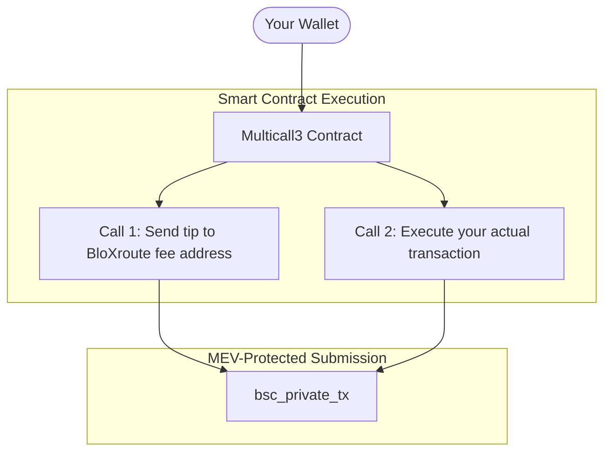

# How to Use Multicall3 for Private Transactions

Multicall3 batches multiple operations into a single transaction with atomic execution using `bsc_private_tx` to get MEV protection with internal fee payment.&#x20;

This is very good for most use cases, e.g., DEX swaps, token purchases, etc but consumes a lot of gas. If any part fails, the entire transaction reverts.

### **How it works**

This is how Multicall3 works:



### Prerequisites

You must have the following:

* Node.js v18 or later installed
* A funded BSC wallet with sufficient BNB for transactions and gas
* GetBlock's BSC Accelerated Dedication Node

### Reference Addresses

| Address                                      | Purpose                 |
| -------------------------------------------- | ----------------------- |
| `0xcA11bde05977b3631167028862bE2a173976CA11` | Multicall3 contract     |
| `0x6374Ca2da5646C73Eb444aB99780495d61035f9b` | BloXroute fee recipient |

### Quickstart



### Extension sample&#x20;

You can extend this code for a DEX swap by encoding the router call and including it as the second Multicall3 call:


```javascript
const PANCAKE_ROUTER = '0x10ED43C718714eb63d5aA57B78B54704E256024E';
const WBNB = '0xbb4CdB9CBd36B01bD1cBaEBF2De08d9173bc095c';
const TOKEN_ADDRESS = '0xYOUR_TOKEN_ADDRESS';

// Build the swap calldata
const routerABI = [
  'function swapExactETHForTokens(uint256 amountOutMin, address[] path, address to, uint256 deadline)'
];
const router = new ethers.Contract(PANCAKE_ROUTER, routerABI, wallet);

const deadline = Math.floor(Date.now() / 1000) + 300;  // 5 minutes from now
const swapData = router.interface.encodeFunctionData('swapExactETHForTokens', [
  minAmountOut,
  [WBNB, TOKEN_ADDRESS],
  wallet.address,
  deadline
]);

// Construct the Multicall3 calls
const calls = [
  {
    target: BLOXROUTE_FEE,
    allowFailure: false,
    value: ethers.parseEther('0.0005'),  // Priority fee
    callData: '0x'
  },
  {
    target: PANCAKE_ROUTER,
    allowFailure: false,
    value: ethers.parseEther('1.0'),  // Swap amount
    callData: swapData
  }
];
```


### Troubleshooting

| Problem                   | Solution                                                                                                                                                     |
| ------------------------- | ------------------------------------------------------------------------------------------------------------------------------------------------------------ |
| "Multicall3: call failed" | <p></p><ul><li>Check you have enough BNB for all calls + gas</li><li>Increase gas limit to 200000</li><li>Verify target addresses are correct</li></ul>      |
|  TX not included          | <p></p><ul><li>Increase tip amount</li><li>Check if you're rate limited</li><li>Verify TX is valid (simulate first)</li></ul>                                |
| Low priority despite tip  | <p></p><ul><li>Increase tip amount</li><li>Check builder status</li><li>Try different builders: <code>mev_builders: ["48club", "bloxroute"]</code></li></ul> |

### Conclusion

This is the simplest method to add tips to private transactions by batching multiple operations into a single transaction with atomic execution. \
This is very good and highly recommended for day-to-day activities like sending transactions or DEX swaps. &#x20;
