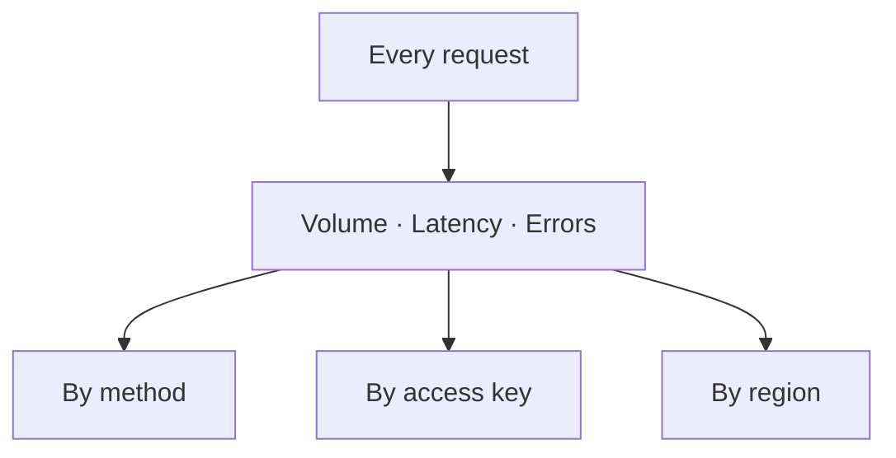

# Advanced Analytics

Advanced Analytics is a private Grafana workspace for your dedicated node. It records every request the node handles and turns that raw activity into a clear picture of how your node is used, in real time. Without it, a dedicated node is a black box: it serves your traffic, but you cannot see the shape of that traffic or where it strains. It shows request counts, latencies, and errors. &#x20;

You see the data as time-series charts, which gives you a more readable and understandable in-depth analysis. You can tell which requests consume more compute units(CU).

### How it works

The add-on measures every request and stores it as a time series. It then lets you view that data along three dimensions:

1. by RPC method,
2. by access key,&#x20;
3. and by region&#x20;

So you can move from a high-level number down to the exact cause behind it.

Three core signals sit at the center of the workspace:

* **Request volume:** how many calls the node receives over time.
* **Latency:** shown as percentiles (p50, p95, p99) rather than a single average. An average hides the slow requests; percentiles expose the tail where real problems live.
* **Error rate:** the share of requests that fail.

The **per-method** view shows which calls cost you the most; heavy methods such as `debug_traceTransaction` and `eth_getLogs` stand out here. The **per-key** view shows which client or service drives your traffic. The **per-region** view shows where your users connect from.

The value comes from following one signal to its source. Say your p99 latency jumps at 14:00. You open the per-method view, filter to that window, and find that `eth_getLogs` latency tripled while everything else held steady. You now know exactly what to optimize, and you never had to guess.

### Benefits

* **Cost attribution.** Assign traffic to a team, a customer, or a feature by looking at the per-key view.
* **Real capacity planning.** Size the node from measured traffic rather than an estimate.
* **Faster debugging.** Trace a latency spike to the method behind it in a single view.
* **Abuse detection.** Spot a key that starts sending abnormal traffic, with the data to prove it.

### When to use it

* You want to attribute cost to a team, a customer, or a feature.
* You plan capacity and need real numbers.
* You debug latency spikes and need to find their cause quickly.
* You suspect one key is behaving abnormally and want evidence.

### Limitations

Analytics gives you visibility, not control. It shows you what is happening; it does not block or shape traffic. When you need to act on what you see — to restrict access or stop abuse — pair it with the IP Allowlist. And because it works from real traffic, a node with very low, steady volume gains little from it.
