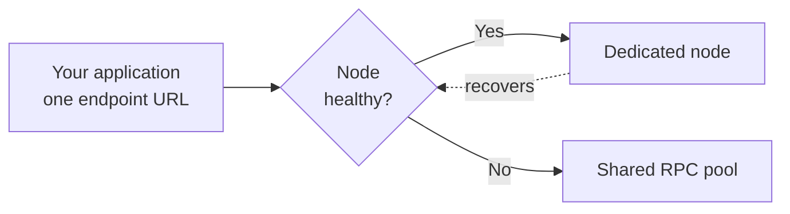

# Automatic RPC Failover

Automatic RPC Failover keeps your application online when your dedicated node degrades. If the node falls behind or starts to fail, the system moves your traffic to **GetBlock shared RPC** and moves it back once the node recovers. The switch is automatic, and your endpoint URL never changes.

A dedicated node gives you isolated, predictable performance, but it is still a single resource. It needs client upgrades, it can fall behind the chain head during a heavy sync, and a traffic spike can push it past its capacity. Without a fallback, any of these moments becomes downtime for your users. Failover removes that single point of failure.

### How it works

The system checks the health of your node on a set interval. It treats the node as degraded when any of these conditions appears:

* the node lags the chain head by more than a set number of blocks;
* its error rate crosses a set threshold;
* its response latency crosses a set limit.

When the node is healthy, all your traffic goes to it, and you get the full benefit of dedicated performance. When the node degrades, the system reroutes your requests to the shared pool, so no request is dropped while the node is unavailable. When the node returns to a healthy state, the system routes traffic back to it.

Because the endpoint URL stays the same throughout, your application does not know the switch happened. You do not reconfigure a client or restart a service.

### Benefits

* **Continuous availability:** A degraded node no longer takes your application down with it.
* **Safe maintenance:** Your node can take client upgrades and maintenance windows without a visible service gap.
* **Spike absorption:** Traffic beyond your dedicated capacity fails over instead of failing outright.
* **No code change:** The URL is unchanged, so your integration is unchanged.

### When to use it

* You run a production application that cannot drop requests.
* Your node needs regular maintenance or client upgrades.
* Your traffic is bursty and sometimes exceeds your dedicated capacity.
* You hold an uptime commitment to your own users.

### Limitations

The shared pool has its own rate limits. Failover is there to keep you online during a problem; it is not a way to get unlimited dedicated capacity on demand. If your steady-state traffic already needs more than your node provides, the answer is more dedicated capacity, not failover. Treat failover as insurance, not as headroom.
