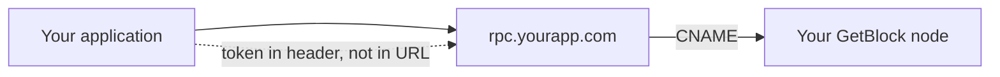

# Custom Endpoint URL

Custom Endpoint URL lets you serve your dedicated node from a domain you own instead of the autogenerated address. Rather than a URL that carries a random access token, you present a clean, branded address such as `rpc.yourapp.com`, while the node behind it stays exactly the same.

### How it works

By default, your endpoint carries a random access token in the path, e.g a typical path from GetBlock `shared.eu-central-1.getblock.io/<ACCESS-TOKEN>/`. That works, but it ties your public configuration to a provider hash, and it places a secret inside a URL, where it tends to end up in server logs, browser history, and proxy records.

This add-on changes the address in two ways:

1. &#x20;You input the domain you own at your GetBlock node with a Canonical name (CNAME) record, or choose a readable subdomain in place of the hash.
2. You keep your authentication in a header, such as `x-access-token`, instead of in the URL, so the secret no longer travels as part of the address.

The node, the performance, and the behavior are unchanged. Only the address your application points at is different.

### Benefits

* **Your brand on your URLs.** A white-label product serves endpoints that carry your name, not a provider hash.
* **A private stack.** Your public configuration does not reveal which infrastructure provider you use.
* **A stable address.** The URL survives token rotation, because the token lives in a header rather than in the path.
* **A safer secret.** Keeping the token out of the URL keeps it out of logs and browser history.

### When to use it

* You build a white-label product, and your URLs must carry your brand.
* You prefer that your public configuration not name your provider.
* You want a readable, stable URL that does not change when you rotate keys.

### Limitations

* If the endpoint is internal and no user ever sees it, the default URL is already enough.
* Setup requires a domain you own and a DNS change on your side.
