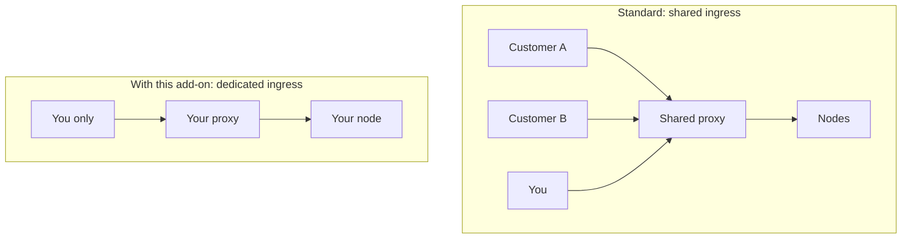

# Dedicated Ingress Proxy

A Dedicated Ingress Proxy gives you your own routing layer in front of your node — a proxy fleet that serves only your traffic. It isolates the one part of the path that a standard dedicated node still shares with everyone else: the gateway.

### The layer most people forget

A dedicated node isolates the compute that runs the chain, but a request does not reach that compute directly. It first passes through an ingress proxy that terminates TLS, checks authentication, applies rate limits, and routes the request onward. On a standard setup, that proxy layer is shared across many customers. Your node is private, but the front door is not.

Most of the time this is fine. It matters when the shared front door becomes the constraint — when another customer's traffic surge slows the gateway, or when your own throughput and policy needs outgrow a shared default.

### What it does

The add-on gives you a proxy fleet that no other customer uses. Because your traffic is the only traffic on it, no other customer's load can compete with yours at the gateway, and the time the proxy adds stays predictable. It also becomes yours to configure: you can apply rate-limit and routing rules that fit your workload rather than a shared default, and your traffic stays isolated from the edge all the way to the node.

### Benefits

* **No noisy neighbor at the gateway:** Another customer's load cannot affect your routing layer.
* **Predictable gateway latency:** With only your traffic on the proxy, the added latency stays stable.
* **Custom policy:** Set rate-limit and routing behavior that a shared policy cannot offer.
* **End-to-end isolation:** Traffic is isolated from the edge to the node, which supports strict compliance requirements.

### When to use it

* Your application runs at high request rates, and the shared gateway has become the limit.
* Your compliance rules require an isolated traffic path, not just an isolated node.
* You need custom rate-limit or routing behavior at the gateway.

### Limitations

* If your traffic is moderate and the shared gateway keeps up, you do not need a dedicated proxy.
* The add-on isolates the routing layer. It does not change the node's own compute capacity.
