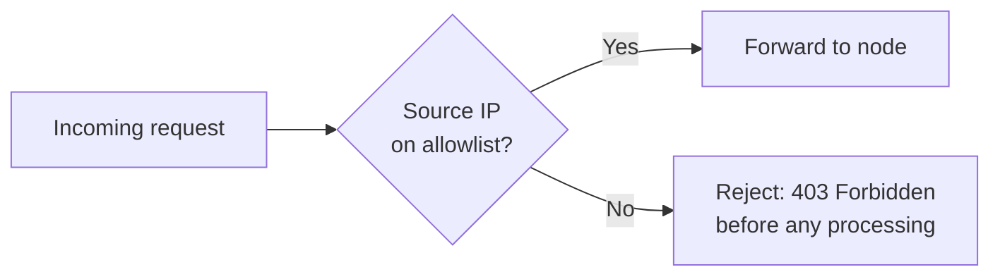

# IP Allowlist

An Internet Protocol (IP)  allowlist is a network security control that restricts access to your RPC endpoint based on the source IP address of each request. When the allowlist is active, only requests from addresses you have approved can reach your node. Every other request is blocked at the gateway, before it reaches the node and before any processing takes place. In effect, it is a "**friend** or **foe**" filter based on where the request comes from.

This adds a layer of defense beyond your access token. A token authenticates _who_ is calling. An allowlist controls _where_ the call comes from. Together they mean that a leaked token is not enough on its own: an attacker would also need to send the request from an approved network.

### How Node Allowlisting Works

1. You add one or more entries to the allowlist. An entry is a single IP address, such as `203.0.113.10`, or a whole subnet in Classless Inter-Domain Routing (CIDR) notation, such as `203.0.113.0/24`. The add-on supports both IPv4 and IPv6.
2. On every incoming request, the gateway compares the source IP against your list. A match lets the request continue to the node. No match returns an access error (`403 Forbidden`) and the request stops there. Because the check runs at the gateway, a rejected request never consumes your node capacity or your quota.

The allowlist follows a deny-by-default posture. When the list is empty, the node behaves as normal. As soon as you add the first entry, the node accepts only the addresses on the list and rejects the rest.

### Before you begin

A few things to plan before you configure the allowlist:

* **Account for every trusted network:** List each environment that calls your node: production backends, staging, workers, and any third-party service that makes requests on your behalf. An address you forget is an address that gets blocked.
* **Do not lock yourself out:** If you administer the node from a fixed IP, add that IP before you rely on the list.
* **Plan for addresses that change:** Some cloud hosts and office connections use addresses that rotate over time. For those, use a CIDR range that covers the expected pool, or route the traffic through a gateway with a static egress IP.

### Benefits

* **Protection if your endpoint leaks:** Even if your URL or token reaches the wrong hands, an unauthorized server cannot use it, because its requests do not pass the IP filter.
* **Protection against quota theft and abuse:** No outside party can burn through your request limits from an address you did not approve.
* **Defense in depth:** The allowlist works on top of token authentication. An attacker would need to steal the token and operate from an allowed IP.
* **Explicit access control:** You decide exactly which servers and environments can reach the endpoint.

### When to use it

The allowlist fits server-side workloads with stable, known addresses: backends, workers, indexers, other nodes, and corporate networks. For example:

1. You work in a regulated field such as payments, custody, or exchange operations.
2. Your backend runs from static egress IPs.
3. You need to prove that only approved systems reach your node.

### Limitations

The allowlist does not fit clients with dynamic IPs, such as mobile apps and browser-based dApps. In those cases, the request comes straight from the end user's device, and the address changes constantly, so there is no stable list to maintain. For those cases, use token authentication together with referrer or origin restrictions instead.

