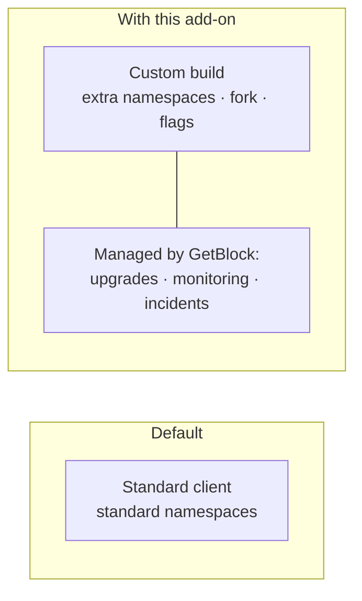

# Nonstandard Client Support

Nonstandard Client Support runs the namespaces, client builds, and configurations that a default node does not enable — extra RPC namespaces, a patched or forked client, or an exotic set of flags. GetBlock operates the setup for you on managed infrastructure, so you get the capability without taking on the operations.

A default node exposes a standard set of RPC namespaces on a standard client build, tuned for the common case. That covers most workloads, but some workloads need what the default deliberately leaves off: the `debug`, `trace`, `txpool`, or `admin` namespaces; a specific client version or a private fork; or custom flags such as an archive sync mode or a particular tracer configuration.

Enabling these yourself means running the node, and running a nonstandard node means owning its upgrades, its monitoring, and its incidents. This add-on takes that on. You describe what you need; GetBlock deploys and operates it.

For example, a default node does not expose the pending transaction pool and does not run a custom tracer. With this add-on, GetBlock enables the `txpool` namespace and deploys your tracer, so you can read the pending pool and trace transactions with your own logic — on infrastructure you do not have to manage.

### Benefits

* **Access to hidden data:** Reach namespaces and traces that a default node does not expose.
* **Your client build:** Run a specific version, a private fork, or a patched client.
* **Managed operation:** GetBlock runs the exotic setup, so your engineers do not manage the machine.

### When to use it

* You run MEV or search workloads that need `txpool` access and custom tracers.
* Your security or forensics work needs `debug_traceTransaction` with a custom tracer.
* You need a patched client, a private fork, or a niche chain client that no shared node runs.

### Limitations

* This add-on costs more than the others because it is bespoke operations rather than a configuration toggle.
* A nonstandard build needs lead time to prepare and deploy.

