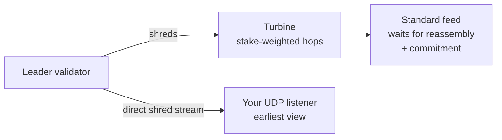

# Solana Shreds Streaming

Solana Shreds Streaming delivers raw block data straight from validators, over UDP, before the block is assembled. It gives you the earliest possible view of what is happening on Solana — earlier than any standard RPC or gRPC feed.

### What a shred is

A Solana leader does not publish a finished block all at once. As it produces a block, it splits the data into small fragments called shreds and streams them across the network through Turbine, Solana's stake-weighted propagation layer. Other validators receive the shreds and reassemble them into a complete block.

Every standard data feed sits at the end of that journey. It waits for the shreds to travel through Turbine, for the block to be reassembled, and for a commitment level to be reached before it reports anything. Shreds streaming skips the wait by reading the shreds at the source.

### What you receive

From the shreds you reconstruct transaction intent as the leader is packing it: transaction signatures, the accounts involved, the instructions (program, accounts, data), address-lookup-table references, and slot numbers. This arrives roughly 100 to 500 milliseconds earlier than a standard commitment-based feed reports the same activity.

That head start is the entire point. In latency-sensitive strategies, seeing a transaction before it is confirmed is the difference between reacting first and reacting too late.

### Two ways to use it

1. **As a dedicated node add-on.** You attach shreds streaming to your Solana dedicated node, giving your node and your workloads a faster, steadier source of block data.
2. **As a standalone service — no node needed.** You top up credits, open a UDP port, and start receiving shreds. You do not run or rent a Solana node at all. Decoding the shreds gives you the transaction data directly, and your credit balance meters the usage.

### How the standalone service works

The service connects to validators and forwards their shreds to your listener over UDP. UDP carries the data at wire speed: it has no handshake and no retransmission, so it removes the overhead that slows a TCP-based feed. You run a listener on an open UDP port, decode the incoming shreds into transactions, and act on them.

### Benefits

* **The earliest view of the chain:** You act on transaction intent before a standard feed reports it.
* **Lower tail latency:** Shreds arrive with less timing variance, so the feed stays steady slot after slot.
* **A redundant data path:** Direct shreds add a second source next to Turbine, which helps in remote or less-peered regions.
* **No node required:** In standalone mode you receive data without the cost and the operations of a full Solana node.

### When to use it

* You run a high-frequency trading bot or an arbitrage engine.
* You run an MEV searcher and need to react first.
* You run a liquidation bot where a few milliseconds decide the outcome.
* You run high-frequency analytics that need the earliest possible data.

### Limitations

* **Pre-execution data only:** Shreds show intent, not results. You do not get success or failure, balance changes, logs, or compute usage, so some transactions you observe will later fail. Treat the stream as a signal, and confirm outcomes through a normal feed.
* **Possible packet loss:** UDP trades reliability for speed, so a raw stream can drop a packet. This is acceptable for speed-critical work, but you design for it.
* **You decode the stream:** Raw shreds need a listener that decodes them. This is a low-level integration, not a single RPC call.
* **Solana only:** Shreds are a Solana concept; the service does not apply to other chains.

### Delivery

| Field             | Value                                                   |
| ----------------- | ------------------------------------------------------- |
| Protocol          | UDP (raw shreds)                                        |
| Access modes      | Dedicated node add-on · standalone credit-based service |
| Available Regions | `eu-central-1`, `us-east-1`, `ap-southeast-1`           |
