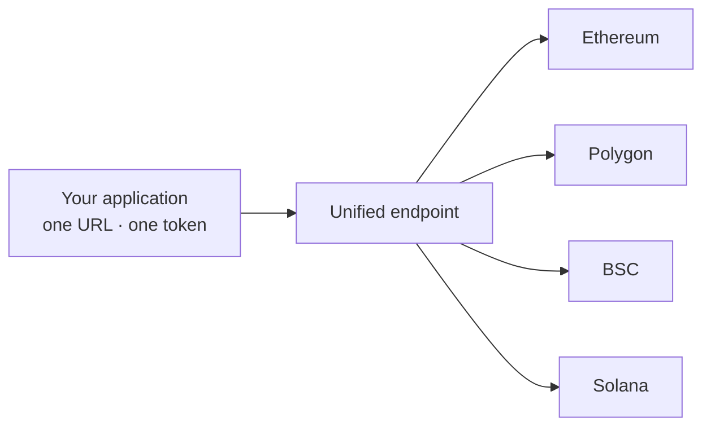

# Unified Multichain Endpoint

A Unified Multichain Endpoint gives you one URL and one credential for every node and chain in your stack. Instead of managing a separate endpoint and key per network, you point at a single base address and name the chain you want in the request.

A multichain application usually collects endpoints as it grows. Each chain brings its own URL, its own access token, and its own security settings, and every new network adds another entry to configure, rotate, and keep in sync. The complexity is not in any single endpoint; it is in the growing set of them.

This add-on collapses that set into one. You keep your dedicated nodes, but you reach them through a single unified endpoint. You select the target chain with a subdomain, a path, or a chain-id parameter, and one credential authenticates across all of them.

Security follows the same principle. You set your rate limits and your IP allowlist once on the unified endpoint, and the policy applies to every chain behind it, rather than being configured network by network.

### Benefits

* **One URL template.** Your client code holds a single pattern, not one URL per network.
* **One credential.** A single token authenticates across all your chains.
* **One security policy.** Rate limits and the allowlist are set once and cover every chain.
* **Less configuration drift.** Adding a chain does not add another endpoint and key to track.

### When to use it

* You build a cross-chain application, a wallet, or an aggregator.
* You run an indexer that reads several chains.
* You manage one endpoint and one key per network today, and the overhead slows you down.

### Limitations

* If you use a single chain and expect to stay on it, one standard endpoint is enough.
* One shared credential across chains is convenient, but it also concentrates access. Scope it carefully and rotate it on a schedule.
