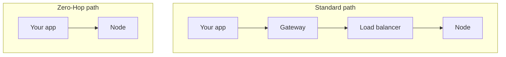

# Zero-hop Node Access

Zero-Hop Node Access gives you a direct connection to your node, removing the routing layer that normally sits in the path. It is built for the workloads where latency is measured in milliseconds, and every one of them counts.

A normal request does not travel straight to the node. It passes through a gateway and a load balancer first. Those layers do useful work—authentication, rate limiting, health-aware routing—but each one adds a small amount of time and, just as important, a small amount of variance. For an ordinary application, this overhead is invisible. For a trading engine competing on speed, that variance is the problem: not only the average latency, but how much it wobbles from request to request.

Zero-Hop pins your connection to your node and takes those intermediate layers out of the path.

Because you always reach the same node rather than being routed to whichever one the balancer picks, you also get a consistent view of the mempool and chain state — which, for trading, is as valuable as the raw speed. For the largest gain, pair Zero-Hop with a node in the region closest to your own systems, so the short path is also a physically short one.

### Benefits

* **Lower latency.** Removing the gateway and load-balancer hops shortens the path.
* **Predictable latency.** A fixed, direct route removes the variance those layers introduce.
* **A consistent node view.** Always hitting the same node keeps your mempool and state view consistent.

### When to use it

* You run a high-frequency trading bot or an arbitrage engine.
* You run an MEV searcher, where every millisecond changes the outcome.
* You send transactions where a consistent node view decides success.

### Limitations

The direct path is also an unprotected one. By removing the routing layer, you give up the automatic failover and load balancing it provides. That is the right trade for a latency-critical workload and the wrong trade for a normal one — if reliability matters more to you than the last few milliseconds, keep the proxy.


Zero-Hop and [Automatic RPC Failover](automatic-rpc-failover.md) pull in opposite directions by design: one removes the routing layer, the other depends on it. Choose the one that fits the workload rather than enabling both.&#x20;

