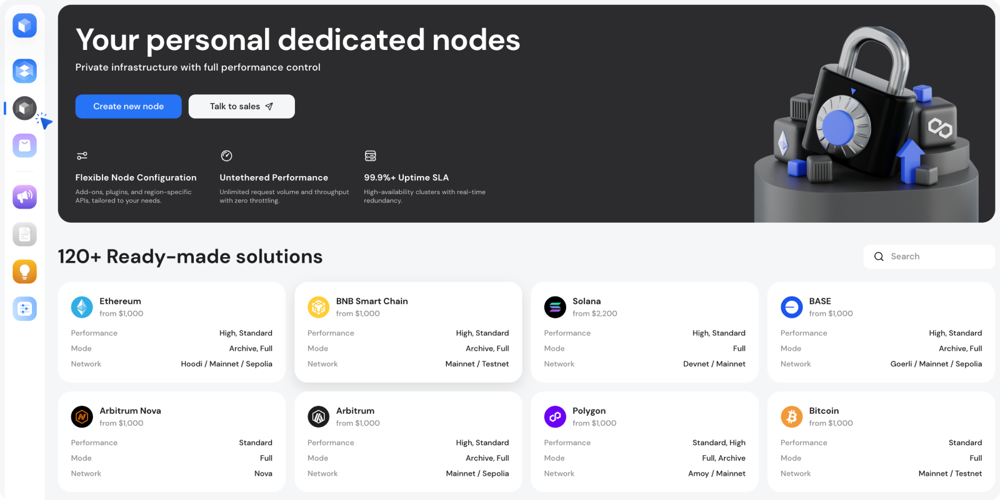
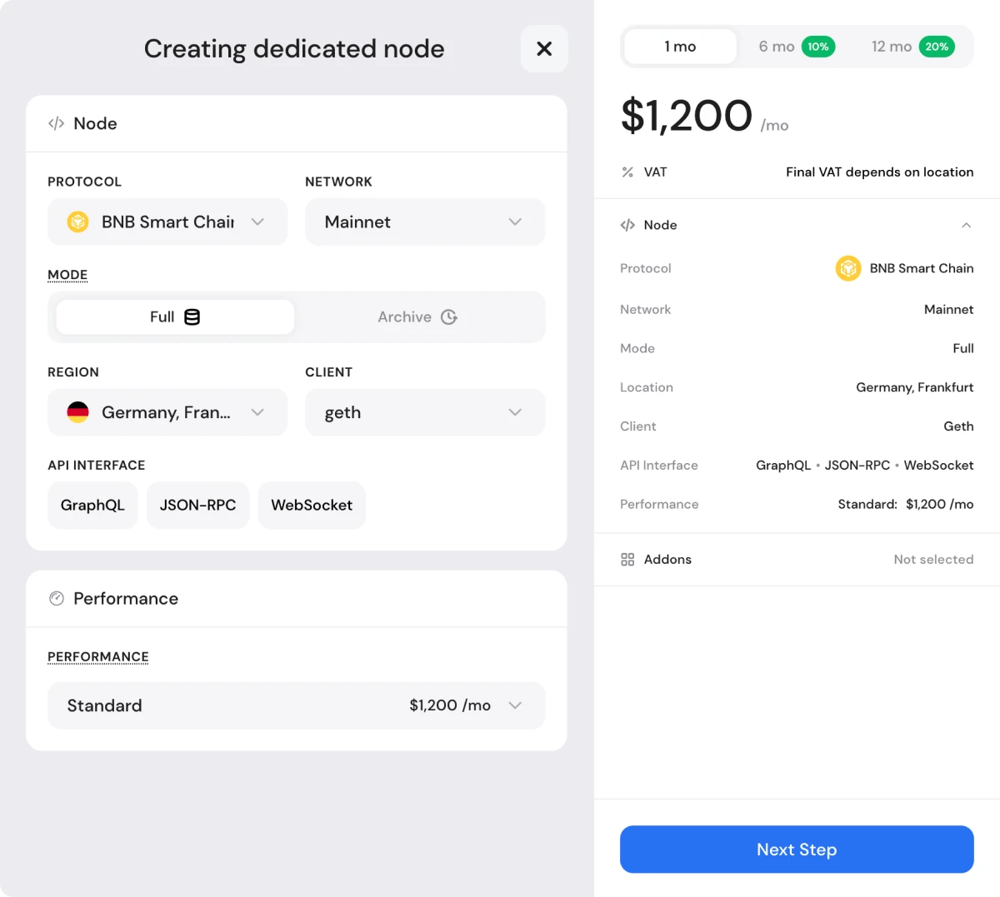
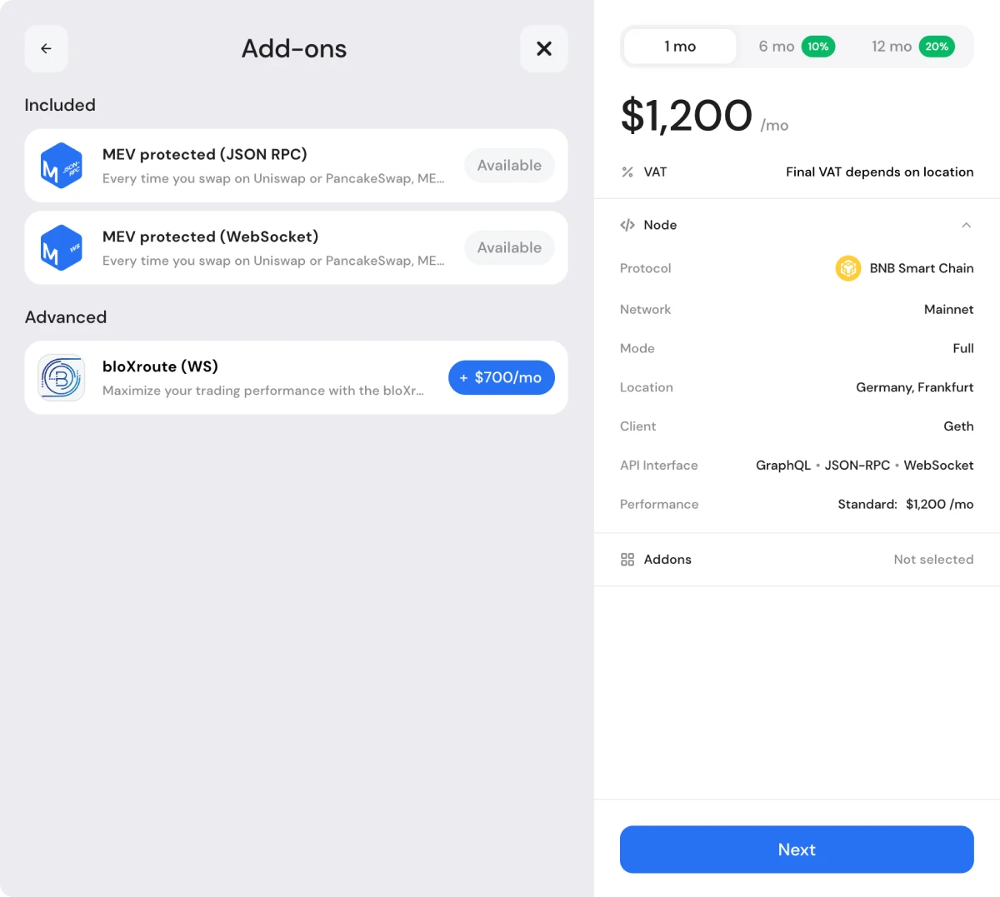
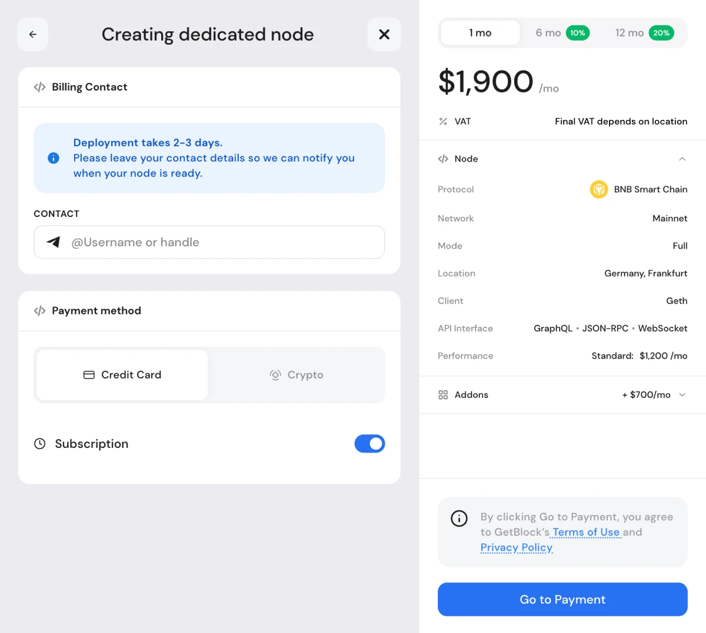
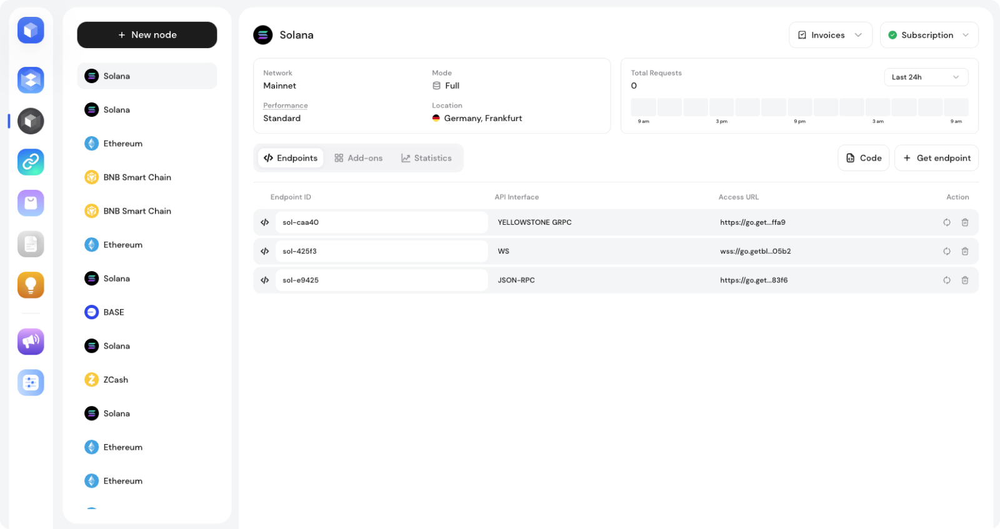

# Configuring dedicated nodes

To deploy a private blockchain server, switch over to the ‘Dedicated Nodes’ tab in the Dashboard.

<figure><figcaption></figcaption></figure>

Select a blockchain protocol from the list or click **Create new node** to begin the setup process from scratch. A dedicated node setup modal will open.

### Step 1: Configure your node

<figure><figcaption></figcaption></figure>

In the setup window:

1. Select the blockchain protocol and the network type (e.g., mainnet, testnet, devnet, etc)
2. Customize your dedicated node with the following options:
   1. **Node type**: Choose between Full Node or Archive Node
   2. **Pick a deployment location**: Germany (Frankfurt), USA (New York), Singapore
   3. **Node client**: Choose your preferred node implementation (e.g., Geth)
   4. **API interface**: Review available interface types
3. Under the **Performance** section, select a [performance tier](dedicated-node-performance-tiers.md):
   1. **High**: premium specs, max throughput
   2. **Standard**: enterprise specs, optimized pricing for moderate-high loads
4. Choose a subscription length — 1, 6, or 12 months — at the top of the summary panel (available discounts are applied automatically)

Verify all selected configurations in the summary section and proceed to the next step.

### Step 2: Select add-ons

On the **Add-ons** screen, you can extend your node with additional capabilities:

* **Included add-ons** are available at no extra cost depending on your configuration
* **Advanced add-ons** are billed in addition to the base node price

<figure><figcaption></figcaption></figure>

Select any add-ons you need and click **Next**.

### Step 3: Payment

<figure><figcaption></figcaption></figure>

On the final screen:

1. **Review** the final pricing and node settings
2. **Billing Contact** — Enter your contact information so the GetBlock team can notify you when your node is ready.&#x20;
3. **Payment method** — Choose between **Credit Card** or **Crypto**.
4. **Subscription** — Enable the subscription toggle if you want to ensure your node renews automatically each billing cycle.
5. When ready, click **Go to Payment**.

Once payment is confirmed, the deployment status will be visible on your Dashboard → Dedicated Nodes tab and Pricing → Manage Plans. Track the payment status from Pricing → Payment History. &#x20;


You can also create additional dedicated nodes by repeating these steps. If additional support is required during setup, you can contact the GetBlock support team directly from your dashboard.


***

### Managing your dedicated node

<figure><figcaption></figcaption></figure>

Once your node is deployed, it appears in the left-hand sidebar. Each node has its own page — select a node from the sidebar to open it.

Three tabs are available for managing the node:

1. **Endpoints**: lists all endpoints associated with your node. To add a new one, click + Get endpoint. You can create multiple endpoints per node with different API interfaces. Endpoints for add-ons can also be created from this tab.
2. **Add-ons**: the central place to manage all add-ons. From here you can add a new add-on to an existing node, cancel an active add-on, create an endpoint.
3. **Statistics**: provides a detailed breakdown of usage metrics for your node.

Use the Invoices and Subscription buttons in the top-right corner of the node view to manage billing.&#x20;
