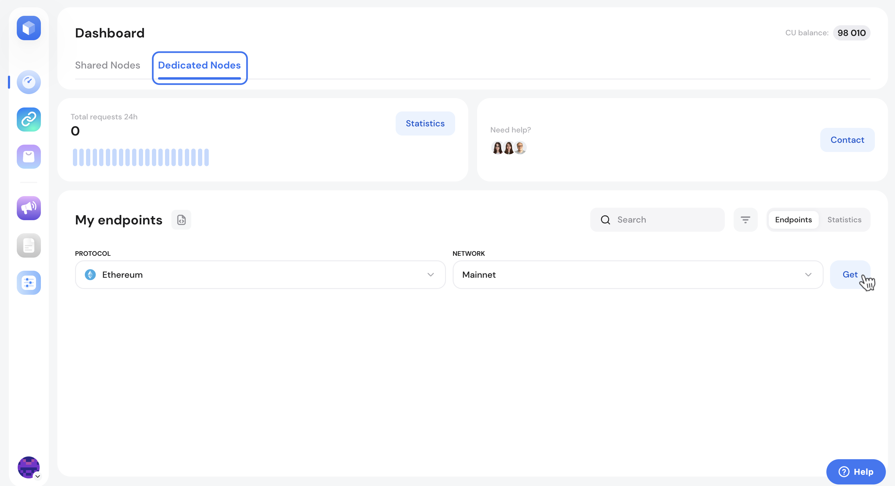
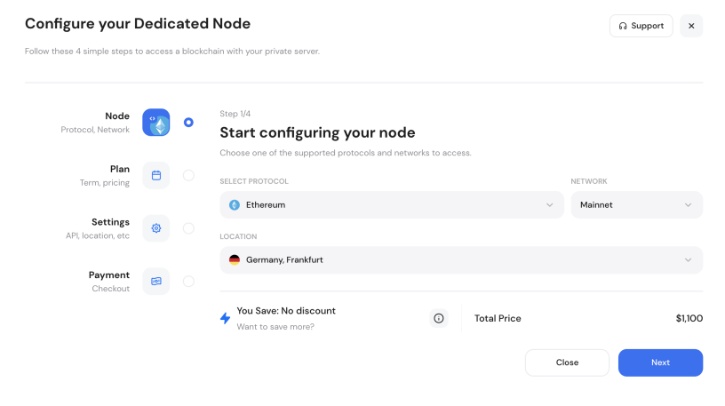
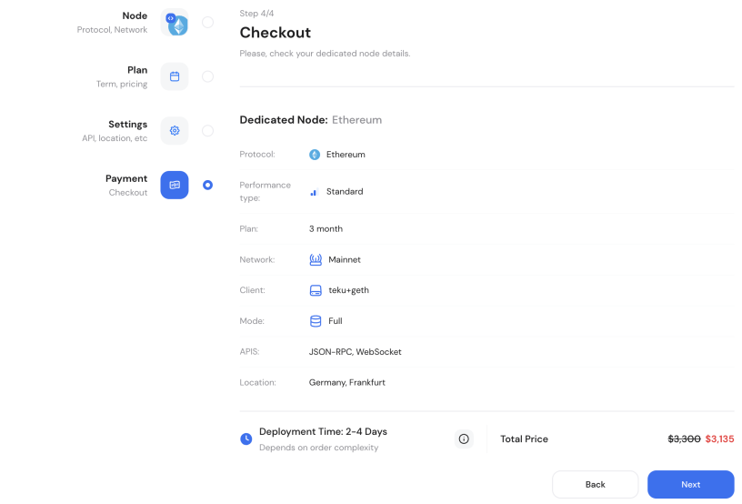

# Configuring dedicated nodes

To create a [dedicated node](https://getblock.io/dedicated-nodes/) endpoint, switch over to the ‘Dedicated Nodes’ tab in the Dashboard.

<figure><figcaption>
Switching to Dedicated nodes setup
</figcaption></figure>

Select a blockchain protocol you wish to deploy and the network type. Click **Get** to begin the setup process.&#x20;

<figure><figcaption></figcaption></figure>

In the setup window:

1. Review and confirm your selected protocol and network.
2. Customize your dedicated node with the following options:
   1. **Region of deployment**: Germany (Frankfurt), USA (New York), Singapore.&#x20;
   2. Select a **subscription** **plan** (available discounts are applied automatically)
   3. **Node type**: Choose between Full Node or Archive Node.
   4. **Node client**: Specify your preferred node implementation.
   5. **Performance** [**tier**](dedicated-node-performance-tiers.md)**:** Choose between **High** (premium specs, max throughput) and **Standard** (enterprise specs, optimized pricing for moderate-high loads).
   6. **API interface**: Select API options and add-ons if applicable.
3. Verify all selected configurations in the summary section and proceed to checkout.

Pay for your dedicated nodes via your GetBlock account. If additional support is required during setup, you can contact the GetBlock support team directly.

<figure><figcaption>
Configuring your private node
</figcaption></figure>

You can add more dedicated nodes following these steps. Once deployed, add as many access tokens for each dedicated node as you need.
