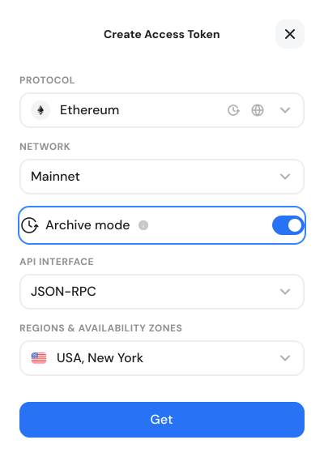

# Enabling archive mode

GetBlock provides direct access to blockchain historical states through both the Dedicated Nodes service and archive-enabled Shared RPC endpoints.

This page covers **Archive Mode** – a setting that turns on archive-node access within GetBlock’s **Shared Nodes subscription**.

Common RPC use cases enabled by Archive Mode:

* Read contract/account state at any past block, not just `latest` , using methods like [`eth_getBalance`](../../api-reference/ethereum-eth/eth_getbalance-ethereum.md)`(address, blockNumber)`, [`eth_getStorageAt`](../../api-reference/ethereum-eth/eth_getstorageat-ethereum.md)`(contract, slot, blockNumber)`, [`eth_getCode`](../../api-reference/ethereum-eth/eth_getcode-ethereum.md)`(address, blockNumber)`, etc.
* Call view functions against historical state: e.g. [`eth_call`](../../api-reference/ethereum-eth/eth_call-ethereum.md)`(..., blockNumber)`.
* Run historical queries and debugging that rely on old state: forensics, audits, explorers, indexing, and retroactive analytics.
* Support tracing and higher-fidelity debugging that may require historical state.

This feature removes the need to run a dedicated archive infrastructure for some use cases, letting developers perform on-demand historical queries via GetBlock RPC API.

***

### Archive mode availability & coverage

Archive functionality is included with **all Shared Node subscriptions**, excluding the Free plan. No additional fee required.

Archive support is provided for a set of popular protocol **mainnets**, including Ethereum, BSC, Polygon, Base, Arbitrum, TRON, Sui, Cardano, etc.

Look for the small history icon (  ) when picking a protocol during the [endpoint setup](creating-node-endpoints.md). It indicates that Archive mode is available for that blockchain.

<figure><figcaption></figcaption></figure>


If you need an archive data for a chain not covered by shared Archive mode, request a [Dedicated Node](configuring-dedicated-nodes/). **Dedicated Nodes** can be deployed in archive mode for **any supported blockchain** and come with additional benefits like:

1. Full blockchain history at the highest throughput
2. Unlimited query capacity
3. Custom node builds & tooling


***

### How to enable the Archive mode

1. Sign in to your GetBlock **dashboard** and make sure you’re on the **Shared Node** tab.
2. Click **Get endpoint** and choose a required blockchain protocol.

<figure><figcaption></figcaption></figure>

3. Find the Mode toggle and switch the **Archive** **mode** on.

<figure><figcaption></figcaption></figure>

3. Finish configuring endpoint details by choosing the API interface and server location as usual.

After clicking **Get**, the new Archive endpoint appears in your Endpoints list. The endpoint URLs will follow the existing GetBlock format but point to archive nodes.

***

### CU billing for Shared Archive endpoints

Archive endpoints usage remains subject to your plan’s [CU limits and performance characteristics](https://docs.getblock.io/getting-started/plans-and-limits/cu-and-rate-limits).

However, serving requests from archive infrastructure involves heavier storage and compute power compared to regular full nodes.

Therefore, enabling the Archive mode affects how CU usage is calculated:

* GetBlock applies a **2× Compute Unit (CU) multiplier** to all requests made through the Archive endpoint.
* The multiplier is applied to **all requests made to an archive endpoint**, even if the invoked RPC call does not require a historical state.

You can review the per-chain CU values for each method on our [Compute Units](https://getblock.io/pricing/compute-units/) page.

> Example:
>
> If `eth_getBalance` costs 20 CU on a standard shared endpoint for a given chain, the same call to an Archive-enabled shared endpoint will cost 40 CU.

Plan accordingly and consider using standard **Full mode** endpoints for non-archive traffic to avoid unnecessary CU consumption.

***

### Best practices

* Use archive endpoints only for workloads that require a historical state. For transactions or current state queries, use a standard Full mode to save CU.
* Monitor CU consumption on the dashboard and set alerts for spikes or when usage nears your plan limit.
* If you run sustained, high-volume archive queries, consider using a Dedicated Node.

***

#### 💬 Need help with archive blockchain data?

[Tell us](https://getblock.io/contact/) what you’re building — our team can guide you to the most efficient archive node setup.
