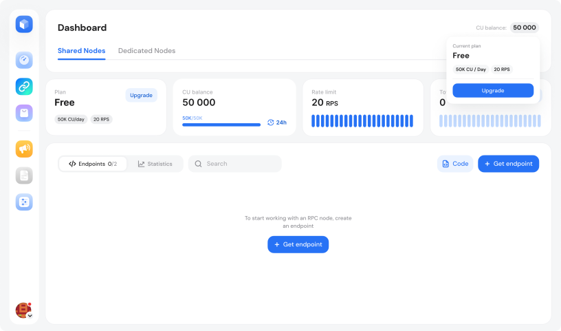

# How to set up an account

### How to Sign Up



**Go to GetBlock**

Visit the [homepage](https://getblock.io/) and click on the 'Dashboard' button in the upper-right corner, or use [this direct link](https://account.getblock.io/sign-up).

<figure><figcaption>
GetBlock's Sign-Up page, where users can register to access blockchain services
</figcaption></figure>



**Choose the sign-up method**

*   **Register with Email**

    Enter your name and email address, then verify your email to activate the account.
*   **Sign in via Google**

    Google will share your name, email, language preferences, and profile picture with GetBlock.
*   **Connect with MetaMask**

    Use a MetaMask wallet browser extension to sign up – no email or password required. If you don’t have a wallet extension installed, you’ll be prompted to add one.
*   **Sign up with GitHub**

    Use your GitHub credentials to set up an account.



**Review and accept policies**

During registration, you will be asked to accept our [Terms of Service](https://getblock.io/terms-of-service/) and [Privacy Policy](https://getblock.io/privacy-policy/).



### Access the dashboard

Once you've created an account and signed in, you'll be directed to the GetBlock [**Dashboard**](https://account.getblock.io).&#x20;

* You can create endpoints
* Monitor your usage plan
* Access statistics.

<figure><figcaption>
GetBlock user Dashboard
</figcaption></figure>

### Check your User ID

1. Click on your profile icon

<figure><figcaption></figcaption></figure>

2. Click on the **Copy** Icon to copy your **User ID**

<figure><figcaption></figcaption></figure>
