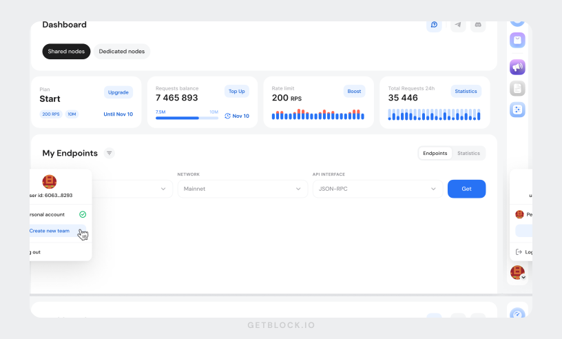
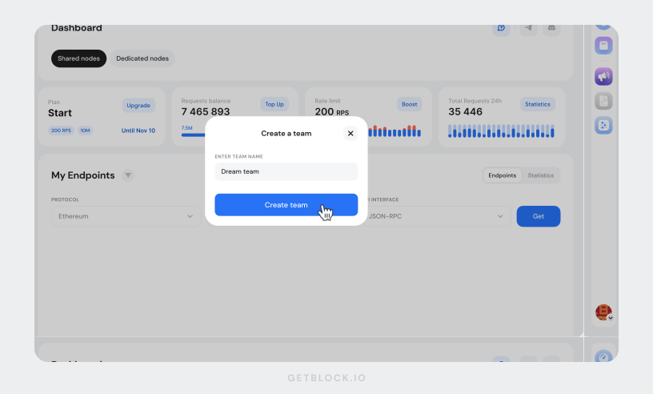
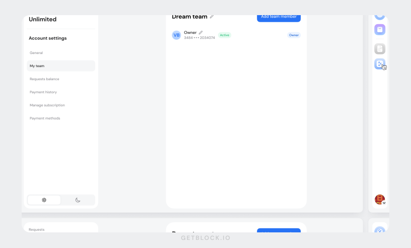
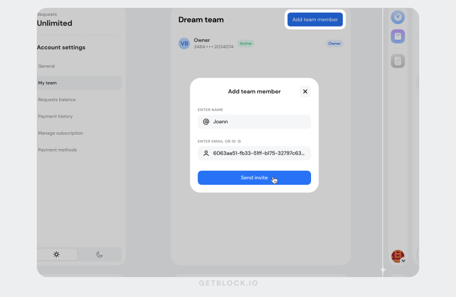
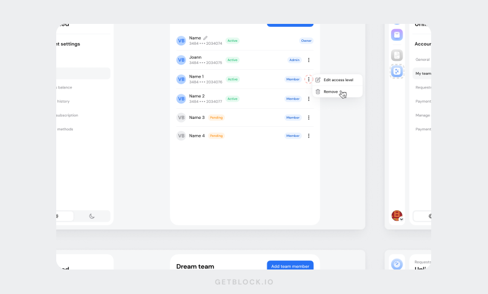
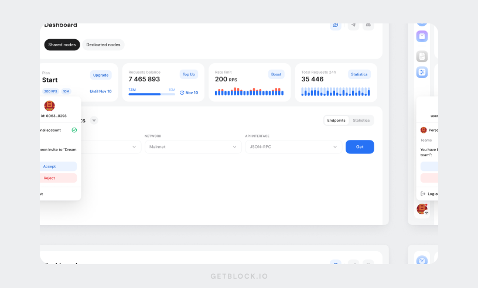
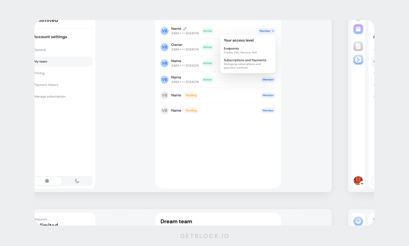
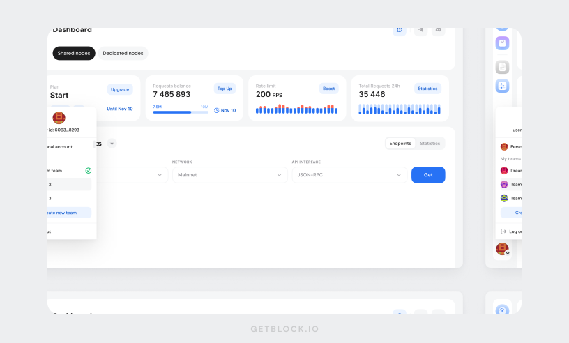

# Team accounts setup

A team account is **a shared workspace** **where multiple users can collaborate**. This setup is ideal for companies and teams using GetBlock services.

**Key benefits:**

* **Organized collaboration:** Work together on company resources.
* **Enhanced security:** Role-based access limits each member to only the features they need.
* **Efficient management:** Easily switch between personal and team accounts.

A **team account user** is a regular GetBlock user. When invited to a team, they can work on company resources, manage service plans or team settings—provided the corresponding permissions are granted. &#x20;

***

### Creating a team account on GetBlock

This part covers a step-by-step guide to setting up your team workspace.

1. Sign in to your GetBlock account. If you don’t have a user account yet, create one following [this guide](../how-to-set-up-an-account.md).&#x20;
2. Click on the **profile icon** in the bottom-left corner of the sidebar. Select "**Create new team**" from the dropdown menu.

<figure><figcaption></figcaption></figure>

3. A popup window will appear. Assign a team name and click the "**Create team**" button.

<figure><figcaption></figcaption></figure>

3. Once the space is created, navigate to **Account Settings** > **My Team** to manage team settings or add teammates.

<figure><figcaption></figcaption></figure>

***

### Adding teammates

The creator of the team account controls who gets invited and manages user roles.


**Limits on GetBlock team accounts:**

* Each user can create up to **3 teams**.
* A user can be invited to an **unlimited number of teams**.
* One team can have a maximum of **30 users.**


You can invite team members to join your team account using either their email address or GetBlock User ID.&#x20;

* **If the teammate has a GetBlock account**: You can invite them using their **ID**. Since they are already registered, they just need to accept the invitation.
* **If the teammate is not registered on GetBlock**: Invite them via **email** so they can first create an account before joining the team.



1. Go to **Account Settings > My Team**.
2. Click **"Add team member"** in the top-right corner.
3. Request the **User ID** from the teammate (they can find it under **Account Settings** > **General**).
4. Enter the name, User I&#x44;**,** and **send the invite**.&#x20;

<figure><figcaption></figcaption></figure>

The user gets a notification and can accept the invite.



1. Go to **Account Settings > My Team**.
2. Click **"Add team member"** in the top-right corner.
3. Enter the teammate's name and **email address.**&#x20;
4. Send the invite.


The invite link is valid for 30 minutes. If it expires, please resend an invitation.


<figure><figcaption></figcaption></figure>

The user will receive an invitation email with a link to sign up and join the team.



A team member is marked as  when they have successfully accepted the invitation and joined the team.&#x20;

If the invitation has been sent but not yet accepted, their status remains .

***

### Managing roles & permissions

Once the user has joined, the team owner or an admin can update their permissions:

1. Go to **My Team** in Account Settings.
2. Click the **three-dot menu** (⋮) next to a team member.
3. Select **"Edit access level"**.
4. Assign **permissions**:
   * **Endpoints:** Create and manage node endpoints, access tokens, and view statistics.
   * **Subscriptions & payments:** Handle payments and plans.
   * **Admin:** Includes all the above permissions, plus the access to manage team settings and member roles.
5. Save changes.

<figure><figcaption></figcaption></figure>


If a Member has no permissions assigned, they will have **View-Only access** by default.


#### **Roles-based permissions**

This table provides a breakdown of actions team account users can perform based on their role.

<table><thead><tr><th width="358.49609375">Action</th><th width="103.0234375" align="center">Owner</th><th width="108.4375" align="center">Admin</th><th align="center">Member</th></tr></thead><tbody><tr><td>Create &#x26; manage access tokens </td><td align="center">✅</td><td align="center">✅</td><td align="center"><a data-footnote-ref href="#user-content-fn-1">🔓</a> </td></tr><tr><td>Manage subscriptions &#x26; payments</td><td align="center">✅</td><td align="center">✅</td><td align="center"><a data-footnote-ref href="#user-content-fn-2">🔓</a></td></tr><tr><td>Add &#x26; remove team members</td><td align="center">✅</td><td align="center">✅</td><td align="center">❌</td></tr><tr><td>Edit access levels</td><td align="center">✅</td><td align="center">✅</td><td align="center">❌</td></tr><tr><td>Promote to Admin</td><td align="center">✅</td><td align="center">❌</td><td align="center">❌</td></tr></tbody></table>


If you need someone to help manage other team members, be sure to give them **Admin** status.&#x20;


***

### Revoking team access

To remove a user from your team account:

1. Navigate to **My Team** in the **Account Settings**.
2. Click the **three-dot menu** (⋮) next to the team member name.
3. Select **"Remove"** from the dropdown menu.

<figure><figcaption></figcaption></figure>


When removed from a team, users lose access to that team workspace but keep their personal account.


***

### How to join a team account

If you’ve been invited to a team on GetBlock, follow these steps to accept the invitation and join the team.



When you have a pending team invitation, a notification badge appears on your account icon .

1. Click your **account icon** to view an invitation.
2. Click **"Accept"** if you're ready to join.

<figure><figcaption></figcaption></figure>

3. After accepting the invitation, you are given access to your team’s workspace. Your [role and permissions](team-accounts-setup.md#roles-based-permissions) will be **determined by the team owner or admin**.

<figure><figcaption></figcaption></figure>



When someone who is not yet registered on GetBlock receives a team invitation, they must first sign up for an account:

1. Check your **inbox** for an email invitation from GetBlock.
2. Clicking the **invitation link** redirects you to the sign-up page.
3. Create a **secure password** for your new account.
4. Check the boxes to agree to the **Terms of Service and Privacy Policy** and complete the registration.


The invite link is **valid for 30 minutes**. If it expires, ask the team **owner** or **admin** to send a new invitation.


<figure><figcaption></figcaption></figure>

Once registered, you’ll have your personal GetBlock account. Additionally, you gain access to the team’s dashboard and resources based on [permissions](team-accounts-setup.md#roles-based-permissions) given by the team owner or admin.


**Next steps: Explore GetBlock**

Now that you’ve joined a team, here are a few useful resources to help you get started:

* [**Getting Started** ](../../)– Learn more about GetBlock.
* [**Managing Endpoints** ](../../guides/endpoint-setup/)– How to create and manage node endpoints.
* [**Plans & Limits**](../plans-and-limits/) – Understanding plans and payments.




***

### **Switching between personal & team accounts**


A team user **does not lose** access to their personal account. They can still use and manage their own endpoints and subscriptions.


To switch between your personal account and any team accounts you are part of:

* Click the **account icon** in the left panel.&#x20;
* A dropdown will show all **teams & personal accounts**.&#x20;
* Switch between them as needed.

<figure><figcaption></figcaption></figure>

The teams list is sorted by recent activity, with the most recently accessed accounts at the top.

***

### **Best practices for team security**

* Regularly review and **audit permissions**. Revoke access for users who are no longer active.
* Grant admin privileges only to **trusted team members**.&#x20;
* Give Members **only the necessary permissions** (e.g., endpoints access or subscriptions management).
* Never **share login credentials**—use team accounts instead.

***

### **Need help?**

If you run into any issues or have questions, please check out our [FAQ](https://getblock.io/faq/) or visit our [Contact Center](https://getblock.io/contact/). You can also use the **Help** button within your GetBlock dashboard to access support or submit a request.

[^1]: Not enabled by default; must be assigned by an Owner or Admin

[^2]: Not enabled by default, must be assigned by an Owner or Admin
