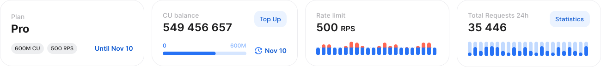
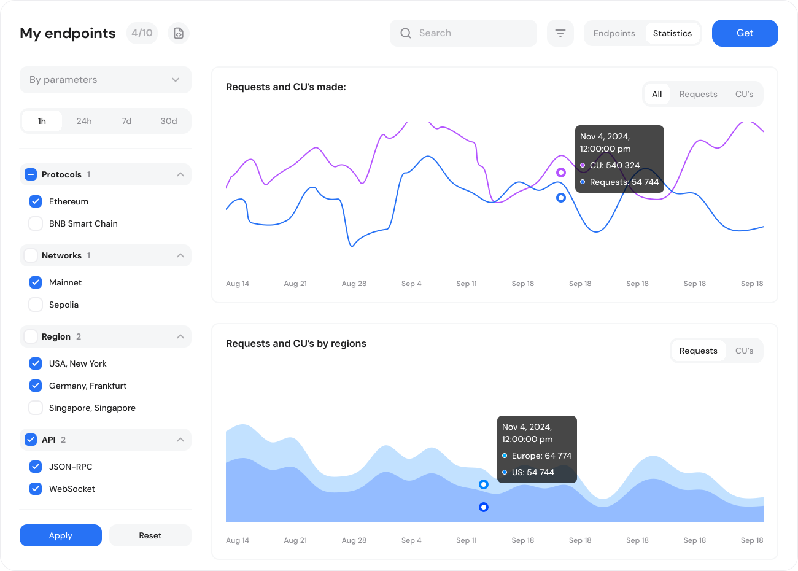
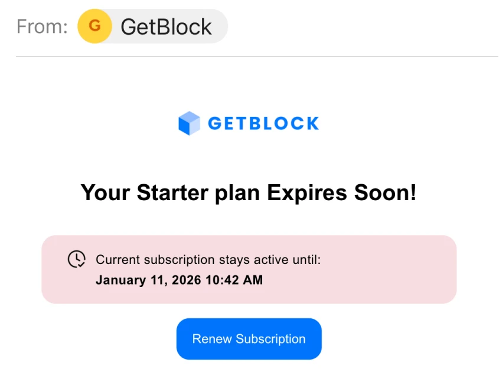

# Monitoring and analytics

These tools help ensure optimal use of GetBlock’s services and keep you informed of key metrics and events related to your account.

### Dashboard

<figure><figcaption></figcaption></figure>

The Dashboard provides a quick snapshot of key metrics:

* Your current plan details
* Remaining CU balance
* Rate limit based on your plan
* Total requests made in the last 24 hours

***

### Detailed statistics

For more detailed analysis, visit the **Statistics** tab in the dashboard.


Customize the data view by **parameters** or by **access** **tokens** using the dropdown menu.


Select the time period, protocol name, networks (mainnet/testnet), region, and API interfaces to analyze the data by parameters.

<figure><figcaption>
The Statistics tab shows more in-depth and customizable data analysis for your endpoints
</figcaption></figure>

All data is displayed through infographics, including:

* Number of requests and CUs
* Response statuses
* Method call distribution
* Rate limit rejections

***

### Notifications and email communication

GetBlock provides automated email updates for key account and subscription events:

* Account registration
* Successful order payments (Shared, Dedicated services, and Top-Ups)
* Start of grace period
* Subscription expiration&#x20;
* Dedicated node deployed and activated
* Recurring payment cancelled


Email notifications are **delivered only to** **accounts** with a **verified email address** provided during registration.

Users who registered using third-party authentication methods, such as MetaMask login, may not receive email notifications.


<figure><figcaption></figcaption></figure>

Users can also choose whether to receive marketing communications from GetBlock. This preference can be managed in Account Settings → General by enabling or disabling the “I want to receive marketing offers” option.
