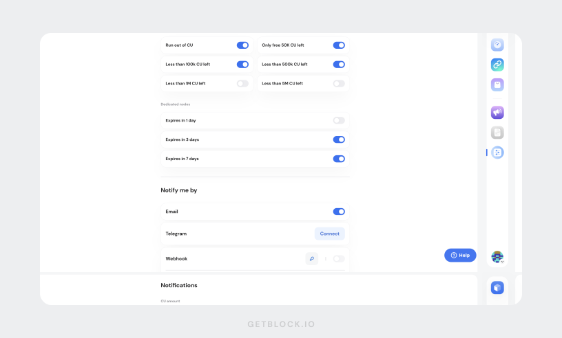

# Monitoring and analytics

These tools help ensure optimal use of GetBlock’s services and keep you informed of key metrics and events related to your account.

### Dashboard

<figure><figcaption></figcaption></figure>

The Dashboard provides a quick snapshot of key metrics:

* Your current plan details
* Remaining CU balance
* Rate limit based on your plan
* Total requests made in the last 24 hours

***

### Detailed statistics

For more detailed analysis, visit the **Statistics** tab in ‘My Endpoints’ section.


Customize the data view by **parameters** or by **access** **tokens** using the dropdown menu.


Select the time period, protocol name, networks (mainnet/testnet), region, and API interfaces to analyze the data by parameters.

<figure><figcaption>
The Statistics tab shows more in-depth and customizable data analysis for your endpoints
</figcaption></figure>

All data is displayed through infographics, including:

* Number of requests and CUs
* Response statuses
* Method call distribution
* Rate limit rejections

<figure><figcaption>
Visual analytics
</figcaption></figure>

***

### Notifications

GetBlock provides a notification system to help you monitor your usage and subscription status.


You can set up alerts for both CU balance and subscription expirations.


Alert types:

* **Run out of CU:** Notifies you when your CU balance reaches zero.
* **CU balance alerts**: Warns when remaining CUs drop below specified limits.
* **Subscription expiration alerts**: Help you renew your dedicated node plans on time.

<figure><figcaption></figcaption></figure>

Set up email, Telegram, or Webhook alerts to monitor your usage and subscription status from **Settings** → **Notification Settings.**
