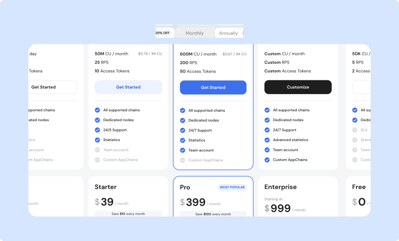
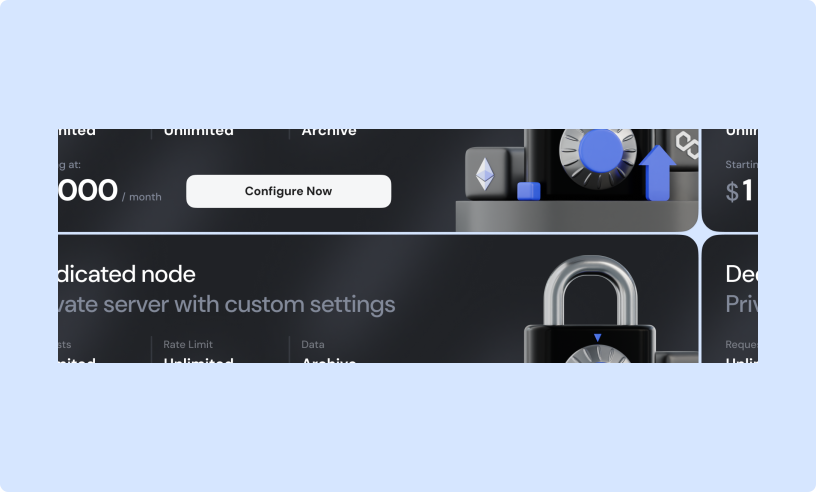

# Choosing your plan

GetBlock offers three main service options—**Shared Nodes**, **Dedicated Nodes**, and **Enterprise Solutions**. This page provides a high-level overview of these services.

You can explore detailed pricing and plans from your **dashboard** in the “Pricing” section or via [https://getblock.io/pricing/](https://getblock.io/pricing/).

***

### Shared nodes

Shared nodes operate on a **resource-sharing model**, where multiple clients access the same underlying node infrastructure maintained by GetBlock.&#x20;

<figure><figcaption>
GetBlock shared node service options
</figcaption></figure>

Our Shared Nodes deliver the perfect balance between affordability and performance:&#x20;

* **Cost efficiency:** Benefit from our pricing model based on [**Compute Units (CU)**](what-counts-as-a-cu.md), so you only pay for the resources needed for your current workload.&#x20;
* **Flexible pricing**: Options range from a **free** to **high-volume plans —** accessible for individual developers and smaller teams while supporting the scaling needs of growing dApps.
* **Consistent performance**: Each plan enforces a Requests Per Second (**RPS**) limit, preventing individual spikes from impacting overall quality.
* **Tiered support levels**: Support options adapt to your requirements, **from basic help to priority** support when you need it most.
* **Multi-chain accessibility**: Prototype, test, and deploy applications **across different networks** without the complexities of connecting to each blockchain individually.


This option is ideal for developers and teams looking for reliable connectivity to various blockchain networks without the higher costs of dedicated server resources.


***

### Dedicated nodes

A Dedicated Node is a **private RPC server** deployed solely for your use case. That means consistent throughput, no API rate throttling due to other users, and better uptime guarantees.


If your project demands the fastest, most reliable blockchain infrastructure, a Dedicated Node from GetBlock is a perfect choice.


<figure><figcaption>
GetBlock private node features and pricing
</figcaption></figure>

This option is ideal for users that require high performance, full control over node configuration, and a flawless connection to the blockchain without any limitations:

* **Mission-critical reliability**: Maximized uptime and robust failover mechanisms for even more reliable service.
* **Unlimited usage**: No per-second request caps or CU tracking.&#x20;
* **Low latency**: With servers available in **Europe**, **Asia**, and **the USA**, choose the optimal server location to minimize latency and enhance performance for your users
* **Fully customizable**: Complete control over your node configurations, including access to archive data.
* **Predictable pricing**:
  * Full Node: $1,000/month;
  * Archive Node: $1,500/ month.
* **Expert support**: 24/7 coverage and immediate issue resolution.


A few **high-resource blockchain** settings (e.g., Arbitrum mainnet, NEAR mainnet) may come with **custom pricing** due to their intense infrastructure requirements.


***

### Enterprise solutions

This option is designed to meet the needs of organizations operating at scale or applications that require extra resources, features, and dedicated support.

What’s included:

* 99.9% uptime guarantee
* Customizable node configurations and integrations
* Performance optimization via load balancers
* Advanced analytics and alert systems
* Priority assistance from GetBlock experts

Visit the [Enterprise Solutions page](https://getblock.io/enterprise-api/) to learn more about how we tailor services to fit complex, high-demand environments.
