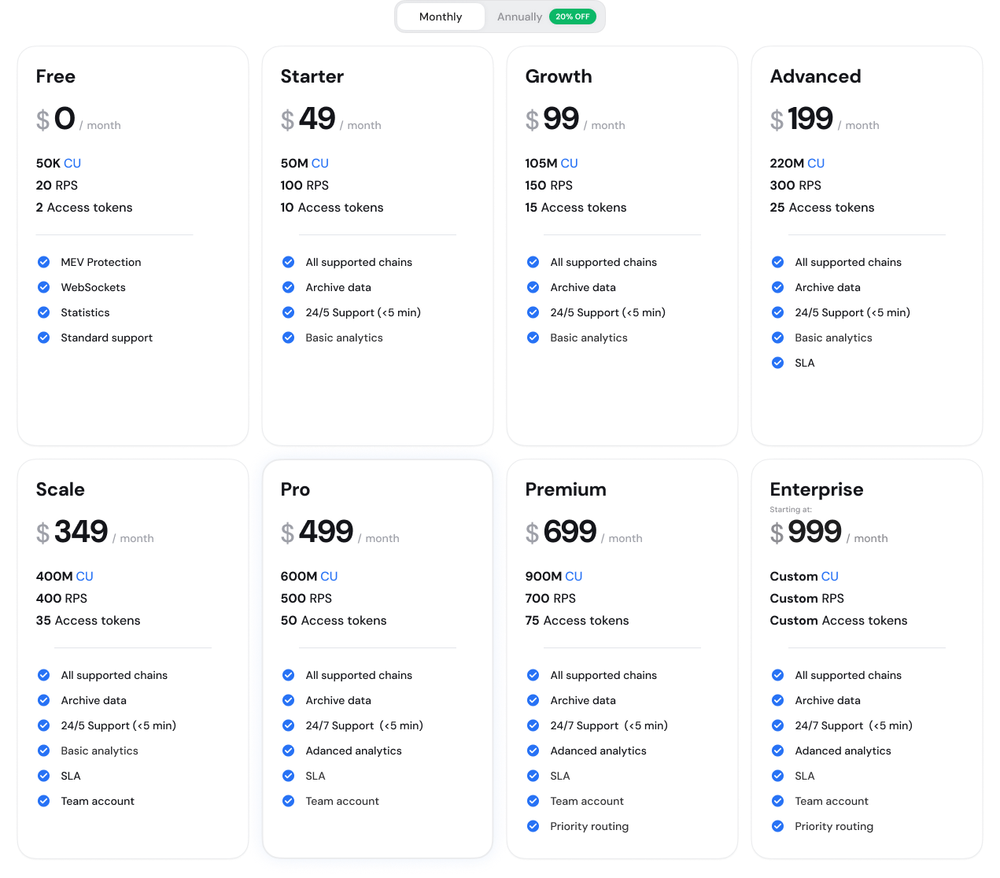
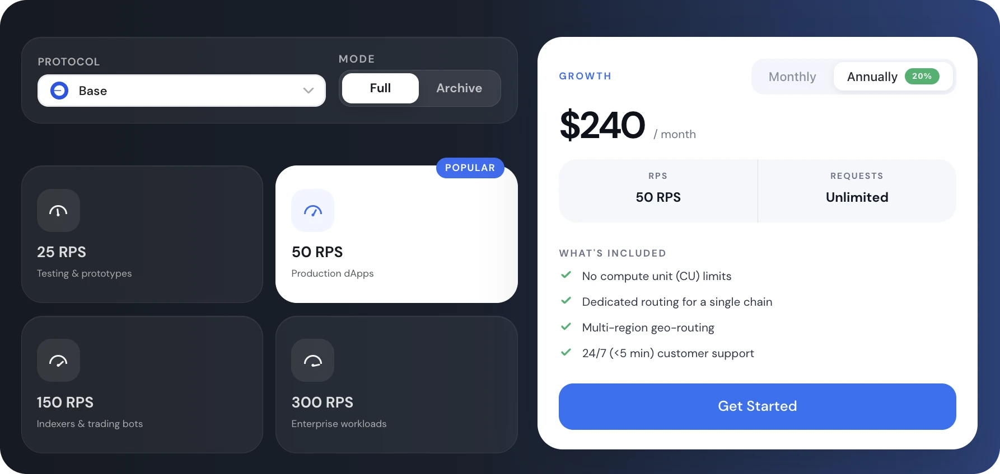
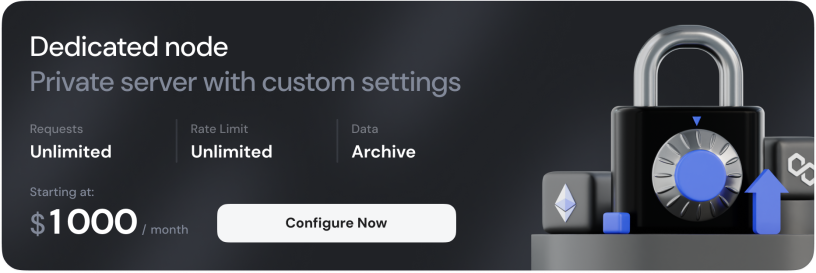

# Choosing your plan

GetBlock offers four main service options: **Shared Nodes**, **Limitless Node**, **Dedicated Nodes**, and **Enterprise Solutions**. This page provides a high-level overview of these services.

You can explore detailed pricing and plans from your **dashboard** in the “Pricing” section or via [https://getblock.io/pricing/](https://getblock.io/pricing/).

***

### Shared Nodes

Shared nodes operate on a **resource-sharing model**, where multiple clients access the same underlying node infrastructure maintained by GetBlock.

<figure><figcaption></figcaption></figure>

Our Shared Nodes deliver the perfect balance between affordability and performance:

* **Cost efficiency:** Benefit from our pricing model based on [**Compute Units (CU)**](what-counts-as-a-cu.md), so you only pay for the resources needed for your current workload.
* **Flexible pricing**: Options range from a **free** to **high-volume plans —** accessible for individual developers and smaller teams while supporting the scaling needs of growing dApps.
* **Consistent performance**: Each plan enforces a Requests Per Second (RPS) limit, preventing individual spikes from impacting overall quality.
* **Multi-chain accessibility**: Prototype, test, and deploy applications across different networks without the complexities of deploying infrastructure for each blockchain individually.
* **Regional endpoints**: Connect to the nearest datacenter — Frankfurt (EU), New York (US), Singapore (APAC) — to minimize network latency.
* **Archive data access**: Run full historical blockchain queries.
* **Tiered support levels**: Support options adapt to your requirements, from basic help to priority support when you need it most.


This option is ideal for developers and teams looking for reliable connectivity to various blockchain networks without the higher costs of dedicated server resources.


***

### Limitless Node

Limitless Node is the middle ground between Shared and Dedicated Nodes. It's an isolated endpoint with **guaranteed RPS** and a **flat monthly fee**. Pricing is set by throughput rather than Compute Units, so you can send unlimited requests within your RPS tier without per-request metering.

<figure><figcaption></figcaption></figure>

* **Dedicated routing** to ensure consistent performance and throughput.
* **Fixed RPS tiers**: Choose the throughput level that matches your workload, from smaller setups to higher-volume production traffic.
* **No Compute Unit (CU) or request limits**: Each plan includes a set RPS limit with unlimited requests within that tier.
* **Multi-region geo-routing**: Traffic is routed to the nearest healthy node across Europe, the USA, and Asia.
* **Fixed pricing**: Flat monthly or yearly fee with no usage-based charges.
* **24/7 support**: Priority coverage with a response time under 5 minutes.


Limitless Node fits workloads with high but predictable request volumes, where a Shared plan's Compute Unit billing is hard to forecast, but a full Dedicated Node is more than you need.


***

### Dedicated Nodes

A Dedicated Node is a **private RPC server** deployed solely for your use case. That means consistent throughput, no API rate throttling due to other users, and better uptime guarantees.


If your project demands the fastest, most reliable blockchain infrastructure, a Dedicated Node from GetBlock is a perfect choice.


<figure><figcaption></figcaption></figure>

This option is ideal for users that require high performance, full control over node configuration, and a flawless connection to the blockchain without any limitations:

* **Mission-critical reliability**: Maximized uptime and robust failover mechanisms for even more reliable service.
* **Unlimited usage**: No per-second request caps or CU tracking.
* **Low latency**: With servers available in **Europe**, **Asia**, and **the USA**, choose the optimal server location to minimize latency and enhance performance for your users.
* **Fully customizable**: Complete control over your node configurations, including access to archive data.
* **Predictable pricing**:
  * Full Node: from $1,000/month;
  * Archive Node: from $1,500/month.
* **Expert support**: 24/7 coverage and immediate issue resolution.


A few **high-resource blockchain** settings (e.g., Solana mainnet, Arbitrum mainnet, NEAR mainnet) may come with **custom pricing** due to their intense infrastructure requirements.


***

### Enterprise solutions

This option is designed to meet the needs of organizations operating at scale or applications that require extra resources, features, and dedicated support.

What’s included:

* 99.9%+ uptime guarantee
* Customizable node configurations and integrations
* Performance optimization via load balancers
* Advanced analytics and alert systems
* Priority assistance from GetBlock experts

Visit the [Enterprise Solutions page](https://getblock.io/enterprise-api/) to learn more about how we tailor services to fit complex, high-demand environments.
