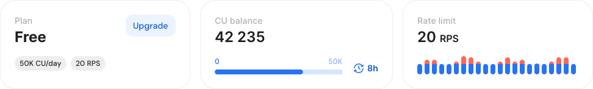
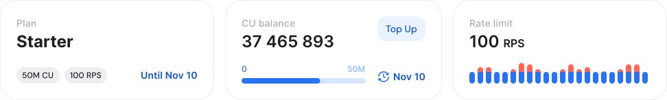
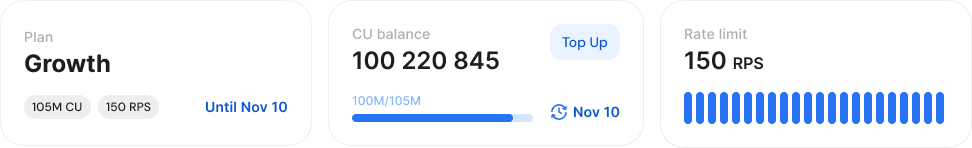
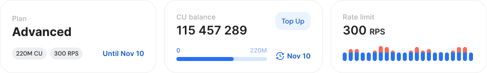
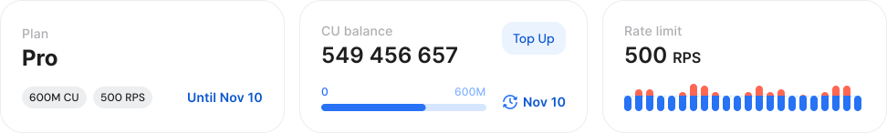
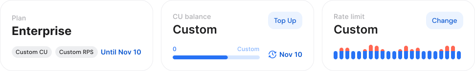
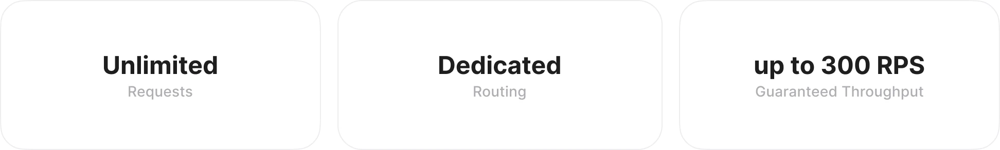
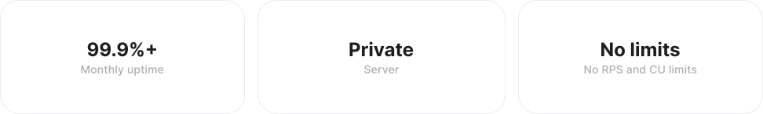

# CU and rate limits

This guide explains how limits work across all available plans, helping you understand what’s included and how to choose the option that best fits your current workload and future growth.


* **Shared Nodes** operate on a system of limits defined by Compute Units (**CUs**) and Requests Per Second (**RPS**). Each plan also determines how many endpoints you can use simultaneously.
* **Limitless Node** has no CU limits - only an RPS limit.
* With **Dedicated Nodes**, you’re not limited by CUs or RPS.


***

### Shared node limits

GetBlock’s shared node service is subject to several usage limits. These are the key limits that directly affect costs and performance:

* [**CU (Compute Units)**](what-counts-as-a-cu.md): Measures the computational effort required to process requests. Different shared node plans include a varying number of CUs that you can use in a month.
* **RPS (Requests Per Second)**: Each plan enforces a maximum number of requests you can send every second. While you’re not billed per request, staying within this limit is critical to maintaining optimal service quality.
* [**Access Tokens**](../authentication-with-access-tokens.md)**:** Access tokens are unique identifiers used to authenticate your connection to GetBlock’s node infrastructure, generated when you create an endpoint. The limitation on your plan determines how many of these access tokens (and therefore endpoints) you can create.

<table><thead><tr><th>Plan</th><th width="129.24566650390625">Price (monthly)</th><th width="120.96441650390625">CU Allocation</th><th width="116.09033203125">RPS Limit</th><th width="99.59716796875">Access Tokens</th><th width="102.822021484375" data-type="checkbox">CU Top-ups</th></tr></thead><tbody><tr><td>Free</td><td>$0</td><td>50,000 / day</td><td>20 RPS</td><td>2</td><td>false</td></tr><tr><td>Starter</td><td>$49</td><td>50M / mo</td><td>100 RPS</td><td>10</td><td>true</td></tr><tr><td>Growth</td><td>$99</td><td>105M / mo</td><td>150 RPS</td><td>15</td><td>true</td></tr><tr><td>Advanced</td><td>$199</td><td>220M / mo</td><td>300 RPS</td><td>25</td><td>true</td></tr><tr><td>Scale</td><td>$349</td><td>400M / mo</td><td>400 RPS</td><td>35</td><td>true</td></tr><tr><td>Pro</td><td>$499</td><td>600M / mo</td><td>500 RPS</td><td>50</td><td>true</td></tr><tr><td>Premium</td><td>$699</td><td>900M / mo</td><td>700 RPS</td><td>75</td><td>true</td></tr><tr><td>Enterprise</td><td>from $999</td><td>Custom</td><td>Custom</td><td>Custom</td><td>true</td></tr></tbody></table>

Check [https://getblock.io/pricing/](https://getblock.io/pricing/) for current pricing and annual discounts across all tiers.


Your **balance of CUs for Shared Nodes** is distributed on **all endpoints** added under the ‘Shared nodes’ tab.




The plan is ideal if you’re **just starting out** and do not have complex calls or large request volumes.

<figure><figcaption></figcaption></figure>

* **CU**: 50,000/day
* **Throughput**: 20 requests per second (RPS)
* **Access Tokens**: 2


**Compute Units** are **renewed daily**, but unused CUs cannot be transferred to the next day.


To increase usage limits, choose between the higher-tier options.



For use cases that are growing beyond the free tier — a first production app or side project. Offers a **significant increase in CU** and **RPS** compared to the Free plan.&#x20;

<figure><figcaption></figcaption></figure>

* **CU**: 50M per month (\~1.6M/day)
* **Throughput**: 100 requests per second (RPS)
* **Access Tokens**: 10
* Additional CU packages can be purchased as needed.



For apps with a growing user base: higher daily call volumes and room for several services or environments at once.

<figure><figcaption></figcaption></figure>

* **CU**: 105M per month (\~3.5M/day)
* **Throughput**: 150 requests per second (RPS)
* **Access Tokens**: 15
* Additional CU packages can be purchased as needed.



**Mid-to-upper tier, production-ready** plan, suitable for moderate-to-high traffic applications.

<figure><figcaption></figcaption></figure>

* **CU**: 220M per month (\~7.2M/day)
* **Throughput**: 300 requests per second (RPS)
* **Access Tokens**: 25
* Add extra compute units (CU) to your account balance when needed without switching plans



For larger apps and teams. More CU headroom and endpoints to run many services or environments from one account.

<figure><figcaption></figcaption></figure>

* **CU**: 400M per month (\~13.3M/day)
* **Throughput**: 400 requests per second (RPS)
* **Access** **Tokens**: 35
* Extra CU packages also available



For applications that need significantly **higher throughput** and **increased resource availability** compared to lower tier plans.

<figure><figcaption></figcaption></figure>

* **CU**: 600M per month (\~20M/day)
* **Throughput**: 500 requests per second (RPS)
* **Access Tokens**: 50
* Purchase additional CU packages when required



**Highest** standard tier before custom Enterprise terms. Built for sustained high-volume production traffic.

<figure><figcaption></figcaption></figure>

* **CU**: 900M per month (\~30M/day)
* **Throughput**: 700 requests per second (RPS)
* **Access Tokens**: 75
* CU top-ups available



**Fully customizable** with tailored CU allocations, rate limits, and access tokens to meet exceptionally high call volumes and performance requirements.

<figure><figcaption></figcaption></figure>

* **CU**: Custom monthly allocation based on your demands
* **Throughput**: Custom
* **Access Tokens**: Custom
* Additional CU packages can be purchased on demand



***

#### Managing unused & extra CUs

If you don’t use all your allocated CUs within a month, the unused amount **will carry over to the next month** as long as **your subscription is** **active and renewed**. If your subscription expires or is not renewed on time, the remaining CUs will be lost.


If your demand exceeds the included limits, you can **purchase extra CU packages**. This means that even within a given plan, there’s room for scaling without an immediate need to move to a higher tier.

* [Top up CUs and boost limits](top-up-cus-and-boost-limits.md)


***

### Limitless node limits

Limitless Node removes Compute Unit limits entirely. You can send unlimited requests within the RPS tier you choose.

<figure><figcaption></figcaption></figure>

* **CU**: No limit&#x20;
* **Rate limit**: Capped at selected RPS tier


See [Limitless Node](limitless-node.md) for tiers, supported chains, and setup.


***

### Dedicated node limits

Our Dedicated Node service is perfect for teams and projects that demand absolute freedom from rate limits and CU monitoring.

<figure><figcaption></figcaption></figure>

* **CU**: Unlimited
* **Rate limit**: Unlimited

***

If you’re unsure which plan best fits your needs, our team is ready to help! [Contact our support team](https://getblock.io/contact/) or visit our [Choosing your plan](choosing-your-plan.md) page for more information.
