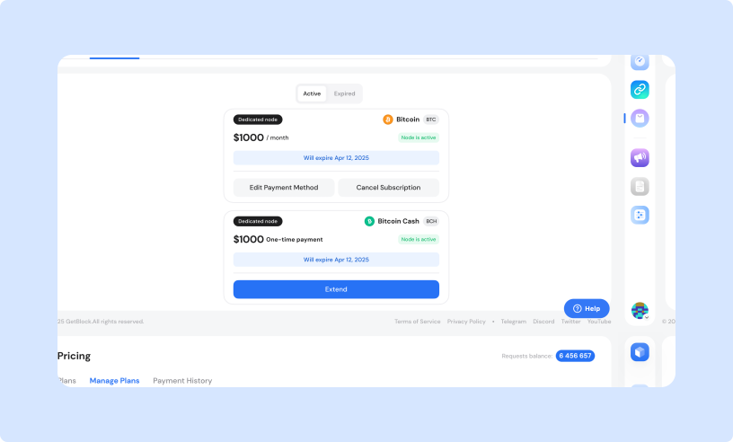
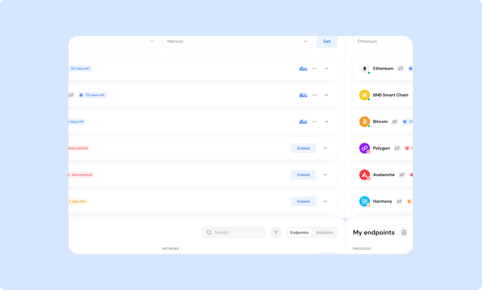
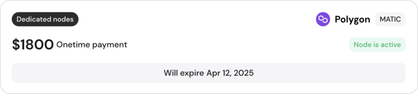
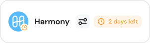
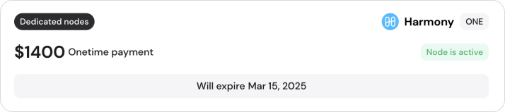
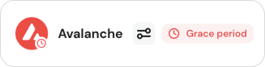
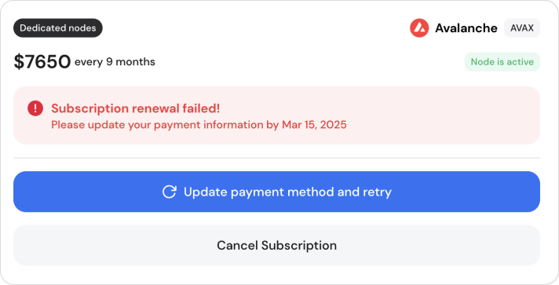
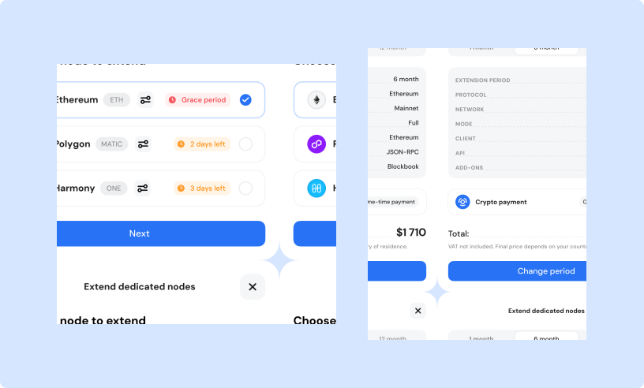
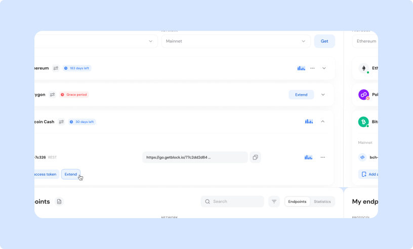
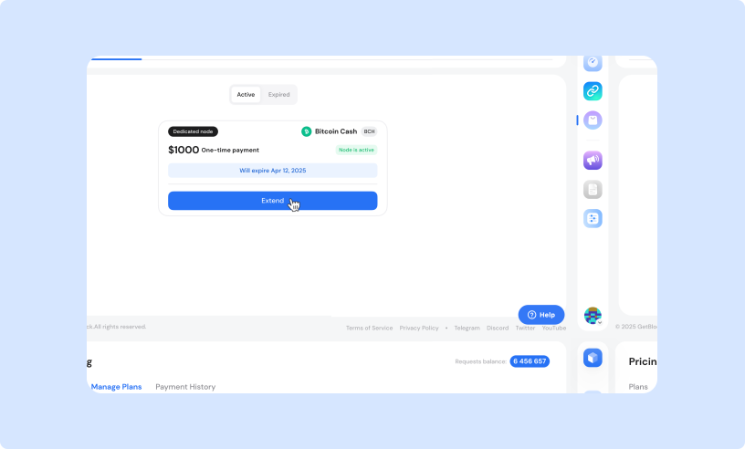

# Dedicated nodes: Manage & extend subscriptions

This page explains how to manage your **dedicated node subscriptions**, including checking their status and extending the service duration—all from your user account.


### Important update on Dedicated Node pricing

GetBlock is introducing an advanced Dedicated Node service with updated pricing. Here’s what this means for you:

* **Existing users** can extend their subscriptions at the old pricing until **May 1, 2025**.
* **New users** can purchase new subscriptions at the current pricing until the service upgrade begins on **March 25, 2025**.


***

### Tracking subscription status

You can monitor the status of your dedicated node subscriptions in three different ways.

#### 1. Dashboard&#x20;

<figure><figcaption></figcaption></figure>

The widget on your dashboard alerts you when your subscription is about to expire or is in a grace period. Click the widget to open a pop-up that lists all nodes that require renewal.

#### 2. Plan manager

<figure><figcaption></figcaption></figure>

The **Manage Plans** section can be found by navigating to the “**Pricing**” option in the left-side menu. You'll see three tabs: click on “**Manage Plans**” to view all your subscriptions in one place.

#### 3. "My endpoints" list

<figure><figcaption></figcaption></figure>

Each endpoint in “**My endpoints**” list now shows its current subscription status.

***

#### Subscription statuses&#x20;

<table><thead><tr><th width="201.48828125" align="center">Status</th><th width="219.43359375" align="center">Dashboard View</th><th align="center" valign="middle">Manage Plans View</th></tr></thead><tbody><tr><td align="center">
<a data-footnote-ref href="#user-content-fn-1">Active </a>

<a data-footnote-ref href="#user-content-fn-1">(<mark style="color:orange;">Recurring Payment</mark></a><mark style="color:orange;">)</mark>
</td><td align="center"></td><td align="center" valign="middle"></td></tr><tr><td align="center">
<a data-footnote-ref href="#user-content-fn-2">Active </a>

<a data-footnote-ref href="#user-content-fn-2">(<mark style="color:green;">One-Time Payment</mark></a><mark style="color:green;">)</mark>
</td><td align="center"></td><td align="center" valign="middle"></td></tr><tr><td align="center">
<a data-footnote-ref href="#user-content-fn-3">Expiring Soon </a>

(<mark style="color:green;">One-Time Payment</mark>) 
</td><td align="center"></td><td align="center" valign="middle"></td></tr><tr><td align="center">
<a data-footnote-ref href="#user-content-fn-4">In Grace Period </a>

(<mark style="color:orange;">Recurring</mark> /<mark style="color:green;">One-Time</mark>)
</td><td align="center"></td><td align="center" valign="middle"></td></tr></tbody></table>

***

### Changing the subscription period

You can modify your subscription period at any time **if you’re on a one-time payment plan** paid with:

* Cryptocurrency;
* Credit car&#x64;**.**&#x20;


#### Note on Recurring Payments

Users **cannot manually extend a plan** when using recurring payments. These subscriptions renew automatically at the end of a billing cycle.

However, if a payment **fails** (e.g., due to an expired card or insufficient funds), your subscription will enter a **3-day grace period**. During this time, your node remains active, allowing you to **update your payment details and retry the renewal** before the service is interrupted.


#### Available options

You can extend your subscription to one of the following periods:

* 1 month
* 6 months
* 12 months

***

### How to extend your Dedicated Node plan

There are three ways to extend your subscription.

#### Option 1: The Dedicated Nodes dashboard

1. Go to **Dedicated Nodes** tab from your dashboar&#x64;**.** Look for the subscription alert widget.

<figure><figcaption></figcaption></figure>

2. Click the widget to see a list of nodes needing renewal and choose one. A pop-up will show extension options (**1**, **6**, or **12 months**).

<figure><figcaption></figcaption></figure>

2. **Choose a new period** and review details. Proceed to checkout.&#x20;
3. Complete the payment by following the instructions provided.
4. Check the "**Payment History**" under the **Pricing** tab to track the progress.

#### Video guide



**For fiat (credit card) payments:**

* Payments are processed via **Paddle**.
* **VAT may apply** depending on the user's location.
* The extension is applied **instantly** once the payment is completed.

{% embed url="https://files.gitbook.com/v0/b/gitbook-x-prod.appspot.com/o/spaces%2FFOeg95CadVyFvyLi70Bh%2Fuploads%2F8pIYDgoi9y0CC2FAKCOb%2FExtendingDedicNodes_Widget_Paddle.mp4?alt=media&token=e5db1173-11ce-43a7-9ca0-af3de0a6e62c" %}
How to extend your node subscription with a card payment




**For crypto payments**:

* Payments are processed via **NOWPayments**.
* Make sure to account for **network fees** to avoid payment issues.
* The extension is applied **after blockchain confirmation**, which may take a few minutes.

{% embed url="https://files.gitbook.com/v0/b/gitbook-x-prod.appspot.com/o/spaces%2FFOeg95CadVyFvyLi70Bh%2Fuploads%2FakJE50bGOIdiyyIyo61n%2FExtending_nodes_CryptoPayments.mp4?alt=media&token=f539d7e3-d430-4665-a39c-d09f7a6f1ce9" fullWidth="false" %}



#### Option 2: From “My Endpoints” list

1. Navigate to your main dashboard and switch to the **Dedicated Nodes** tab.
2. **Choose a node to extend.** Expand the node’s details and click **"Extend"** to begin the process.
3. Follow the pop-up instructions to select the **new subscription period** and finalize the process.

<figure><figcaption></figcaption></figure>

#### Option 3: Via the "Manage Plans" menu

1. Navigate to **Pricing > Manage Plans**.
2. **Review all subscriptions**. Subscriptions nearing expiration are listed at the top.
3. **Follow the same steps:** Select your node, choose a new period, and confirm your payment.

<figure><figcaption></figcaption></figure>

***

### How to keep your Dedicated Node running smoothly

* [ ] **Keep an eye on your subscription.** Check your dashboard or plan manager to track expiration dates. Status tracking is now easier with our latest updates.
* [ ] Avoid disruptions by **renewing before your subscription ends**. This ensures your node remains active and accessible without downtime.
* [ ] For **recurring payments**, ensure your card information is up to date. Payment failures (e.g., expired card) can interrupt service.

If you face any issues with renewal or extensions, feel free to reach out to GetBlock support—we’re happy to assist.

[^1]: Your node subscription renews automatically at the end of each billing cycle using a saved payment method.

[^2]: The node is active under a one-time payment plan and will not renew automatically. To continue using the service, you’ll need to manually extend the subscription before it expires.

[^3]: The subscription will expire soon (within 3 days). Renewal is required.

[^4]: After the subscription expires, there is a 3-day grace period where the node remains active. During this time, you can renew your subscription or resolve payment issues (update billing details).
