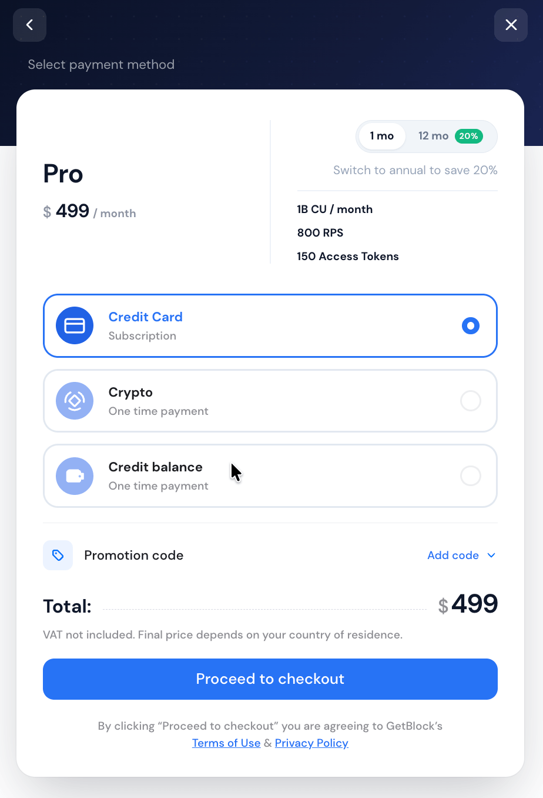
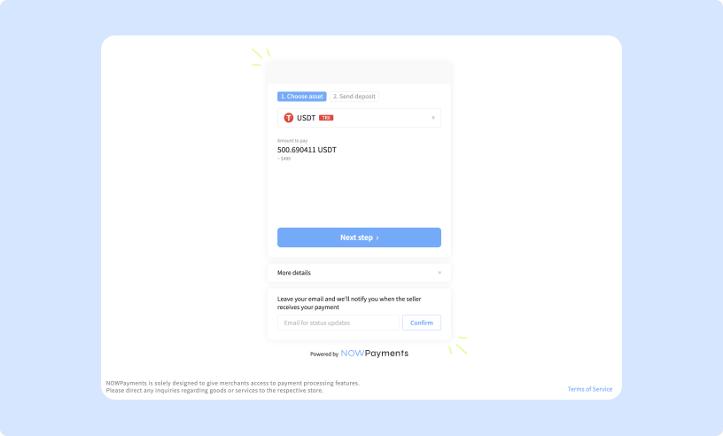

# Payment methods

Fiat and crypto payments go directly toward a subscription or one-time charge. Credits are a prepaid balance you fund first, then spend across any service on the platform.

### Fiat payments

Users can pay for subscriptions using traditional fiat currency via **Paddle**.

**How it works:**

* **Recurring payments enabled by default**: Payment is automatically deducted on the billing date.
* **Fees**: VAT is applied to Paddle payments and varies depending on your region
* **If the card balance is insufficient**: GetBlock will retry the payment after three days. If the retry fails, the plan will be frozen until the payment is resolved.

<figure><figcaption>
Selecting fiat as a payment method
</figcaption></figure>


Please, account for VAT when planning your payments.


***

#### Updating your payment details

To update your payment information while you have an active subscription:

1. Go to **Billing** → **Billing Information**.
2. Click ‘**Edit**’.
3. Enter your updated payment details and save the changes.

***

### Crypto payments

Users can pay for subscriptions or top up their Credits with cryptocurrency through **NOWPayments**.

**How it works:**

* **Payments are processed as one-time transactions**: add funds as needed.
* **Supported cryptocurrencies**: any token on any network available through NOWPayments at the time of payment.
* **Fees**: blockchain network fees apply.

<figure><figcaption>
Crypto payments
</figcaption></figure>


If the network fees are insufficient or the transaction fails, the payment will not be processed and the subscription plan will not be activated. **Please, include enough gas fees to ensure the transaction processes successfully**.


***

### GetBlock Credits

GetBlock Credits are a universal, USD-denominated prepaid balance you can use to pay for any service on the platform — Shared Node subscriptions, Dedicated Nodes, Limitless plans, CU top-ups, and on-demand Products in the dashboard's **Products** tab (Wallet Audit, AML Checks, TRON Energy delegation, Solana Shred Streaming, Solana Market Data, etc.)

**How it works:**

* Prepaid model: Top up your balance in advance. It can then cover subscription costs or one-time service fees without triggering a new external transaction each time.
* "Credits" appears as a payment option alongside fiat and crypto during checkout.
* GetBlock Credits are prepaid service credits. Once topped up, they can't be withdrawn or refunded to a bank account or crypto wallet.
* Your balance is tied to your account and can't be moved to another GetBlock account.

#### How to top up Credits

1. Go to **Billing** in your dashboard and select "**Top up Credits**."&#x20;
2. Choose a preset amount (e.g. $10, $50, $100) or enter a custom value
3. Pick a payment method to fund it: card payments via Stripe, or crypto via NOWPayments.

The Billing page shows your current balance, top-up history, and invoices.

<figure><figcaption></figcaption></figure>


#### Paying for RPC services (Shared Node plans, Dedicated Nodes, Limitless Node) with Credits

* Only **one-time payment** is supported — recurring billing via Credits isn't available yet.
* Your balance needs to cover tax as well as the plan price. Top up enough to cover the plan price _plus_ tax.

