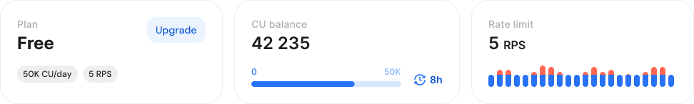
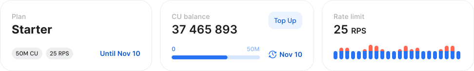
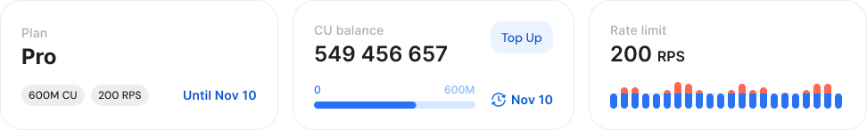
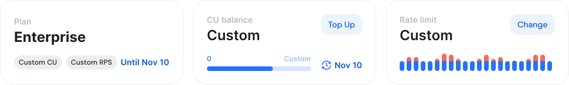
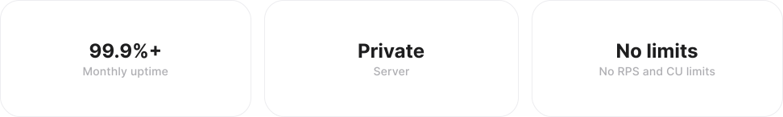

# CU and rate limits

This guide explains how limits work across all available plans, helping you understand what’s included and how to choose the option that best fits your current workload and future growth.


* **Shared Nodes** operate on a system of limits defined by Compute Units (**CUs**) and Requests Per Second (**RPS**). Each plan also determines how many access tokens you can generate.
* With **Dedicated Nodes**, you’re not limited by CUs or RPS.


***

### Shared node limits

GetBlock’s shared node service is subject to several usage limits. These are the key limits that directly affect costs and performance:

* **CU (Compute Units)**: Measures the computational effort required to process requests. Different shared node plans include a varying number of CUs that you can use in a month.
* **RPS (Requests Per Second)**: Each plan enforces a maximum number of requests you can send every second. While you’re not billed per request, staying within this limit is critical to maintaining optimal service quality.
* **Access Tokens:** Access tokens are unique identifiers used to authenticate your connection to GetBlock’s node infrastructure, generated when you create an endpoint. The limitation on your plan determines how many of these access tokens (and therefore endpoints) you can create.

<table><thead><tr><th width="183.06640625">Plan</th><th>Free</th><th>Starter</th><th>Pro</th><th>Enterprise</th></tr></thead><tbody><tr><td><a data-footnote-ref href="#user-content-fn-1">Price/month</a></td><td>$0</td><td>$49</td><td>$499</td><td>from $999</td></tr><tr><td>CU Allocation</td><td>50k/day</td><td>50M/month</td><td>600M/month</td><td>Custom</td></tr><tr><td>RPS Limit</td><td>5 RPS</td><td>25 RPS</td><td>200 RPS</td><td>Custom </td></tr><tr><td>Access Tokens</td><td>2</td><td>10</td><td>50</td><td>Custom</td></tr><tr><td>Extra CU Purchase</td><td>❌</td><td>✅</td><td>✅</td><td>✅</td></tr></tbody></table>

To see the full comparison table, navigate to [https://getblock.io/pricing/](https://getblock.io/pricing/).


Your **balance of CUs for Shared Nodes** is distributed on **all endpoints** added under the ‘Shared nodes’ tab.


#### 1) Free plan

The plan is ideal if you’re just starting out and do not have complex calls or large request volumes.&#x20;

<figure><figcaption></figcaption></figure>

* **CU**: 50,000/day&#x20;
* **Rate**: 5 requests per second (RPS)
* **Access Tokens**: 2&#x20;


**Compute Units** are **renewed daily**, but unused CUs cannot be transferred to the next day.


Clients who want to increase their usage limits can choose between the options below.

#### 2) Starter plan

This is a monthly subscription designed for use cases that are growing beyond the free tier. It offers a significant increase in CU compared to the Free plan.

<figure><figcaption></figcaption></figure>

* **CU**: 50M per month (\~1.6M/day)
* **Rate**: 25 requests per second (RPS)
* **Access Tokens**: 10
* Additional CU packages can be purchased as needed.

#### 3) Pro plan

The Pro Plan is the perfect middle ground before going custom. It's built for applications that need higher throughput and increased resource availability.

<figure><figcaption></figcaption></figure>

* **CU**: 600M per month (\~20M/day)
* **Rate**: 200 requests per second (RPS)
* **Access Tokens**: 50
* Purchase additional CU packages when required

#### 4) Enterprise plan

The Enterprise plan is fully customizable with tailored CU allocations, rate limits, and access tokens to meet exceptionally high call volumes and performance requirements.&#x20;

<figure><figcaption></figcaption></figure>

* **CU**: Custom monthly allocation based on your demands
* **Rate limit**: Custom
* **Access Tokens**: Custom&#x20;
* Additional CU packages can be purchased on demand.

***

#### Managing unused & extra CUs

If you don’t use all your allocated CUs within a month, the unused amount **will carry over to the next month as long as your subscription is** **active and renewed**. If your subscription expires or is not renewed on time, the remaining CUs will be lost.


If your demand exceeds the included limits, you can **purchase extra CU packages**. This means that even within a given plan, there’s room for scaling without an immediate need to move to a higher tier.

* [Top up CUs and boost limits](top-up-requests-and-boost-rps.md)


***

### Dedicated node limits

Our Dedicated Node service is perfect for teams and projects that demand absolute freedom from rate limits and CU monitoring.

<figure><figcaption></figcaption></figure>

* **CU**: Unlimited
* **Rate**: Unlimited

***

If you’re unsure which plan best fits your needs, our team is ready to help! [Contact our support team](https://getblock.io/contact/) or visit our [Choosing your plan](choosing-your-plan.md) page for more information.\

[^1]: Prices are based on monthly billing. Opt for **annual subscriptions** to save up to **$100 per month**.
