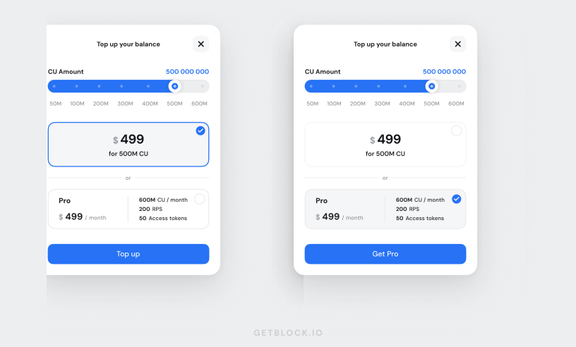
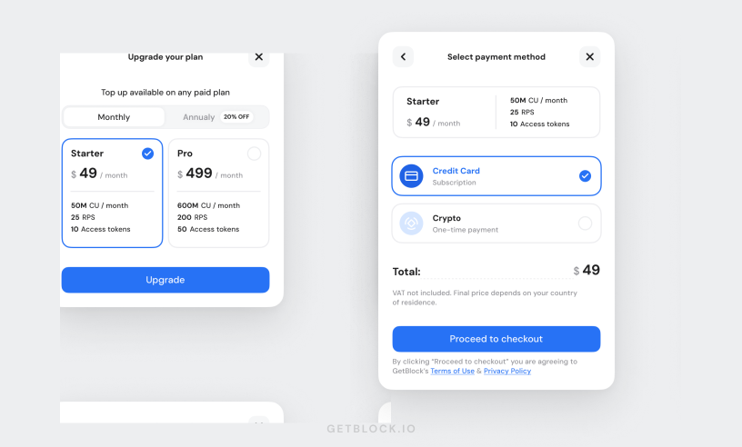
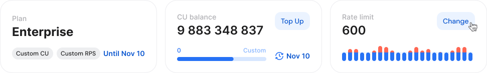
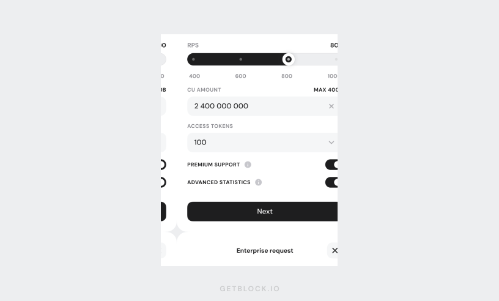

# Top up CUs and boost limits

The current **CU balance** **for Shared Node** users is displayed on the **Dashboard**. This shows how many Compute Units (CUs) are left before running out.&#x20;

With the "**Top Up**" feature, users can add more **Compute Units** to their account or upgrade to higher monthly limits.

***

### Add Compute Units: Paid plan users

<figure><figcaption></figcaption></figure>

**Starter, Pro & Enterprise** users can refill their CU balance or switch to another plan for increased limits:

1. Click the "**Top Up**" button on the **Dashboard**.
2. Select the **number of CUs** you’d like to add or choose the recommended plan (if prompted) based on your usage needs.
3. **Confirm** and finalize your purchase.

<figure><figcaption></figcaption></figure>

Your account balance will be updated immediately upon successful payment.

***

### **Increase CU limits: Free plan users**

Free plan users **cannot top up their Compute Units directly**. Instead, you have the option to upgrade to one of our monthly paid plans, providing significantly higher limits and extra features.

<figure><figcaption></figcaption></figure>

***

### Boost CU, RPS, and Access Token limits

If you're on the **Enterprise** plan (our customizable Shared Node plan), you can additionally request **higher RPS and Access Token limits**. Here’s how:

1. Click "**Change**" on the Dashboard next to the **Rate Limit** section.

<figure><figcaption></figcaption></figure>

2. Fill out and submit a **request form**, choosing your desired RPS limit, CU amount, and number of Access Tokens.

<figure><figcaption></figcaption></figure>

3. Our team will review your request and reach out to you with next steps shortly.


This feature is perfect for users who need higher transaction throughput without changing their plan. For more demanding needs, consider [Dedicated Nodes](https://getblock.io/dedicated-nodes/).

