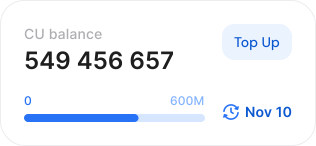

# What counts as a CU

In our **Shared Node** plans, we use **CU-based pricing**. **CUs, Compute Units,** is a way to measure the computational resources that each API request consumes.


#### Request vs CU

**Requests** are the raw number of calls (e.g., an RPC method call) you make to the node, while **Compute Units** show how much computing power each call uses.


Instead of charging a fixed fee for every call, GetBlock calculates the “cost” of processing a request based on **the actual computational work involved** – such as CPU & memory usage, and disk I/O.

Here's how it works:

* Different shared node plans include different allocations of Compute Units (CUs)
* Each API call deducts an amount based on the resources it consumes
* Users can track their remaining CUs in real time on the dashboard

<figure><figcaption></figcaption></figure>

This model ensures costs are aligned with actual infrastructure usage.


**Learn More**

* [CU and rate limits](cu-and-rate-limits.md) — Check how many CUs are included in each plan.


***

### How CUs are calculated

Every API call "spends" a number of Compute Units. The total value is determined by three main factors:

1. **Base CU cost** (chain multiplier) reflecting the network's resource intensity
2. **Method-specific multiplier** which varies by API method
3. **Archive Modifier** applied when a request is served by an archive node

The total Compute Units for an API call are calculated using the following formula:

$$
\text{Total CU} = \text{Chain Multiplier} \times \text{Method Multiplier} \times \text{Archive Modifier}
$$

Where:

* **Archive Modifier = 1** for standard full-node requests
* **Archive Modifier = 2** for requests served by archive endpoint

***

#### 1. Chain-based multipliers

Not all blockchains are built or operate the same way. GetBlock accounts for inherent differences between networks by assigning **chain multipliers** based on factors such as:

* Protocol complexity and the size of the blockchain data
* Node infrastructure costs
* Operational overhead

Here’s how blockchains are grouped based on their average resource intensity:

<table><thead><tr><th width="340.78125" align="center">Chains</th><th width="110.8125" align="center">Multiplier</th><th align="center">Explanation</th></tr></thead><tbody><tr><td align="center">Algorand, Bitcoin, Bitcoin Cash, Dash, Dogecoin, Ethereum Classic, Kusama, Litecoin, Near, OKB, Polkadot, Rootstock, Scroll, Shiba Inu, Sonic, Syscoin, Telos, Zcash, <em>others</em></td><td align="center">10</td><td align="center">Low per-request resource cost and write/read complexity</td></tr><tr><td align="center">Aptos, Arbitrum, Arbitrum Nova, Avalanche, BNB Smart Chain, Base, Blast, Cardano, Cosmos, Cronos, Ethereum, Filecoin, Flow, Gnosis, Harmony, Kaia, Linea, Moonbeam, OKT, Optimism, Polygon, Polygon zkEVM, StarkNet, Tezos, Tron, XRP, opBNB, zkSync</td><td align="center">20</td><td align="center">Moderate resource intensity</td></tr><tr><td align="center">Allora, Avail, Bahamut, Chiliz, Ronin, Stellar, Zilliqa, Xphere</td><td align="center">30</td><td align="center">Moderate–high resource intensity</td></tr><tr><td align="center">Solana, Sui, TON, 0g, Akash, Atleta, B3, Berachain, Bitlayer, Botanix, Celo, Core, Corn, Cronos zkEVM, Electroneum, Etherlink, Flare, Goat, Gravity, IOTA, IOTA EVM, Immutable zkEVM, Incentiv, Ink, Lens, Matchain, Metis, Midnight, Monad, Movement, Nervos, Oasis, Rollux, SEI, Siacoin, Somnia, Soneium, Stacks, Swellchain, TAC, Taiko, Tenet, Unichain, XDC, Xai, Zora</td><td align="center">50</td><td align="center">High resource intensity: high throughput, large state or complex execution environments</td></tr></tbody></table>

***

#### 2. Method-specific multipliers

Different API methods **put different loads on backend nodes**. For example:

* <mark style="color:green;">`eth_blockNumber`</mark> is lightweight since it just returns the latest block number.
* <mark style="color:green;">`trace_replayBlockTransactions`</mark> executes a full replay of all txs in a block and can be extremely heavy.

Therefore, individual blockchain methods have their own multipliers, depending on how computationally demanding each particular operation is.

The example table below shows some Ethereum blockchain methods with their associated multipliers and total CU calculated **for the full node queries**.

<table><thead><tr><th width="271.0625">Ethereum RPC Method</th><th align="center">Method Multiplier</th><th align="center">Base Chain Multiplier</th><th align="center">Total CU</th></tr></thead><tbody><tr><td><code>eth_blockNumber</code></td><td align="center">1</td><td align="center">20</td><td align="center">20</td></tr><tr><td><code>eth_getTransactionByHash</code></td><td align="center">1</td><td align="center">20</td><td align="center">20</td></tr><tr><td><code>debug_traceTransaction</code></td><td align="center">2</td><td align="center">20</td><td align="center">40</td></tr><tr><td><code>debug_traceBlock</code></td><td align="center">2</td><td align="center">20</td><td align="center">40</td></tr><tr><td><code>trace_call</code></td><td align="center">2</td><td align="center">20</td><td align="center">40</td></tr><tr><td><code>trace_transaction</code></td><td align="center">2</td><td align="center">20</td><td align="center">40</td></tr><tr><td><code>txpool_status</code></td><td align="center">2</td><td align="center">20</td><td align="center">40</td></tr><tr><td><code>trace_replayTransaction</code></td><td align="center">4</td><td align="center">20</td><td align="center">80</td></tr></tbody></table>

> Calculation example for <mark style="color:green;">`debug_traceTransaction`</mark>:\
> \
> $$20\ (\text{Ethereum base multiplier}) \times 2\ (\text{method multiplier}) = \mathbf{40\ CU}$$

For full details on all methods - including exact multipliers and total CU values for each protocol - please refer to our [Compute Units page](https://getblock.io/pricing/compute-units/).

***

#### 3. Archive modifier

GetBlock Shared Node endpoints can be configured in [Archive Mode](../endpoint-setup/enabling-archive-mode.md) to provide historical state access from managed archive nodes.&#x20;

To reflect the heavier load on node infrastructure, requests to these endpoints use an Archive Modifier of 2 applied on top of an existing method multiplier.

_Example:_ Ethereum (chain multiplier = 20), `debug_traceTransaction` (method multiplier = 2):

* Regular full-node request: `20 × 2 × 1 = 40 CU`
* Archive-mode request: `20 × 2 × 2 = 80 CU` (archive modifier applied)

The table below shows CU costs for some Ethereum RPC methods when requests are sent to an archive-enabled endpoint (Archive Modifier = 2).

<table data-full-width="false"><thead><tr><th width="227.4296875">Ethereum RPC Method</th><th align="right">Method Multiplier</th><th align="right">Base Chain Multiplier</th><th align="right">Archive Modifier</th><th align="right">Total CU (Archive Endpoint)</th></tr></thead><tbody><tr><td><code>eth_blockNumber</code></td><td align="right">1</td><td align="right">20</td><td align="right">2</td><td align="right">40</td></tr><tr><td><code>eth_getTransactionByHash</code></td><td align="right">1</td><td align="right">20</td><td align="right">2</td><td align="right">40</td></tr><tr><td><code>debug_traceTransaction</code></td><td align="right">2</td><td align="right">20</td><td align="right">2</td><td align="right">80</td></tr><tr><td><code>debug_traceBlock</code></td><td align="right">2</td><td align="right">20</td><td align="right">2</td><td align="right">80</td></tr><tr><td><code>trace_call</code></td><td align="right">2</td><td align="right">20</td><td align="right">2</td><td align="right">80</td></tr><tr><td><code>trace_transaction</code></td><td align="right">2</td><td align="right">20</td><td align="right">2</td><td align="right">80</td></tr><tr><td><code>txpool_status</code></td><td align="right">2</td><td align="right">20</td><td align="right">2</td><td align="right">80</td></tr><tr><td><code>trace_replayTransaction</code></td><td align="right">4</td><td align="right">20</td><td align="right">2</td><td align="right">160</td></tr></tbody></table>


#### The Archive Modifier is applied to all requests sent to an archive-enabled endpoint.

If a request is routed to an archive endpoint, the Archive Modifier = 2 — even if the specific method does not require historical state.

Requests sent to full node endpoints use Archive Modifier = 1.


The tables above includes selected RPC methods for illustration purposes. The complete list of all CU costs is maintained on the [Compute Units page](https://getblock.io/pricing/compute-units/).&#x20;

***

### Why we use the CU system at GetBlock?

#### 🛡️ **It helps keep infrastructure stable**

Tracking and pricing requests based on how “heavy” they are:

* Discourages abuse (like hammering archive calls) and protects node performance & uptime.
* Makes it easier for GetBlock to scale and optimize resources behind the scenes.

#### 💰 **Compute Units provide a fair, usage-based billing model**

A simple per-request pricing model would charge the same for all methods, which isn’t scalable or logical. The CU model fixes this imbalance.

#### ⚙️ To h**elp developers build smarter**

Because each API call has a clear CU cost, you can spot inefficiencies quickly (e.g. which parts of your dApp consume the most), making it easier to fine-tune performance.
