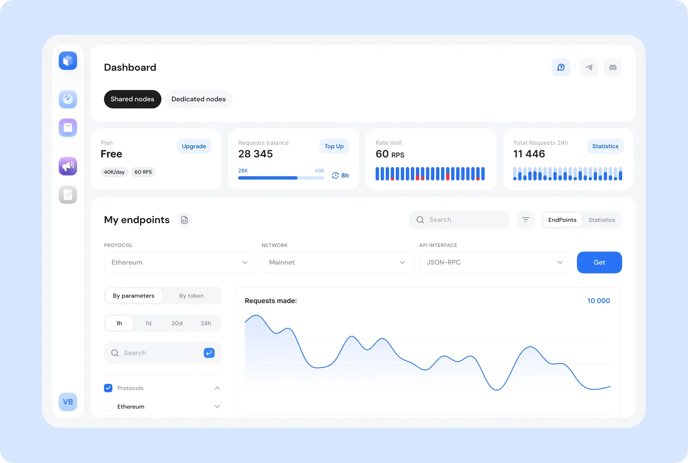

# Basic-level Model-Context Protocol with GetBlock API Endpoints

The Model-Context Protocol (MCP) is an open standard created by [Anthropic](https://www.anthropic.com/news/model-context-protocol) that provides a universal way for AI assistants to connect to external data sources and tools. 

With MCP, AI applications can connect to various data sources (e.g., local files, databases), tools (e.g., search engines, calculators), and workflows (e.g., specialized prompts)—enabling them to access key information and perform tasks effectively.

You can picture MCP as a "USB-C for AI":

* **Before USB-C:** Every device had different charging ports
* **After USB-C:** One universal port works with everything

Similarly, MCP creates a universal "port" for AI assistants to connect to data.

In short, MCP helps AI applications access the right information at the right time, thereby reducing the likelihood of incorrect or misleading responses. 

In this guide, you will learn how to: 

* Get a GetBlock Access Token for Ethereum's API endpoint
* A basic MCP server with three core capabilities:
  * Check ETH balance for any Ethereum address
  * Get current gas prices
  * Retrieve the latest block number
* Claude configuration and deployment

#### Prerequisites

1. Basic understanding of JavaScript
2. Must have installed [Node](https://nodejs.org/en/download/current) and [npm](https://docs.npmjs.com/downloading-and-installing-node-js-and-npm/)
3. A GetBlock [account](https://account.getblock.io/sign-up)
4. [Claude Desktop](https://claude.ai/download)

#### Technology Stack:

* Node.js: JavaScript runtime environment that lets developers create servers, web apps, command line tools and scripts.
* [Model Context Protocol SDK:](https://www.npmjs.com/package/@modelcontextprotocol/sdk) This allows applications to provide the context for LLMs in a standardized way.
* [Zod](https://www.npmjs.com/package/zod): TypeScript-first validation library.
* [Ethers](https://app.gitbook.com/u/1wJGT7OT7jepsEvyRiFTRZlbXjF3): A library for interacting with the Ethereum blockchain and its ecosystem.

### Step 1: Project Initialization

1. Set up your project directory using this command:

```bash
# create project folder
mkdir basic-ethereum-mcp
# navigate through the folder
cd basic-ethereum-mcp
# initialise npm
npm init -y
```

2. Install Dependencies:

```bash
npm install @modelcontextprotocol/sdk zod ethers
```

* `@modelcontextprotocol/sdk`: Core MCP server functionality that provides `McpServer` class and transport mechanisms.
* `ethers`: Js library for interacting with Blockchain e.g Ethereum.
* `zod`: a schema that validates user inputs before processing.

3. Configure `Package.json`

<pre class="language-json"><code class="lang-json">{
  "name": "basic-ethereum-mcp",
  "version": "1.0.0",
<strong>  "type": "module",
</strong>  "description": "MCP server with GetBlock API integration",
  "main": "server.js",
  "bin": {
<strong>    "mcp-ethereum": "./server.js"
</strong>  },
  "scripts": {
<strong>    "start": "node server.js"
</strong>  },
  "keywords": ["mcp", "blockchain", "ethereum", "getblock"],
  "author": "Your Name",
  "license": "MIT",
  "dependencies": {
    "@modelcontextprotocol/sdk": "^1.22.0",
    "ethers": "^6.15.0",
    "zod": "^3.25.76"
  }
}
</code></pre>

* `"type": "module"` - Enables ES6 import/export syntax (required for MCP SDK)
* `"main": "server.js"` - Specifies entry point of your application
* `"bin"` - Allows running server as `npx mcp-ethereum` command
* `"scripts"` - Defines shortcuts like `npm start`

4.  Get GetBlock's API Access Token

    1. Log in to your [GetBlock account](https://account.getblock.io/)
    2. On your dashboard, scroll and click on **Get Endpoint**
    3. Select the Ethereum **Mainnet** network
    4. Under **API Interface,** select JSON-RPC
    5. Click on **Create** to get your endpoint

    &#x20;    Your endpoint will look like:

    ```json
    https://go.getblock.us/{YOUR-ACCESS-TOKEN}/
    ```

    f. Save the token in `.env` file in this format:

    ```javascript
    GETBLOCK_TOKEN=your_token
    ```


    <div data-gb-custom-block data-tag="hint" data-style="warning" class="hint hint-warning"><p>Keep your endpoint safe, as it contains an access token</p></div>
5. Project Structure

Create the following files to have a basic structure for your project:

```bash
├── server.js            // Main application
└── .env                // Environment variables
└── .gitignore          // Git ignore file
```

### Step 2: Server File Setup

#### 1. Import dependencies


Your script will be written inside `server.js`


```javascript
import { McpServer } from "@modelcontextprotocol/sdk/server/mcp.js";
import { StdioServerTransport } from "@modelcontextprotocol/sdk/server/stdio.js";
import { ethers } from "ethers";
import { z } from "zod";

// Validate environment
const GETBLOCK_TOKEN = process.env.GETBLOCK_TOKEN;

// Initialise Ethers provider with GetBlock
const provider = new ethers.JsonRpcProvider(
  `https://go.getblock.us/${GETBLOCK_TOKEN}/`
);
```

**What this does:**

* Reads API token from environment variable
* Creates Ethers provider pointing to GetBlock endpoint
* All blockchain queries route through GetBlock's infrastructure

#### 3. Create MCP server instance

```javascript
// Create MCP server with modern API
const server = new McpServer({
  name: "ethereum-mcp-server",
  version: "1.0.0",
});

console.error("✅ Ethereum MCP Server initialized");
```

**Configuration:**

* `name` - Unique identifier for your server
* `version` - Semantic version for tracking updates
* `console.error()` - Logs to stderr (separate from data output)

#### 4.  Implement Blockchain Query Tools

**Tool 1: Get ETH Balance**

This tool fetches the ETH balance for any Ethereum address:

<pre class="language-javascript"><code class="lang-javascript">server.tool(
<strong>  "get_eth_balance",
</strong>  {
    address: z
      .string()
      .regex(/^0x[a-fA-F0-9]{40}$/)
      .describe("Ethereum address (0x followed by 40 hex characters)"),
  },
  async ({ address }) => {
    try {
      // Fetch balance from blockchain
      const balanceWei = await provider.getBalance(address);

      // Convert Wei to ETH
      const balanceEth = ethers.formatEther(balanceWei);

      // Return structured response
      return {
        content: [
          {
            type: "text",
            text: JSON.stringify(
              {
                address: address,
                balance: balanceEth,
                unit: "ETH",
                balanceWei: balanceWei.toString(),
              },
              null,
              2
            ),
          },
        ],
      };
    } catch (error) {
      return {
        content: [
          {
            type: "text",
            text: JSON.stringify({
              error: error.message,
              address: address,
            }),
          },
        ],
        isError: true,
      };
    }
  }
);
</code></pre>

**What this does:**&#x20;

* Register the tool
* Validates Ethereum address format
* Queries Ethereum blockchain through GetBlock
* Returns balance in Wei (smallest unit)
* Converts Wei to human-readable ETH e.g `1500000000000000000` → `"1.5"`
* Return MCP content format
  * JSON stringified with 2-space indentation
  * Includes raw Wei value for precision

**Tool 2: Get Gas Price**

This tool retrieves current Ethereum gas prices:&#x20;

<pre class="language-javascript"><code class="lang-javascript"><strong>server.tool("get_gas_price", {}, async () => {
</strong>  try {
    // Fetch current fee data
    const feeData = await provider.getFeeData();

    // Convert to Gwei
    const gasPriceGwei = ethers.formatUnits(feeData.gasPrice, "gwei");

    return {
      content: [
        {
          type: "text",
          text: JSON.stringify(
            {
              gasPrice: gasPriceGwei,
              unit: "Gwei",
              gasPriceWei: feeData.gasPrice.toString(),
              maxFeePerGas: feeData.maxFeePerGas
                ? ethers.formatUnits(feeData.maxFeePerGas, "gwei")
                : null,
              maxPriorityFeePerGas: feeData.maxPriorityFeePerGas
                ? ethers.formatUnits(feeData.maxPriorityFeePerGas, "gwei")
                : null,
            },
            null,
            2
          ),
        },
      ],
    };
  } catch (error) {
    return {
      content: [
        {
          type: "text",
          text: JSON.stringify({ error: error.message }),
        },
      ],
      isError: true,
    };
  }
});
</code></pre>

**What it does:**&#x20;

* Register the tool
* Fetch gas price
* Converts the gas price from Wei to Gwei (1 Gwei = 10^9 Wei)

**Tool 3: Get Block Number**

This tool returns the latest Ethereum block number.

```javascript
server.tool("get_block_number", {}, async () => {
  try {
    // Fetch latest block number
    const blockNumber = await provider.getBlockNumber();

    return {
      content: [
        {
          type: "text",
          text: JSON.stringify(
            {
              blockNumber: blockNumber,
              timestamp: new Date().toISOString(),
              network: "Ethereum Mainnet",
            },
            null,
            2
          ),
        },
      ],
    };
  } catch (error) {
    return {
      content: [
        {
          type: "text",
          text: JSON.stringify({ error: error.message }),
        },
      ],
      isError: true,
    };
  }
});
```

**What this does:**

* Get the latest block
* Includes server timestamp for correlation

#### **5: Server Startup and Connection**

1. **Create a Server connection with Claude desktop**

```javascript
async function main() {
  try {
    // Create stdio transport for Claude Desktop
    const transport = new StdioServerTransport();

    // Connect server to transport
    await server.connect(transport);

    console.error("🚀 Ethereum MCP Server is running!");
    console.error("📡 Connected via stdio transport");
    console.error("⏳ Waiting for tool calls...");
  } catch (error) {
    console.error("❌ Failed to start server:", error);
    process.exit(1);
  }
}
```

What this does:&#x20;

* `const transport = new StdioServerTransport()`: create communication channel between the client(Claude Desktop) and the server(script)
* Links MCP server to transport mechanism
* Registers all tools with MCP client
* Starts listening for incoming requests


2. Start the server and shut down:

```javascript
// Handle graceful shutdown
process.on("SIGINT", () => {
  console.error("\n👋 Shutting down...");
  process.exit(0);
});

// Start the server
main().catch((error) => {
  console.error("💥 Fatal error:", error);
  process.exit(1);
});
```

**What this does:**&#x20;

* `SIGINT` - Handles Ctrl+C interrupts
* When the user runs `npm run start` , this will start the server.

### Step 3: Configuration and Deployment

1. Open your Claude Desktop
2. Click on **Settings**
3. Scroll down and Click on **Developer**
4. Under **Local MCP Server**, click on `Edit Config`

<figure><figcaption></figcaption></figure>

5. Add the following **configuration**:



**Config Location:**

```bash
~/Library/Application Support/Claude/claude_desktop_config.json
```

**Edit Configuration:**

```bash
code ~/Library/Application\ Support/Claude/claude_desktop_config.json
```

**Add the following configuration:**

```json
{
  "mcpServers": {
    "ethereum": {
      "command": "node",
      "args": [
        "/Users/YOUR_USERNAME/basic-ethereum-mcp/server.js"
      ],
      "env": {
        "GETBLOCK_TOKEN": "your-actual-getblock-token-here"
      }
    }
  }
}
```



**Config Location:**

```
%APPDATA%\Claude\claude_desktop_config.json
```

**Add the following configuration:**

```json
{
  "mcpServers": {
    "ethereum": {
      "command": "node",
      "args": [
        "C:\\Users\\YOUR_USERNAME\\basic-ethereum-mcp/\\server.js"
      ],
      "env": {
        "GETBLOCK_TOKEN": "your-actual-getblock-token-here"
      }
    }
  }
}
```





**Config Location:**

```
~/.config/Claude/claude_desktop_config.json
```

**Add the following configuration:**

```json
{
  "mcpServers": {
    "ethereum": {
      "command": "node",
      "args": [
        "/home/YOUR_USERNAME/basic-ethereum-mcp//server.js"
      ],
      "env": {
        "GETBLOCK_TOKEN": "your-actual-getblock-token-here"
      }
    }
  }
}
```



### Step 4: Testing Your Server

**Test 1: Check ETH Balance**

```
What's the ETH balance of 0xd1af2dac4e0a9d1f58b99e2f42bc0320ed74a7cd?
```


Permit Claude to query the data


**Expected:** Claude calls `get_eth_balance` tool and shows balance e.g&#x20;

> **The ETH balance for address 0xd1af2dac4e0a9d1f58b99e2f42bc0320ed74a7cd is 0.000104792219532 ETH (approximately 104,792,219,532,000 wei).**

**Test 2: Gas Price**

```
What's the current Ethereum gas price?
```

**Expected:** Claude calls `get_gas_price` tool and shows price in Gwei e.g&#x20;

> The current Ethereum gas price is **0.071638489 Gwei** (or about 71.6 million wei).
>
> For EIP-1559 transactions:
>
> * **Max Fee Per Gas**: 0.143276976 Gwei
> * **Max Priority Fee Per Gas**: 0.000000002 Gwei
>
> This is relatively low gas pricing, which means it's a good time for transactions on the Ethereum network.

**Test 3: Block Number**

```
What's the latest Ethereum block number?
```

**Expected:** Claude calls `get_block_number` tool and shows block e.g&#x20;

> The latest Ethereum block number is **23,811,857** on the Ethereum Mainnet, as of 2025-11-16 at 12:50:34 UTC.

#### Step 4: Advanced Tests

**Test 4: Multiple Queries**

```
Check the balance for 0xd8dA6BF26964aF9D7eEd9e03E53415D37aA96045 
and tell me if the current gas price is high or low
```

**Expected:** Claude calls both tools and provides analysis e.g&#x20;

> **Balance for 0xd1af2dac4e0a9d1f58b99e2f42bc0320ed74a7cd:**
>
> * **0.000104792219532 ETH**
>
> **Current Gas Price Assessment:** The current gas price of **0.063 Gwei** is **very low**. This is excellent for making transactions!
>
> For context:
>
> * **Low gas**: < 20 Gwei
> * **Average gas**: 20-50 Gwei
> * **High gas**: 50-100 Gwei
> * **Very high gas**: > 100 Gwei
>
> At 0.063 Gwei, you're looking at extremely cheap transaction costs right now. This is a great time to interact with the Ethereum network if you're planning any transactions.

**Test 5: Natural Language**

```
Is now a good time to send an Ethereum transaction?
```

**Expected:** Claude checks gas price and provides a recommendation e.g&#x20;

> Yes, **now is an excellent time** to send an Ethereum transaction! Here's why:
>
> The current gas price of 0.060 Gwei is extremely low. To put this in perspective, a standard ETH transfer (21,000 gas units) would only cost about:
>
> **0.060 Gwei × 21,000 = 0.00000126 ETH** (roughly $0.004 USD)
>
> This is about as cheap as gas fees get on Ethereum. Gas prices can spike to 30-100+ Gwei during busy periods, which would make the same transaction 500-1600x more expensive.
>
> **However, one thing to consider:** The address you checked (0xd1af...a7cd) only has 0.0001048 ETH. While the gas is cheap right now, you'd still need to ensure you're leaving enough in the wallet to cover the gas fee for any transaction you want to make.
>
> If you're planning to send transactions from a different address with more funds, or if you're just doing something simple like a basic ETH transfer, this is definitely an opportune moment to take advantage of these low gas prices!

### Troubleshooting

If you experience this error:&#x20;

<figure><figcaption></figcaption></figure>

This means that:

1. Your GetBlock token is missing or incorrect
2. The base URL is not correct.&#x20;


Each location has a unique URL




```bash
https://go.getblock.us/7hys368hus...
```



```bash
https://go.getblock.asia/f782e8ec54....
```



```bash
https://go.getblock.io/d4067b3cc......
```



### Conclusion

In this guide, you've successfully functional MCP server that connects AI assistants to blockchain data using the GetBlock API. Now you know what MCP is, how to set up your project, get your GetBlock Token and get a response directly from your Claude.&#x20;

#### Additional Resources

* [MCP docs](https://modelcontextprotocol.io/)
* [MCP SDK](basic-level-model-context-protocol-with-getblock-api-endpoints.md#id-5-server-startup-and-connection)
* [Basic Ethereum MCP repo](https://github.com/GetBlock-io/guides/tree/main/basic-ethereum-mcp)
