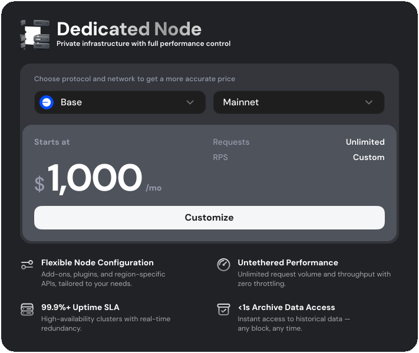
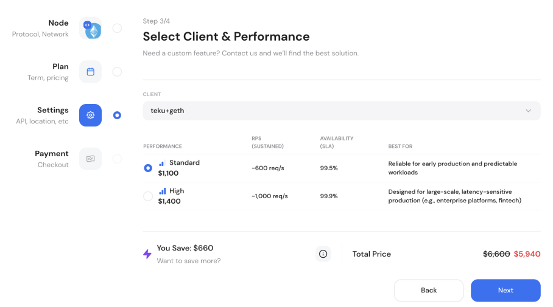

# Dedicated node performance tiers

Dedicated Nodes are fully private blockchain nodes deployed and managed for your team. With two distinct performance presets, you can balance throughput, SLA, and budget to fit your workload.

Available tiers:

1. **High Performance Tier:** Designed to provide maximum available resources, throughput, and reliability. It is intended for applications where performance and availability are critical. The focus is on delivering the highest service levels and supporting the most demanding production workloads.
2. **Standard Performance Tier:** Designed to offer enterprise-grade performance sufficient for the majority of professional and business use cases, but at a more cost-efficient level. It targets demanding business applications and sustained usage, but without the additional (and sometimes excessive) headroom reserved for High Performance tier.

By providing these options, GetBlock helps you to deploy Dedicated Nodes that are tailored to your application’s technical, operational, and budget requirements.

***

### Dedicated Node tiers overview

When deploying a Dedicated Node, you can choose between High and Standard setups to align with your application’s resource needs and expected workload.

* Select **High** if your workload is latency-sensitive, demands very high concurrent throughput, or is critical to business continuity.
* Select **Standard** for typical production apps, where workload is within supported performance bounds.

Configuring tiers is available for all supported protocols unless there are specific infrastructure limitations for a given network. In this case, a chain will only support a single tier.&#x20;


Always check available configurations in your dashboard


#### _High vs Standard tier comparison table_

<table data-header-hidden><thead><tr><th width="208.7109375">Feature </th><th>High Performance</th><th>Standard Performance</th></tr></thead><tbody><tr><td><strong>Resource allocation</strong></td><td>Maximum hardware and bandwidth</td><td>Balanced hardware profile</td></tr><tr><td><strong>Throughput</strong></td><td>Highest supported </td><td>High </td></tr><tr><td><strong>SLA</strong></td><td>99.9% uptime</td><td>99.5% uptime</td></tr><tr><td><strong>Recommended for</strong></td><td>Applications with high transaction volumes &#x26; large user bases, mission-critical systems, and any workflow where latency and throughput are the top priority</td><td>Most production dApps, wallets, and enterprise tools or projects that need guaranteed resources but do not require the maximum performance tier</td></tr></tbody></table>

***

### Dedicated Node pricing

Dedicated Nodes are billed at a set monthly rate determined by configured settings:

1. **Performance tier**: Total cost scales with the performance tier selected – High tier is priced at a premium relative to the Standard tier.
2. **Blockchain network**: Each protocol has different hardware requirements, which impact both High and Standard tier pricing.
3. **Node mode**: Full or Archive.
4. **Client parameters**.

Refer to your Dashboard for up-to-date pricing details and protocol-specific options.


Monthly costs are always shown during configuration in the **Dashboard** for each supported network and region.


<figure><figcaption>
Dedicated Node pricing in the GetBlock Dashboard
</figcaption></figure>

***

### Steps to configure dedicated node tiers&#x20;

To select a tier during node setup, open the Dedicated Node dashboard:

1. Select protocol, network, deployment region, node mode, and a preferred client.
2. As a final step, choose the Performance Tier (High or Standard) and required API interfaces.&#x20;

<figure><figcaption></figcaption></figure>

3. Review updated performance and pricing details.

Your dedicated node will be ready for use upon activation. To switch between tiers after deploying, reach out to support.&#x20;

***

#### **Need a more customized setup?**

For advanced workloads or unique requirements, our engineering team can help craft a custom private node solution beyond the High/Standard presets. [Contact us](https://getblock.io/contact/) for tailored deployments.
