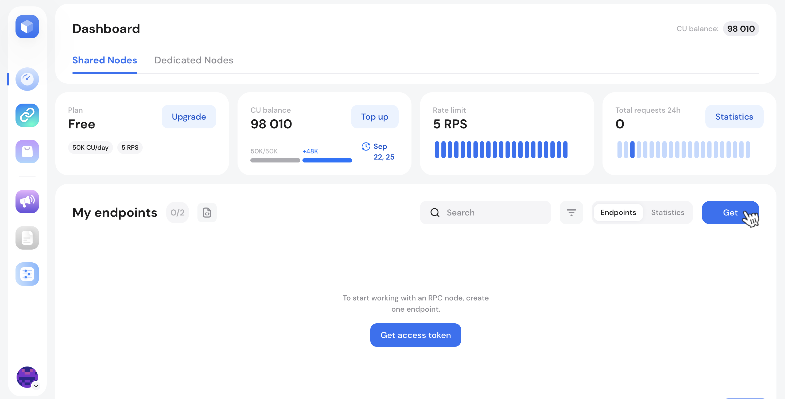
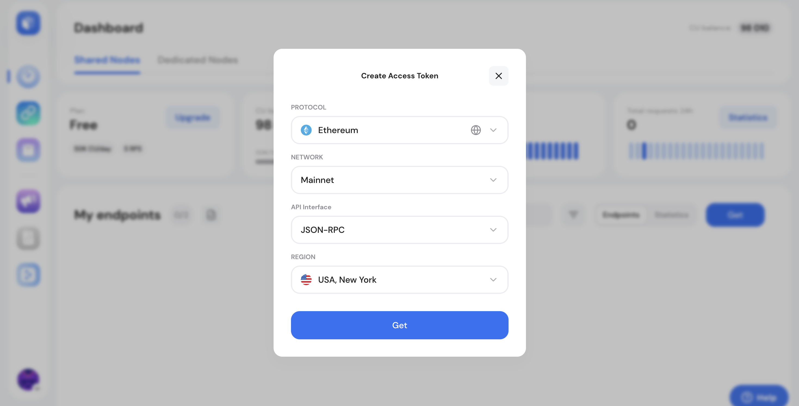
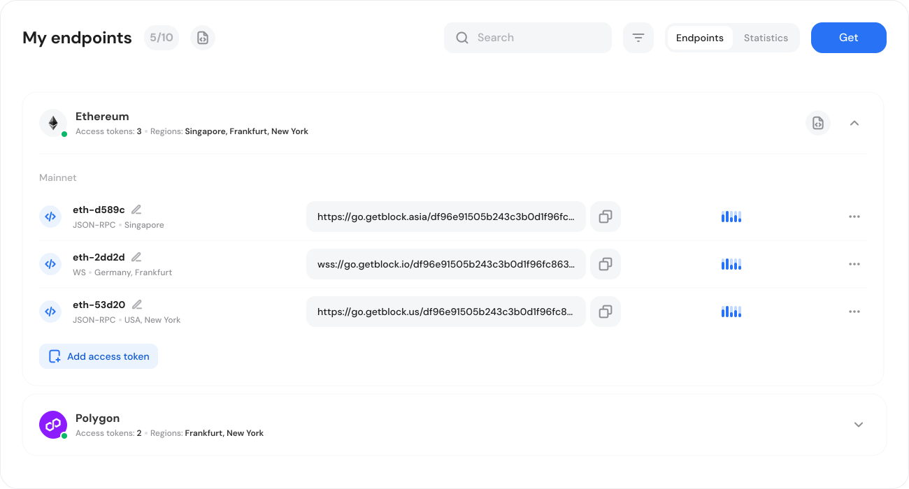

# Creating node endpoints

This short guide shows you how to **create an RPC endpoint** (an RPC URL) for any supported protocol in your GetBlock Shared Node dashboard to connect it to your app, script, or wallet.&#x20;


In GetBlock, an _endpoint URL_ includes your unique **Access Token** — the credential that authenticates RPC requests. GetBlock’s UI sometimes labels the whole endpoint provisioning flow “Get Access Token” because a new RPC URL is created together with the token.&#x20;

Related:

* [Access token management ](../../getting-started/authentication-with-access-tokens.md)
* [GetBlock Deploys Major Security Upgrade: Introducing Access Tokens](https://getblock.io/blog/getblock-deploys-major-security-upgrade-introducing-access-tokens/)


***

The steps below cover how to generate a new endpoint URL with an Access Token:



Log in to your GetBlock account and navigate to the **Dashboard**.



Scroll down to find the **My Endpoints** section on the Dashboard.



Click **Get** to open the endpoint setup menu.&#x20;

<figure><figcaption></figcaption></figure>



In the modal that opens, select:

* The desired blockchain **protocol** (Ethereum, BNB Chain, Polygon, etc.)
* The **network** you want to interact with (mainnet or testnet)
* The **API** interface that you need (e.g., JSON-RPC, WebSockets, GraphQL)
* One of the available server **locations** (Frankfurt, New York, or Singapore)&#x20;

<figure><figcaption></figcaption></figure>



Click 'Get' and have the endpoint URL with an access token generated.



Generate and add as many access tokens as required for this protocol. Each token is a unique endpoint for you and your application to interact with the blockchain.


All GetBlock endpoints follow a predictable format. The visible difference is the hostname reflecting the region selected during the setup.&#x20;

**Endpoint examples**:

```markup
EU (Frankfurt):   https://go.getblock.io/<ACCESS_TOKEN>/
US (New York):    https://go.getblock.us/<ACCESS_TOKEN>/
Asia (Singapore): https://go.getblock.asia/<ACCESS_TOKEN>/
```

The token encodes the protocol, networks, and routing on the server — clients don’t need to specify a chain in the URL.


***

### Viewing and managing endpoints

The created URL is shown on the endpoints list so you can copy it and start calling the node.&#x20;

<figure><figcaption></figcaption></figure>


Because the Access Token is embedded, **the URL&#x20;**_**is**_**&#x20;the credential**. Keep it secret and store securely. If the URL is exposed, regenerate or revoke it from your GetBlock account.

