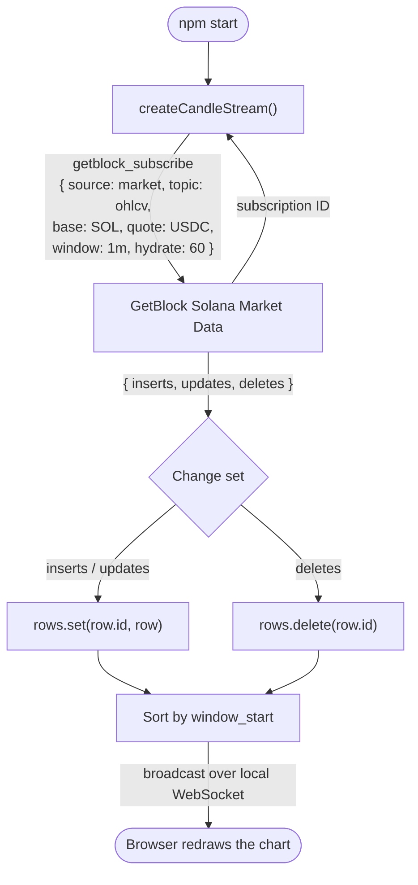

# How to Build a Live Solana Candlestick Chart with GetBlock Solana Market Data

Every price chart starts the same way: you need candles, and Solana does not hand you any. What the chain gives you is raw transactions across dozens of DEX programs, each with its own instruction layout. To draw a single one-minute candle, you have to subscribe to blocks, decode swaps from Raydium, Orca, Meteora, and the rest, normalize them into a common trade shape, group those trades into time buckets, and keep the whole pipeline correct while slots keep arriving. That is weeks of work before you render a single wick.

[**GetBlock Solana Market Data**](https://app.gitbook.com/s/FOeg95CadVyFvyLi70Bh/solana-market-data) does that aggregation for you and streams the finished candles over WebSocket, complete with a backfill so your chart is populated the moment it opens.


The GetBlock Solana Market service is a billable service.&#x20;


In this guide, you'll build a **live SOL/USDC candlestick chart** that backfills the last hour on startup and then updates in real time as trades land.

### What you'll build

A `createCandleStream(options, onSeries)` function that:

1. Opens a WebSocket to the Solana Market Data stream and subscribes to the `ohlcv` topic.
2. Seeds the chart with the last 60 one-minute candles from the `hydrate` backfill.
3. Upserts rows by their stable `id`, so the candle that is still open is revised in place.
4. Removes rows that arrive in `deletes` as they fall out of the window.
5. Emits a time-sorted candle array that the browser chart redraws whenever it changes.

### How it works




The candle for the window still in progress is sent repeatedly under the **same `id`** as more trades land. Key your state by `id` and overwrite. If you append every message to an array instead, one minute of trading becomes dozens of duplicate candles and the chart marches sideways with a flat price.


## Prerequisites

* **Node.js 20+** — the examples use the built-in global `WebSocket`, so no client library is needed.
* A [**GetBlock account**](https://account.getblock.io)
* A [**Solana Market Data API key**](https://account.getblock.io/products/solana-data-stream#api-keys) with the product activated on it.
* Basic JavaScript knowledge.

## Project Setup



### Create the project and install dependencies

The stream client needs nothing extra, but you'll serve the chart to a browser, so install a WebSocket **server** and `dotenv`.

```bash
mkdir solana-candles && cd solana-candles
npm init -y
npm pkg set type=module
npm install ws dotenv
mkdir public
```



### Add your API key

Create a `.env` file in the project root:

```bash
GETBLOCK_API_KEY=your_api_key_here
```


Solana Market Data passes the key as an `apiKey` **query parameter**, not an `Authorization` header. Because it sits in the URL, keep it server-side — never ship it to the browser.




### Build the candle stream

This is the core of the project. It subscribes, reconciles the change sets into a `Map` keyed by `id`, and hands a sorted array to a callback.


```js
import 'dotenv/config';

const STREAM_URL =
  `wss://stream.eu-central-1.getblock.io/v1/solana-mainnet/stream?apiKey=${process.env.GETBLOCK_API_KEY}`;

export const SOL = 'So11111111111111111111111111111111111111112';
export const USDC = 'EPjFWdd5AufqSSqeM2qN1xzybapC8G4wEGGkZwyTDt1v';

// The chart wants seconds and numbers; the API sends ISO timestamps and
// strings (strings preserve precision, so convert only at the edge).
function toSeries(rows) {
  return [...rows.values()]
    .map((r) => ({
      time: Math.floor(new Date(r.window_start).getTime() / 1000),
      open: Number(r.open),
      high: Number(r.high),
      low: Number(r.low),
      close: Number(r.close),
    }))
    .sort((a, b) => a.time - b.time);
}

export function createCandleStream(options, onSeries) {
  const { base = SOL, quote = USDC, window = '1m', hydrate = 60 } = options;
  const rows = new Map();
  const ws = new WebSocket(STREAM_URL);

  ws.onopen = () => {
    ws.send(JSON.stringify({
      jsonrpc: '2.0',
      id: 'getblock.io',
      method: 'getblock_subscribe',
      params: [{
        source: 'market',
        topic: 'ohlcv',
        params: { base, quote, window, hydrate, throttle: '1s' },
      }],
    }));
  };

  ws.onmessage = (event) => {
    const msg = JSON.parse(event.data);

    // The first reply is the subscription ID, not a candle.
    if (typeof msg.result === 'string') {
      console.log(`Subscribed to ${window} candles:`, msg.result);
      return;
    }

    const { inserts = [], updates = [], deletes = [] } = msg.params.result;

    // Upsert by id, then remove deletes by id. `updates` revises the candle
    // that is still open; `deletes` are rows falling out of the hydrate window.
    for (const row of [...inserts, ...updates]) rows.set(row.id, row);
    for (const row of deletes) rows.delete(row.id);

    onSeries(toSeries(rows));
  };

  ws.onclose = (event) => {
    console.error(`Stream closed (code ${event.code}). Retrying in 3s…`);
    setTimeout(() => createCandleStream(options, onSeries), 3000);
  };

  return ws;
}
```



Candle rows arrive with the payload nested under `params.result`, not `result`. Only the opening acknowledgement uses a top-level `result`, and it is a plain string — which is exactly what the `typeof msg.result === 'string'` check catches.




### Serve the chart to a browser

A small HTTP server serves the page and relays each new series via a local WebSocket. Keeping the API key on this side means the browser never sees it.


```js
import http from 'node:http';
import fs from 'node:fs';
import { WebSocketServer } from 'ws';

export function startServer(port = 8080) {
  const page = fs.readFileSync(new URL('./public/index.html', import.meta.url));

  const server = http.createServer((req, res) => {
    res.writeHead(200, { 'Content-Type': 'text/html' });
    res.end(page);
  });

  const wss = new WebSocketServer({ server });
  let latest = [];

  // A browser that connects late still gets the current chart immediately.
  wss.on('connection', (socket) => {
    if (latest.length) socket.send(JSON.stringify(latest));
  });

  server.listen(port, () => console.log(`Chart on http://localhost:${port}`));

  return function broadcast(series) {
    latest = series;
    const payload = JSON.stringify(series);
    for (const socket of wss.clients) {
      if (socket.readyState === socket.OPEN) socket.send(payload);
    }
  };
}
```


Now the page itself, using TradingView's Lightweight Charts from a CDN:


```html
<!doctype html>
<html>
<head>
  <meta charset="utf-8" />
  <title>SOL/USDC — live candles</title>
  <script src="https://unpkg.com/lightweight-charts@4.1.3/dist/lightweight-charts.standalone.production.js"></script>
  <style>
    body { margin: 0; font: 14px system-ui, sans-serif; background: #0f1115; color: #e6e6e6; }
    header { padding: 12px 16px; border-bottom: 1px solid #23262d; }
    h1 { margin: 0; font-size: 15px; font-weight: 600; }
    #status { color: #7a8290; font-size: 12px; margin-top: 2px; }
    #chart { height: calc(100vh - 62px); }
  </style>
</head>
<body>
  <header>
    <h1>SOL / USDC — 1m candles</h1>
    <div id="status">connecting…</div>
  </header>
  <div id="chart"></div>

  <script>
    const chart = LightweightCharts.createChart(document.getElementById('chart'), {
      layout: { background: { color: '#0f1115' }, textColor: '#e6e6e6' },
      grid: { vertLines: { color: '#1c1f26' }, horzLines: { color: '#1c1f26' } },
      timeScale: { timeVisible: true, secondsVisible: false },
      autoSize: true,
    });

    const series = chart.addCandlestickSeries({
      upColor: '#26a65b', downColor: '#e04f5f',
      wickUpColor: '#26a65b', wickDownColor: '#e04f5f',
      borderVisible: false,
    });

    const status = document.getElementById('status');
    const ws = new WebSocket(`ws://${location.host}`);

    ws.onmessage = (event) => {
      const candles = JSON.parse(event.data);

      // setData replaces the whole series, so the candle still being revised
      // is redrawn in place rather than appended as a duplicate.
      series.setData(candles);

      const last = candles[candles.length - 1];
      status.textContent =
        `${candles.length} candles · last close ${last.close.toFixed(4)} USDC`;
    };

    ws.onclose = () => { status.textContent = 'disconnected'; };
  </script>
</body>
</html>
```




### Wire it together and run

The entry point starts the server, starts the stream, and pipes one into the other.


```js
import { createCandleStream, SOL, USDC } from './candles.js';
import { startServer } from './server.js';

const broadcast = startServer(8080);

createCandleStream(
  { base: SOL, quote: USDC, window: '1m', hydrate: 60 },
  (series) => {
    broadcast(series);
    const last = series[series.length - 1];
    if (last) {
      console.log(
        `${new Date(last.time * 1000).toISOString().slice(11, 19)}  ` +
        `O ${last.open.toFixed(2)}  H ${last.high.toFixed(2)}  ` +
        `L ${last.low.toFixed(2)}  C ${last.close.toFixed(2)}  ` +
        `(${series.length} candles)`
      );
    }
  }
);
```


Start it:

```bash
node index.js
```

Then open `http://localhost:8080`

The live URL page looks like this:

<figure><figcaption></figcaption></figure>

The terminal prints the candle currently being built:


```bash
Chart on http://localhost:8080
Subscribed to 1m candles: 0x413ff763f0614355435e11aa3eb6a366
12:26:00  O 104.33  H 104.33  L 104.32  C 104.32  (60 candles)
12:26:00  O 104.33  H 104.46  L 104.32  C 104.32  (60 candles)
12:26:00  O 104.33  H 104.46  L 104.13  C 104.26  (60 candles)
12:26:00  O 104.33  H 104.46  L 104.13  C 104.32  (60 candles)
12:26:00  O 104.33  H 104.48  L 104.13  C 104.34  (60 candles)
12:26:00  O 104.33  H 104.48  L 104.13  C 104.33  (60 candles)
```


Read that output closely, because it shows the whole model working:

* The **timestamp stays at `12:26:00`** — these are all the same candle, revised.
* The **high climbs** `104.33 → 104.46 → 104.48` as bigger trades land in the window.
* The **count stays at 60** — `hydrate` holds the set size, so an old candle is evicted for each new one.



## Understanding the response

Each row in `inserts`, `updates`, and `deletes` is one candle. These are the fields the chart uses, plus the ones worth knowing about.

<table data-search="false"><thead><tr><th>Field</th><th>Type</th><th>What it tells you</th></tr></thead><tbody><tr><td><code>id</code></td><td>number</td><td>Stable identifier for the candle. The key for your local state — the open candle keeps it while it changes.</td></tr><tr><td><code>window_start</code></td><td>string</td><td>Start of the candle's period. Use this as the chart's time axis.</td></tr><tr><td><code>window_end</code></td><td>string</td><td>End of the candle's period.</td></tr><tr><td><code>window_duration</code></td><td>string</td><td>Period as an ISO 8601 duration — a <code>1m</code> window comes back as <code>PT1M</code>.</td></tr><tr><td><code>open</code></td><td>string</td><td>First price traded in the window, in the quote token.</td></tr><tr><td><code>high</code></td><td>string</td><td>Highest price traded in the window.</td></tr><tr><td><code>low</code></td><td>string</td><td>Lowest price traded in the window.</td></tr><tr><td><code>close</code></td><td>string</td><td>Latest price traded — still moving while the window is open.</td></tr><tr><td><code>open_usd</code></td><td>string</td><td>Same as <code>open</code>, converted to USD. <code>high_usd</code>, <code>low_usd</code>, <code>close_usd</code> follow the same pattern.</td></tr><tr><td><code>base_volume</code></td><td>string</td><td>Volume traded, denominated in the base token.</td></tr><tr><td><code>quote_volume</code></td><td>string</td><td>Volume traded, denominated in the quote token.</td></tr><tr><td><code>volume_usd</code></td><td>string</td><td>Volume traded, expressed in USD.</td></tr><tr><td><code>data_points</code></td><td>string</td><td>How many trades went into the candle. A low count means a thin, less reliable candle.</td></tr><tr><td><code>base</code> / <code>quote</code></td><td>string</td><td>Mint addresses of the pair, useful when one socket carries several markets.</td></tr></tbody></table>


Numbers arrive as **strings** so no precision is lost on very small token prices. Convert with `Number()` only at the point you draw or compare, and keep the string if you need to display the exact value.


## Troubleshooting

<table data-search="false"><thead><tr><th>Symptom</th><th>Likely cause</th><th>Fix</th></tr></thead><tbody><tr><td>Socket closes instantly with code <code>1006</code> and no reason</td><td>The key is rejected during the handshake, and browsers can't surface the <code>401</code></td><td>Check <code>GETBLOCK_API_KEY</code> is set and that Solana Market Data is activated on that key.</td></tr><tr><td>Chart fills with duplicate candles marching sideways</td><td>Appending each message instead of upserting by <code>id</code></td><td>Key your state by <code>row.id</code> and overwrite, as <code>candles.js</code> does.</td></tr><tr><td><code>Cannot read properties of undefined (reading 'result')</code></td><td>Treating the subscription acknowledgement as a candle notification</td><td>Return early when <code>typeof msg.result === 'string'</code>.</td></tr><tr><td><code>Value is null</code> or a blank chart from <code>setData</code></td><td>Series not sorted by time, or duplicate timestamps</td><td>Sort ascending by <code>time</code> and keep one row per <code>id</code>.</td></tr><tr><td><code>window must be one of 1s, 10s, 30s, 1m, …</code></td><td>An unsupported <code>window</code> such as <code>7m</code></td><td>Use a listed value.</td></tr><tr><td><code>hydrate must be an integer from 1 to 100</code></td><td><code>hydrate</code> outside the allowed range</td><td>Pass a value between <code>1</code> and <code>100</code>.</td></tr><tr><td><code>base must be a base58-encoded 32-byte Solana public key</code></td><td>A malformed or truncated mint address</td><td>Copy the full base58 mint for both <code>base</code> and <code>quote</code>.</td></tr><tr><td>Flooded with candles for pairs you didn't ask for</td><td><code>base</code> and <code>quote</code> were omitted, subscribing you to every market</td><td>Always set both mints.</td></tr><tr><td>Candle count never grows beyond <code>hydrate</code></td><td>Not a bug — <code>hydrate</code> is the size of the retained set, not just a backfill</td><td>Raise <code>hydrate</code> (max <code>100</code>), or keep evicted candles in your own store.</td></tr></tbody></table>

## Conclusion

You built a live Solana price chart by subscribing to the `ohlcv` topic on GetBlock Solana Market Data, reconciling the `inserts`, `updates`, and `deletes` change sets into a `Map` keyed by each candle's stable `id`, and relaying the sorted series to a browser that redraws it on every change. The same reconciliation pattern works for every other topic in the product — swap `ohlcv` for `trades`, `vwap`, or `volume` and only the row's shape changes.

### Resources

* [Solana Market Data overview](https://docs.getblock.io/solana-market-data/overview)
* [Market data concepts](../solana-market-data/market-data.md)
* [API Reference — the `ohlcv` topic](../solana-market-data/api-reference/ohlcv-market-data.md)
* [API Reference — `getblock_subscribe`](../solana-market-data/api-reference/getblock_subscribe-market-data.md)
* [Get an API key](https://account.getblock.io/products/solana-data-stream#api-keys)
* [Solana Candles Repo](https://github.com/GetBlock-io/guides/tree/main/solana-candles)
* [Lightweight Charts documentation](https://tradingview.github.io/lightweight-charts/)
