# Building a Pay-Per-Request Blockchain API with x402 + GetBlock

### Overview

The x402 protocol is an open payment method that enables developers and service providers to charge/sell their APIs and content via HTTP without requiring third-party integrations, credential setup, or gas fees.&#x20;

The x402 protocol brings the [HTTP 402 "Payment Required" status code](https://developer.mozilla.org/en-US/docs/Web/HTTP/Reference/Status/402) to life. Originally reserved in the HTTP specification for future use with digital payments, x402 finally implements this vision, enabling micropayments to be made directly over HTTP.

#### How it works

1. Frank adds "payment required" to his API endpoints
2. His client requests a protected resource,&#x20;
3. The server responds with `402 Payment Required` along with payment details.
4. The client signs a payment authorisation
5. He/she retries the request and receives the data.&#x20;

All of this happens in seconds, without traditional payment infrastructure.

| Traditional API monetization requires              | With x402                                                      |
| -------------------------------------------------- | -------------------------------------------------------------- |
| User registration and account management           | **No accounts needed** — The wallet _is_ the identity          |
| API key generation and rotation                    | **No API keys** — Payment _is_ the authentication              |
| Payment processing integration (e.gStripe, PayPal) | **Global access** — Anyone with USDC can use your API          |
| Subscription tiers and billing cycles              | **Instant micropayments** — Charge per request                 |
| <p></p><p>Fraud prevention and rate limiting</p>   | **Built-in rate limiting** — Users only call what they pay for |
| Transaction or gas fee                             | Gasless fee                                                    |

#### Components of x402

The x402 ecosystem consists of three main components, which are:&#x20;

1. **Client Side:**

This is the interface e.g frontend, that users interact with, which initiates a request to access a paid resource. It handles the payment requirements, prepare payment payload and resubmits the request with payment.


Clients do not need to manage accounts, credentials, or session tokens beyond their crypto wallet. All interactions are stateless and occur over standard HTTP requests.


2. **Server Side:**

The server is the resource provider enforcing payment for access to its services, such as API services, content providers, or any HTTP-accessible resource requiring monetization. It defines payment requirements, verifies payment payloads, settles transactions, and provides the resources.


Servers do not need to manage client identities or maintain session state. Verification and settlement are handled per request.


3. **Facilitators:**&#x20;

The facilitator is an optional but recommended service that verifies and settles payment between clients and servers.&#x20;

#### Architecture Overview

```mermaid
flowchart TB
    subgraph Client["🖥️ Client (dApp)"]
        A[User connects wallet]
        B[Request API endpoint]
        C[Sign payment with MetaMask]
    end

    subgraph Server["⚙️ Server (Express + x402)"]
        D[Receive request]
        E{Payment header<br/>present?}
        F[Return 402 + payment requirements]
        G[Verify with Facilitator]
        H{Payment<br/>valid?}
        I[Fetch from GetBlock]
        J[Return data]
        K[Return 402 error]
    end

    subgraph External["🌐 External Services"]
        L[Facilitator<br/>PayAI Network]
        M[GetBlock API]
    end

    A --> B
    B --> D
    D --> E
    E -->|No| F
    F --> C
    C --> B
    E -->|Yes| G
    G --> L
    L --> H
    H -->|Yes| I
    H -->|No| K
    I --> M
    M --> J
    J --> Client
```



**Key Components Explained:**

| Component            | Role                                                                                     | SDK to Use                                                                                                                                                          |
| -------------------- | ---------------------------------------------------------------------------------------- | ------------------------------------------------------------------------------------------------------------------------------------------------------------------- |
| **Client (dApp)**    | Browser app with wallet connection. Uses `@x402/fetch` to handle payments automatically. | <ul><li><a href="https://www.npmjs.com/package/@x402/evm">@x402/evm</a></li><li><a href="https://www.npmjs.com/package/@x402/fetch">@x402/fetch</a></li></ul>       |
| **Server (Express)** | Your API server. Uses `@x402/express` middleware to protect routes and define prices.    | <ul><li><a href="https://www.npmjs.com/package/@x402/core">@x402/core</a></li><li><a href="https://www.npmjs.com/package/@x402/express">@x402/express</a></li></ul> |
| **Facilitator**      | Third-party service that verifies payment signatures and settles USDC transfers.         | <ul><li>https://x402.org/facilitator</li><li>https://facilitator.payai.network</li></ul>                                                                            |

#### Who is x402 For?

* **API Developers** — Monetize your APIs without managing subscriptions or API keys
* **AI Agents** — Enable autonomous systems to pay for resources programmatically
* **Content Creators** — Charge per article, image, or download
* **Data Providers** — Sell real-time data feeds with per-request pricing
* **Blockchain Services** — Offer RPC access, indexing, or analytics with micropayments

#### Real-Life Use Cases

1. **AI Agent Economy** — AI agents paying for web searches, API calls, or compute resources
2. **Pay-Per-Article News** — Read individual articles without monthly subscriptions
3. **Blockchain Data Services** — Pay-per-query for on-chain analytics
4. **Premium API Access** — Charge for rate-limited or enhanced API endpoints
5. **Decentralized CDN** — Pay nodes for bandwidth and storage per request

#### What You're Building

In this guide, you'll build a complete pay-per-request blockchain data API:

* **Backend:** Express.js server with x402 payment middleware
* **Frontend:** Vanilla JavaScript dApp with MetaMask integration
* **Data Source:** GetBlock's Ethereum node API
* **Payment:** USDC on Base Sepolia testnet

**Endpoints you'll create:**

| Endpoint                    | Price       | Description                          |
| --------------------------- | ----------- | ------------------------------------ |
| `GET /api/eth/block/latest` | $0.001 USDC | Get the latest Ethereum block number |
| `GET /api/eth/gas`          | $0.001 USDC | Get the current gas price            |

#### Prerequisites

* Node.js 18+
* MetaMask wallet
* Base Sepolia USDC (from [Circle Faucet](https://faucet.circle.com/))
* [GetBlock API key](https://getblock.io/) (free tier available)
* Basic knowledge of JavaScript/Express

### A. Project Setup

#### Step 1: Create Project Directories

```bash
mkdir getblock-x402-dapp
cd getblock-x402-dapp
mkdir server client
```

#### Step 2: Initialize Server Package

```bash
cd server
npm init -y
```

#### Step 3: Install Dependencies

```bash
npm install express cors axios dotenv @x402/core @x402/evm @x402/express
```

**Dependency Overview:**

| Package                                                        | Purpose                                                   |
| -------------------------------------------------------------- | --------------------------------------------------------- |
| [`express`](https://www.npmjs.com/package/express)             | Web server framework                                      |
| [`cors`](https://www.npmjs.com/package/cors)                   | Cross-origin resource sharing                             |
| [`axios`](https://www.npmjs.com/package/ax)                    | HTTP client for GetBlock API                              |
| [`dotenv`](https://www.npmjs.com/package/dotenv)               | Environment variable management                           |
| [`@x402/core`](https://www.npmjs.com/package/@x402/core)       | x402 core utilities (Resource Server, Facilitator Client) |
| [`@x402/evm`](https://www.npmjs.com/package/@x402/evm)         | EVM blockchain support (Base, Ethereum)                   |
| [`@x402/express`](https://www.npmjs.com/package/@x402/express) | Express middleware for payment protection                 |

#### Step 4: Configure package.json

Update `server/package.json`:

<pre class="language-json"><code class="lang-json">{
  "name": "getblock-x402-server",
  "version": "1.0.0",
  "description": "",
<strong>  "main": "server.js",
</strong>  "scripts": {
    "test": "echo \"Error: no test specified\" &#x26;&#x26; exit 1",
<strong>    "start": "node server.js",
</strong>  },
  "keywords": ["x402", "getblock"]serv,
  "author": "",
  "license": "ISC",
<strong>  "type": "module",
</strong>  "dependencies": {
    "@x402/core": "^2.2.0",
    "@x402/evm": "^2.2.0",
    "@x402/express": "^2.2.0",
    "axios": "^1.13.2",
    "cors": "^2.8.5",
    "dotenv": "^17.2.3",
    "express": "^5.2.1"
  }
}
</code></pre>

#### Folder Structure

Create the following project structure:

```bash
getblock-x402-dapp/
├── server/
│   ├── server.js        # Express server with x402 middleware
│   ├── package.json     # Server dependencies
│   └── .env             # Environment variables (API keys)
└── client/
    └── index.html       # Frontend dApp (single file)
```

### Backend: Express Server with x402

#### Step 1: Environment Configuration

Create `server/.env`:

```bash
# Your wallet address to receive payments
PAYMENT_WALLET_ADDRESS=0xYourWalletAddressHere

# GetBlock API key (optional - will use mock data if not set)
GETBLOCK_API_KEY=your_getblock_api_key_here

# Server port
PORT=4021
```


Replace `0xYourWalletAddressHere` with your actual MetaMask wallet address. This is where you'll receive USDC payments.


#### Step 2: Create the Server

Create `server/server.js` and add the following code:


```javascript
import express from "express";
import cors from "cors";
import path from "path";
import { fileURLToPath } from "url";
import { paymentMiddleware } from "@x402/express";
import { x402ResourceServer, HTTPFacilitatorClient } from "@x402/core/server";
import { registerExactEvmScheme } from "@x402/evm/exact/server";
import axios from "axios";
import "dotenv/config";

// ES Module directory resolution
const __filename = fileURLToPath(import.meta.url);
const __dirname = path.dirname(__filename);

const app = express();

// =============================================================================
// CORS Configuration
// =============================================================================
// x402 uses custom headers for payment data, so we need to expose them
app.use(
  cors({
    origin: true,
    credentials: true,
    methods: ["GET", "POST", "OPTIONS"],
    allowedHeaders: [
      "Content-Type",
      "Authorization",
      "X-PAYMENT",
      "X-Payment",
      "x-payment",
    ],
    exposedHeaders: [
      "X-PAYMENT-RESPONSE",
      "X-Payment-Response",
      "x-payment-response",
      "X-PAYMENT-REQUIRED",
      "X-Payment-Required",
      "x-payment-required",
    ],
  })
);

app.use(express.json());

// =============================================================================
// Request Logging (for debugging)
// =============================================================================
app.use((req, res, next) => {
  console.log(`[${new Date().toISOString()}] ${req.method} ${req.path}`);
  
  const paymentHeader = req.headers["x-payment"] || req.headers["X-PAYMENT"];
  if (paymentHeader) {
    console.log("  Payment header present (length:", paymentHeader.length, ")");
  }
  
  next();
});

// =============================================================================
// Configuration
// =============================================================================
const payTo = process.env.PAYMENT_WALLET_ADDRESS;
const GETBLOCK_API_KEY = process.env.GETBLOCK_API_KEY;
const GETBLOCK_URL = GETBLOCK_API_KEY
  ? `https://go.getblock.io/${GETBLOCK_API_KEY}`
  : null;

console.log("\n📋 Configuration:");
console.log(`   Payment wallet: ${payTo}`);
console.log(`   GetBlock API: ${GETBLOCK_API_KEY ? "Configured" : "Not configured (using mock data)"}`);

// Validate required config
if (!payTo) {
  console.error("❌ Missing PAYMENT_WALLET_ADDRESS in .env");
  process.exit(1);
}

// =============================================================================
// GetBlock API Helper
// =============================================================================
async function callGetBlock(method, params = []) {
  // If no API key, return mock data for demo purposes
  if (!GETBLOCK_URL) {
    console.log("  Using mock data (no GetBlock API key)");
    if (method === "eth_blockNumber") {
      const mockBlock = Math.floor(Date.now() / 1000);
      return { result: "0x" + mockBlock.toString(16) };
    }
    if (method === "eth_gasPrice") {
      return { result: "0x" + (20 * 1e9).toString(16) }; // 20 Gwei
    }
    return { result: null };
  }

  // Call GetBlock API
  try {
    const response = await axios.post(GETBLOCK_URL, {
      jsonrpc: "2.0",
      id: "getblock",
      method,
      params,
    });
    return response.data;
  } catch (error) {
    console.error("  GetBlock API error:", error.message);
    throw error;
  }
}

// =============================================================================
// x402 Setup
// =============================================================================

// Initialize the facilitator client
// The facilitator verifies payment signatures and settles transactions
const facilitatorUrl = "https://facilitator.payai.network";
console.log(`   Facilitator: ${facilitatorUrl}`);

const facilitatorClient = new HTTPFacilitatorClient({
  url: facilitatorUrl,
});

// Create the resource server and register the EVM payment scheme
const server = new x402ResourceServer(facilitatorClient);
registerExactEvmScheme(server);

// =============================================================================
// Payment Route Configuration
// =============================================================================
// Define which routes require payment and how much they cost
const paymentConfig = {
  "GET /api/eth/block/latest": {
    accepts: [
      {
        scheme: "exact",           // Payment scheme (exact amount)
        price: "$0.001",           // Price in USD
        network: "eip155:84532",   // Base Sepolia (CAIP-2 format)
        payTo,                     // Your wallet address
      },
    ],
    description: "Get latest Ethereum block number",
    mimeType: "application/json",
  },
  
  "GET /api/eth/gas": {
    accepts: [
      {
        scheme: "exact",
        price: "$0.001",
        network: "eip155:84532",
        payTo,
      },
    ],
    description: "Get current gas price",
    mimeType: "application/json",
  },
};

// Apply the payment middleware
// This intercepts requests to protected routes and verifies payment
app.use(paymentMiddleware(paymentConfig, server));

// =============================================================================
// Static Files & Routes
// =============================================================================

// Serve the frontend
app.use(express.static(__dirname));

app.get("/", (req, res) => {
  res.sendFile(path.join(__dirname, "../client/index.html"));
});

// Free endpoint: API information
app.get("/api", (req, res) => {
  res.json({
    message: "GetBlock x402 API",
    version: "1.0.0",
    network: "Base Sepolia (eip155:84532)",
    facilitator: facilitatorUrl,
    payTo,
    endpoints: [
      {
        path: "/api/eth/block/latest",
        price: "$0.001 USDC",
        description: "Get latest Ethereum block number",
      },
      {
        path: "/api/eth/gas",
        price: "$0.001 USDC",
        description: "Get current gas price",
      },
    ],
  });
});

// =============================================================================
// Protected Endpoints (require payment)
// =============================================================================

// Get latest block number
app.get("/api/eth/block/latest", async (req, res) => {
  console.log("  ✓ Payment verified - serving block data");
  try {
    const result = await callGetBlock("eth_blockNumber");
    res.json({
      blockNumber: result.result,
      decimal: parseInt(result.result, 16),
      timestamp: new Date().toISOString(),
      source: GETBLOCK_URL ? "getblock" : "mock",
    });
  } catch (error) {
    console.error("  Error fetching block number:", error.message);
    res.status(500).json({ error: error.message });
  }
});

// Get current gas price
app.get("/api/eth/gas", async (req, res) => {
  console.log("  ✓ Payment verified - serving gas data");
  try {
    const result = await callGetBlock("eth_gasPrice");
    const gasPriceWei = BigInt(result.result);
    res.json({
      gasPriceWei: result.result,
      gasPriceGwei: (Number(gasPriceWei) / 1e9).toFixed(2),
      timestamp: new Date().toISOString(),
      source: GETBLOCK_URL ? "getblock" : "mock",
    });
  } catch (error) {
    console.error("  Error fetching gas price:", error.message);
    res.status(500).json({ error: error.message });
  }
});

// =============================================================================
// Error Handling
// =============================================================================
app.use((err, req, res, next) => {
  console.error("Server error:", err);
  res.status(500).json({ error: err.message });
});

// =============================================================================
// Start Server
// =============================================================================
const PORT = process.env.PORT || 4021;
app.listen(PORT, () => {
  console.log(`Server running at http://localhost:${PORT}`);
  console.log("Protected endpoints:");
  Object.entries(paymentConfig).forEach(([route, config]) => {
    console.log(`   ${route} - ${config.accepts[0].price} USDC`);
  })
});
```


### Frontend: Vanilla JS dApp

Create `client/index.html` and add the following code:


```html
<!DOCTYPE html>
<html lang="en">
  <head>
    <meta charset="UTF-8" />
    <meta name="viewport" content="width=device-width, initial-scale=1.0" />
    <title>GetBlock x402 dApp</title>
    <style>
      * {
        box-sizing: border-box;
        margin: 0;
        padding: 0;
      }
      body {
        font-family: -apple-system, BlinkMacSystemFont, Roboto, "Segoe UI", sans-serif;
        background: rgb(0, 0, 0);
        min-height: 100vh;
        color: #fff;
        padding: 2rem;
      }
      .container {
        max-width: 700px;
        margin: 0 auto;
      }
      header {
        text-align: center;
        margin-bottom: 2rem;
      }
      h1 {
        font-size: 2.2rem;
        margin-bottom: 0.5rem;
        background: linear-gradient(90deg, #00d4ff, #7b2cbf);
        -webkit-background-clip: text;
        -webkit-text-fill-color: transparent;
        background-clip: text;
      }
      .subtitle {
        color: #888;
        margin-bottom: 1.5rem;
      }
      .wallet-section {
        text-align: center;
        margin-bottom: 2rem;
      }
      #connectBtn {
        background: #7b2cbf;
        color: white;
        border: none;
        padding: 1rem 2rem;
        border-radius: 12px;
        font-size: 1.1rem;
        font-weight: 600;
        cursor: pointer;
        transition: all 0.3s ease;
      }
      #connectBtn:hover {
        opacity: 0.9;
        transform: translateY(-2px);
      }
      #walletInfo {
        background: rgba(0, 212, 255, 0.1);
        border: 1px solid rgba(0, 212, 255, 0.3);
        padding: 1rem;
        border-radius: 12px;
        display: none;
      }
      #walletInfo.connected {
        display: block;
      }
      .wallet-address {
        font-family: monospace;
        color: #00d4ff;
      }
      .endpoints {
        margin-top: 2rem;
      }
      .endpoints h2 {
        font-size: 1.2rem;
        color: #888;
        margin-bottom: 1rem;
      }
      .endpoint-card {
        display: flex;
        justify-content: space-between;
        align-items: center;
        padding: 1.25rem;
        background: rgba(255, 255, 255, 0.05);
        border-radius: 12px;
        margin-bottom: 0.75rem;
        border: 1px solid rgba(255, 255, 255, 0.1);
        transition: all 0.3s ease;
      }
      .endpoint-card:hover {
        background: rgba(255, 255, 255, 0.08);
        border-color: rgba(0, 212, 255, 0.3);
      }
      .endpoint-name {
        font-weight: 600;
        margin-bottom: 0.25rem;
      }
      .endpoint-price {
        color: #00d4ff;
        font-size: 0.9rem;
      }
      .pay-btn {
        background: #7b2cbf;
        color: white;
        border: none;
        padding: 0.6rem 1.2rem;
        border-radius: 8px;
        font-weight: 600;
        cursor: pointer;
        transition: all 0.3s ease;
      }
      .pay-btn:hover {
        opacity: 0.9;
      }
      .pay-btn:disabled {
        opacity: 0.5;
        cursor: not-allowed;
      }
      #status {
        margin-top: 1.5rem;
        padding: 1rem;
        border-radius: 12px;
        display: none;
      }
      #status.error {
        display: block;
        background: rgba(255, 0, 0, 0.1);
        border: 1px solid rgba(255, 0, 0, 0.3);
        color: #ff6b6b;
      }
      #status.loading {
        display: block;
        background: rgba(255, 255, 0, 0.1);
        border: 1px solid rgba(255, 255, 0, 0.3);
        color: #ffd93d;
      }
      #status.success {
        display: block;
        background: rgba(0, 255, 0, 0.1);
        border: 1px solid rgba(0, 255, 0, 0.3);
        color: #00ff88;
      }
      #result {
        margin-top: 1.5rem;
        display: none;
      }
      #result.show {
        display: block;
      }
      #result h3 {
        color: #00ff88;
        margin-bottom: 0.75rem;
      }
      #result pre {
        background: rgba(0, 0, 0, 0.4);
        padding: 1rem;
        border-radius: 8px;
        overflow-x: auto;
        font-size: 0.9rem;
      }
      footer {
        text-align: center;
        margin-top: 3rem;
        color: #666;
        font-size: 0.85rem;
      }
      .network-badge {
        display: inline-block;
        background: rgba(123, 44, 191, 0.2);
        color: #b57edc;
        padding: 0.25rem 0.75rem;
        border-radius: 20px;
        font-size: 0.8rem;
        margin-top: 0.5rem;
      }
      .info-box {
        background: rgba(255, 255, 255, 0.05);
        border: 1px solid rgba(255, 255, 255, 0.1);
        border-radius: 12px;
        padding: 1rem;
        margin-bottom: 1.5rem;
        font-size: 0.9rem;
        color: #aaa;
      }
      .info-box a {
        color: #00d4ff;
        text-decoration: none;
      }
      .info-box a:hover {
        text-decoration: underline;
      }
      .debug-log {
        background: rgba(0, 0, 0, 0.3);
        padding: 0.5rem;
        margin-top: 1rem;
        border-radius: 8px;
        font-family: monospace;
        font-size: 0.75rem;
        max-height: 200px;
        overflow-y: auto;
        display: none;
      }
      .debug-log.show {
        display: block;
      }
    </style>
  </head>
  <body>
    <div class="container">
      <header>
        <h1>GetBlock x402 dApp</h1>
        <p class="subtitle">Pay-per-request blockchain data powered by x402</p>
      </header>

      <div class="info-box">
        <strong>Requirements:</strong> MetaMask wallet with USDC on Base Sepolia testnet.<br />
        Get test USDC from <a href="https://faucet.circle.com/" target="_blank">Circle Faucet</a>
      </div>

      <div class="wallet-section">
        <button id="connectBtn">Connect Wallet</button>
        <div id="walletInfo">
          <p>Connected: <span class="wallet-address" id="walletAddress"></span></p>
          <p style="margin-top: 0.5rem; font-size: 0.85rem; color: #888">
            USDC Balance: <span id="usdcBalance">Loading...</span>
          </p>
          <span class="network-badge">Base Sepolia Testnet</span>
        </div>
      </div>

      <div class="endpoints" id="endpoints" style="display: none">
        <h2>Available Endpoints</h2>
        <div class="endpoint-card">
          <div>
            <div class="endpoint-name">Latest Block Number</div>
            <div class="endpoint-price">$0.001 USDC</div>
          </div>
          <button class="pay-btn" data-endpoint="/api/eth/block/latest">Pay & Fetch</button>
        </div>
        <div class="endpoint-card">
          <div>
            <div class="endpoint-name">Current Gas Price</div>
            <div class="endpoint-price">$0.001 USDC</div>
          </div>
          <button class="pay-btn" data-endpoint="/api/eth/gas">Pay & Fetch</button>
        </div>
      </div>

      <div id="status"></div>
      <div id="result">
        <h3>✓ Result</h3>
        <pre id="resultData"></pre>
      </div>

      <footer>
        <p>Network: Base Sepolia | Powered by GetBlock & x402</p>
        <a href="#" id="toggleDebug" style="color: #666; font-size: 0.75rem">Toggle Debug Log</a>
        <div class="debug-log" id="debugLog"></div>
      </footer>
    </div>

    <!-- Load dependencies from CDN -->
    <script type="module">
      // =======================================================================
      // Import Dependencies
      // =======================================================================
      import {
        createWalletClient,
        custom,
        getAddress,
      } from "https://esm.sh/viem@2.21.0";
      import { baseSepolia } from "https://esm.sh/viem@2.21.0/chains";
      import {
        x402Client,
        wrapFetchWithPayment,
      } from "https://esm.sh/@x402/fetch";
      import { registerExactEvmScheme } from "https://esm.sh/@x402/evm/exact/client";

      // =======================================================================
      // Configuration
      // =======================================================================
      const API_URL = "http://localhost:4021";
      const BASE_SEPOLIA_CHAIN_ID = "0x14a34"; // 84532 in hex
      const USDC_ADDRESS = "0x036CbD53842c5426634e7929541eC2318f3dCF7e"; // Base Sepolia USDC

      // =======================================================================
      // State
      // =======================================================================
      let fetchWithPayment = null;
      let userAddress = null;

      // =======================================================================
      // DOM Elements
      // =======================================================================
      const connectBtn = document.getElementById("connectBtn");
      const walletInfo = document.getElementById("walletInfo");
      const walletAddressEl = document.getElementById("walletAddress");
      const usdcBalanceEl = document.getElementById("usdcBalance");
      const endpointsSection = document.getElementById("endpoints");
      const statusEl = document.getElementById("status");
      const resultEl = document.getElementById("result");
      const resultData = document.getElementById("resultData");
      const debugLog = document.getElementById("debugLog");
      const toggleDebug = document.getElementById("toggleDebug");

      // =======================================================================
      // Debug Logging
      // =======================================================================
      function log(msg, type = "info") {
        const time = new Date().toLocaleTimeString();
        const color =
          type === "error" ? "#ff6b6b" : type === "success" ? "#00ff88" : "#aaa";
        debugLog.innerHTML += `<div style="color:${color}">[${time}] ${msg}</div>`;
        debugLog.scrollTop = debugLog.scrollHeight;
        console.log(`[${type}]`, msg);
      }

      toggleDebug.addEventListener("click", (e) => {
        e.preventDefault();
        debugLog.classList.toggle("show");
      });

      function showStatus(message, type) {
        statusEl.textContent = message;
        statusEl.className = type || "";
      }

      // =======================================================================
      // USDC Balance Helper
      // =======================================================================
      async function getUsdcBalance(address) {
        try {
          // Call balanceOf(address) on USDC contract
          const data = "0x70a08231" + address.slice(2).padStart(64, "0");
          const result = await window.ethereum.request({
            method: "eth_call",
            params: [{ to: USDC_ADDRESS, data }, "latest"],
          });
          const balance = parseInt(result, 16) / 1e6; // USDC has 6 decimals
          return balance.toFixed(6);
        } catch (e) {
          log("Error getting USDC balance: " + e.message, "error");
          return "0.000000";
        }
      }

      // =======================================================================
      // Create x402-Compatible Signer
      // =======================================================================
      /**
       * Creates a signer object that x402 can use to sign payment authorizations.
       * This wraps MetaMask's signing capabilities in the interface x402 expects.
       */
      function createMetaMaskSigner(address, walletClient) {
        return {
          address: address,

          async signTypedData(typedData) {
            log("Signing payment authorization...");
            log("Domain: " + JSON.stringify(typedData.domain));

            try {
              // Use viem's signTypedData which handles EIP-712 formatting
              const signature = await walletClient.signTypedData({
                account: address,
                domain: typedData.domain,
                types: typedData.types,
                primaryType: typedData.primaryType,
                message: typedData.message,
              });

              log("Signature obtained: " + signature.substring(0, 20) + "...", "success");
              return signature;
            } catch (error) {
              log("Signing error: " + error.message, "error");
              throw error;
            }
          },
        };
      }

      // =======================================================================
      // Connect Wallet Handler
      // =======================================================================
      connectBtn.addEventListener("click", async () => {
        try {
          if (!window.ethereum) {
            showStatus("Please install MetaMask!", "error");
            return;
          }

          showStatus("Connecting wallet...", "loading");
          log("Requesting wallet connection...");

          // Request account access
          const accounts = await window.ethereum.request({
            method: "eth_requestAccounts",
          });
          userAddress = getAddress(accounts[0]); // Normalize address checksum
          log("Connected to: " + userAddress, "success");

          // Switch to Base Sepolia network
          log("Checking network...");
          try {
            await window.ethereum.request({
              method: "wallet_switchEthereumChain",
              params: [{ chainId: BASE_SEPOLIA_CHAIN_ID }],
            });
            log("On Base Sepolia", "success");
          } catch (switchError) {
            // Network not added - add it
            if (switchError.code === 4902) {
              log("Adding Base Sepolia network...");
              await window.ethereum.request({
                method: "wallet_addEthereumChain",
                params: [
                  {
                    chainId: BASE_SEPOLIA_CHAIN_ID,
                    chainName: "Base Sepolia",
                    nativeCurrency: { name: "ETH", symbol: "ETH", decimals: 18 },
                    rpcUrls: ["https://sepolia.base.org"],
                    blockExplorerUrls: ["https://sepolia.basescan.org"],
                  },
                ],
              });
            } else {
              throw switchError;
            }
          }

          // Create viem wallet client
          log("Creating wallet client...");
          const walletClient = createWalletClient({
            account: userAddress,
            chain: baseSepolia,
            transport: custom(window.ethereum),
          });

          // Create x402-compatible signer
          log("Creating x402 signer...");
          const signer = createMetaMaskSigner(userAddress, walletClient);

          // Initialize x402 client with EVM scheme
          log("Initializing x402 client...");
          const x402client = new x402Client();
          registerExactEvmScheme(x402client, { signer });

          // Wrap fetch with automatic payment handling
          fetchWithPayment = wrapFetchWithPayment(fetch, x402client);
          log("x402 client ready!", "success");

          // Update UI
          walletAddressEl.textContent = `${userAddress.slice(0, 6)}...${userAddress.slice(-4)}`;

          const balance = await getUsdcBalance(userAddress);
          usdcBalanceEl.textContent = balance + " USDC";
          log("USDC Balance: " + balance);

          walletInfo.classList.add("connected");
          connectBtn.style.display = "none";
          endpointsSection.style.display = "block";
          showStatus("", "");
        } catch (error) {
          log("Connection error: " + error.message, "error");
          showStatus("Connection failed: " + error.message, "error");
        }
      });

      // =======================================================================
      // Endpoint Button Click Handlers
      // =======================================================================
      document.querySelectorAll(".pay-btn").forEach((btn) => {
        btn.addEventListener("click", async () => {
          if (!fetchWithPayment) {
            showStatus("Please connect wallet first", "error");
            return;
          }

          const endpoint = btn.dataset.endpoint;
          const fullUrl = API_URL + endpoint;

          // Disable buttons during request
          document.querySelectorAll(".pay-btn").forEach((b) => (b.disabled = true));
          btn.textContent = "Processing...";
          showStatus("Making request...", "loading");
          resultEl.classList.remove("show");

          try {
            log("Request: GET " + fullUrl);

            // Make the paid request - x402 handles payment automatically
            const response = await fetchWithPayment(fullUrl, { method: "GET" });

            log("Response status: " + response.status);

            if (response.status === 402) {
              const text = await response.text();
              log("402 response: " + text.substring(0, 200), "error");

              try {
                const data = JSON.parse(text);
                if (data.accepts) {
                  log("Payment requirements received", "error");
                  throw new Error("Payment failed - check USDC balance and try again");
                }
                throw new Error(data.error || "Payment required");
              } catch (e) {
                if (e.message.includes("Payment") || e.message.includes("USDC")) throw e;
                throw new Error("Payment required");
              }
            }

            if (!response.ok) {
              const text = await response.text();
              log("Error: " + text, "error");
              throw new Error(`Failed (${response.status}): ${text}`);
            }

            // Success! Display the data
            const data = await response.json();
            log("Success!", "success");
            resultData.textContent = JSON.stringify(data, null, 2);
            resultEl.classList.add("show");
            showStatus("✓ Payment successful!", "success");

            // Refresh USDC balance
            const newBalance = await getUsdcBalance(userAddress);
            usdcBalanceEl.textContent = newBalance + " USDC";
          } catch (error) {
            log("Error: " + error.message, "error");
            showStatus("Error: " + error.message, "error");
          } finally {
            // Re-enable buttons
            document.querySelectorAll(".pay-btn").forEach((b) => {
              b.disabled = false;
              b.textContent = "Pay & Fetch";
            });
          }
        });
      });

      // =======================================================================
      // Handle Wallet Events
      // =======================================================================
      if (window.ethereum) {
        window.ethereum.on("accountsChanged", () => location.reload());
        window.ethereum.on("chainChanged", () => location.reload());
      }

      // =======================================================================
      // Initialize
      // =======================================================================
      log('Ready. Click "Connect Wallet" to start.');
      log("Toggle this debug log with the link below.");
    </script>
  </body>
</html>
```


### Running the Application

#### Step 1: Start the Server

```bash
cd server
npm start
```

You should see:

```
📋 Configuration:
   Payment wallet: 0xYourWalletAddress
   GetBlock API: Configured
   Facilitator: https://facilitator.payai.network

Server running at http://localhost:4021
Protected endpoints:
   GET /api/eth/block/latest - $0.001 USDC
   GET /api/eth/gas - $0.001 USDC
```

#### Step 2: Access the Frontend

Open your browser and navigate to:

```bash
http://localhost:4021
```

Your frontend should look like this:<br>

<figure><figcaption></figcaption></figure>

1. Connect your wallet
2. Select any of the endpoints you want to access
3. Sign the request

<figure><figcaption></figcaption></figure>

4. The payment is then verified, scroll down to see the result

<figure><figcaption><p>Result of the latest block number</p></figcaption></figure>

### Troubleshooting

1. **"Failed to create payment payload: Address undefined":** This means the wallet client was not properly initialized. Make sure you're using `getAddress()` to normalize the address:

```javascript
userAddress = getAddress(accounts[0]);
```

2. **CORS Errors:** This means the server not configured for x402 headers. Ensure CORS middleware includes x402 headers:

```javascript
allowedHeaders: ["X-PAYMENT", ...],
exposedHeaders: ["X-PAYMENT-REQUIRED", ...],
```

3. **"Facilitator does not support scheme":** This mean the facilitator is unreachable or doesn't support your network. To resolve this:

&#x20;    i. Check internet connection

&#x20;    ii. Try an alternative facilitator: `https://facilitator.payai.network`

&#x20;    iii. Verify you're using the correct network ID: `eip155:84532`

4. "**Facilitator Connectivity Issues**"

If the default facilitator is down, you can try:

```javascript
const facilitatorClient = new HTTPFacilitatorClient({
  url: "https://x402.org/facilitator", // Alternative facilitator
});
```

5. **Wallet Signing Problems**

If MetaMask shows an error during signing:

1. **Check network** — Ensure you're on Base Sepolia (Chain ID 84532)
2. **Check balance** — Ensure you have enough USDC for the request

#### Debug Mode

Enable the debug log by clicking "Toggle Debug Log" at the bottom of the page. This shows:

* Connection steps
* Network switching
* Signing requests
* API responses
* Error details

### Resources

* [x402 Protocol Docs](https://x402.gitbook.io/x402)
* [GetBlock Account Dashboard](https://account.getblock.io)
* [Circle Faucet](https://faucet.circle.com/)
* [Base Sepolia Explorer](https://sepolia.basescan.org/)
* [x402 + GetBlock dApp Repo](https://github.com/GetBlock-io/guides/tree/main/getblock-x402-dapp)

### Conclusion

In this guide, you learnt what x402 is all about, including its use cases, components, architecture diagram etc. You also learnt how to set up the project and built a complete pay-per-request blockchain data API using x402 and GetBlock.
