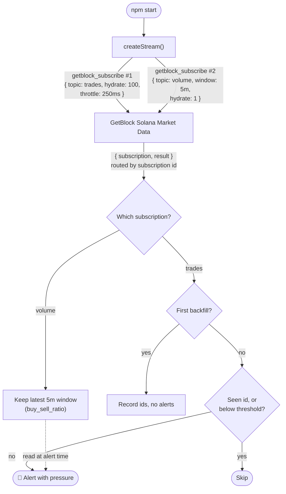

# How to Build a Solana Whale Trade Alert Bot with GetBlock Solana Market Data

When a wallet swaps $30,000 of SOL in one go, the traders watching know about it within seconds, and everyone else finds out from the price chart afterwards. Catching those trades yourself is harder than it looks on Solana: the same swap can route through Raydium, Orca, Meteora or a Jupiter aggregation, and each program encodes it differently. You would need to stream every block, decode swaps from each venue, convert raw token amounts into prices, and do it fast enough for the alert to still matter. A single large trade also says little without context: a big buy lands differently in a market that is already buy-heavy.

**GetBlock Solana Market Data** streams trades that are already decoded and normalized across venues, together with rolling buy/sell volume, over a single WebSocket.

In this guide, you'll build a **whale trade alert bot that flags every SOL/USDC trade above a size you choose**, adds the market's current buy/sell pressure to each alert, and recovers trades it missed during a short disconnect.

### What you'll build

A `watchWhales(stream, options, onWhale)` function that:

1. Subscribes to the `trades` topic for SOL/USDC on a shared WebSocket.
2. Records the startup backfill without alerting on it, so only new trades fire.
3. Calls `onWhale` once for each trade at or above the size threshold, even across reconnects.
4. Recovers large trades that landed while the connection was down.

It runs alongside a `watchPressure()` subscription to the `volume` topic on the same socket, so every alert also shows whether the last five minutes have been buy-heavy or sell-heavy.

### How it works




Keep `hydrate` at `100` on the `trades` subscription. Each push reflects a retained set of that size, and in testing on SOL/USDC, `hydrate: 10` silently dropped about 10% of trades and `hydrate: 1` dropped 67%. At `100`, no trades were dropped across throttle values from `100ms` to `2s`.


## Prerequisites

* **Node.js 20+** — the bot uses the built-in global `WebSocket`, so no WebSocket library is needed.
* A [**GetBlock account**](https://account.getblock.io)
* A [**Solana Market Data API key**](https://account.getblock.io/products/solana-data-stream#api-keys) with the product activated on it.
* Basic JavaScript knowledge.

## Project Setup



### Create the project

The only dependency is `dotenv`, for loading your key.

```bash
mkdir solana-whale-alerts && cd solana-whale-alerts
npm init -y
npm pkg set type=module
npm pkg set scripts.start="node index.js"
npm install dotenv
```



### Configure your key and threshold

Create a `.env` file in the project root:

```bash
GETBLOCK_API_KEY=your_api_key_here
MIN_USDC=10000
```

`MIN_USDC` is the smallest trade that triggers an alert, measured in the quote token. For SOL/USDC that is effectively US dollars. At `10000`, a test run produced eight alerts in four minutes, several landing in the same second. Raise it for fewer, bigger alerts.


The API key travels in the `apiKey` query parameter of the WebSocket URL, not in a header. Keep it in `.env` and out of version control.




### Confirm the stream with wscat

Before writing code, check that your key can open both subscriptions on one connection.

```bash
npm install -g wscat
wscat -c 'wss://stream.eu-central-1.getblock.io/v1/solana-mainnet/stream?apiKey=<API-KEY>'
```

Paste the two requests one after the other:


```json
{"jsonrpc":"2.0","id":1,"method":"getblock_subscribe","params":[{"source":"market","topic":"trades","params":{"base":"So11111111111111111111111111111111111111112","quote":"EPjFWdd5AufqSSqeM2qN1xzybapC8G4wEGGkZwyTDt1v","hydrate":100,"throttle":"250ms"}}]}
{"jsonrpc":"2.0","id":2,"method":"getblock_subscribe","params":[{"source":"market","topic":"volume","params":{"base":"So11111111111111111111111111111111111111112","quote":"EPjFWdd5AufqSSqeM2qN1xzybapC8G4wEGGkZwyTDt1v","window":"5m","hydrate":1,"throttle":"1s"}}]}
```


Each request returns its own subscription ID. Every later message names one of those IDs in `params.subscription`, which is how the bot tells trades from volume on a single socket.

| Parameter  | Type    | Description                                                                                                  |
| ---------- | ------- | -------------------------------------------------------------------------------------------------------------- |
| `source`   | string  | `market` for Solana Market Data.                                                                             |
| `topic`    | string  | `trades` for individual fills, `volume` for windowed buy/sell activity.                                      |
| `base`     | string  | Mint address of the asset being traded — here, SOL.                                                          |
| `quote`    | string  | Mint address of the asset it is priced in — here, USDC.                                                      |
| `window`   | string  | `volume` only. Aggregation period, one of `1s`, `10s`, `30s`, `1m`, `5m`, `30m`, `1h`, `2h`, `4h`, `6h`, `8h`, `12h`, `24h`. |
| `hydrate`  | integer | Rows the subscription retains, `1`–`100`, sent first as a backfill. Defaults to `100` when omitted.          |
| `throttle` | string  | Minimum gap between pushes, such as `250ms` or `1s`.                                                          |


Always set both `base` and `quote`. Leaving them out does not select a default pair — it subscribes you to every market on Solana at once.




### Share one socket between subscriptions

The stream module owns the connection. It sends every registered subscription when the socket opens, routes each notification to its handler by subscription ID, and tells the handler whether the message is that subscription's opening backfill. If the connection drops, it reconnects and replays everything.


```js
import 'dotenv/config';

const STREAM_URL =
  `wss://stream.eu-central-1.getblock.io/v1/solana-mainnet/stream?apiKey=${process.env.GETBLOCK_API_KEY}`;

// One socket carrying several subscriptions. Every subscription is remembered,
// so the full set can be replayed after the connection drops.
export function createStream() {
  const subscriptions = [];
  let retries = 0;
  let byRequestId;
  let bySubscriptionId;

  function connect() {
    byRequestId = new Map();
    bySubscriptionId = new Map();
    const ws = new WebSocket(STREAM_URL);

    ws.onopen = () => {
      retries = 0;
      subscriptions.forEach((sub, i) => {
        byRequestId.set(i + 1, sub);
        ws.send(JSON.stringify({
          jsonrpc: '2.0',
          id: i + 1,
          method: 'getblock_subscribe',
          params: [sub.request],
        }));
      });
    };

    ws.onmessage = (event) => {
      const msg = JSON.parse(event.data);

      if (msg.error) {
        console.error(`Subscription ${msg.id} rejected: ${msg.error.message}`);
        return;
      }

      // The acknowledgement pairs our request id with a subscription id.
      if (typeof msg.result === 'string') {
        bySubscriptionId.set(msg.result, { sub: byRequestId.get(msg.id), isSnapshot: true });
        return;
      }

      // Every notification names its subscription, so route on that.
      const entry = bySubscriptionId.get(msg.params?.subscription);
      if (!entry) return;
      entry.sub.onChange(msg.params.result, entry.isSnapshot);
      entry.isSnapshot = false;
    };

    // Reconnect fast: after a drop, only the last 100 trades can be recovered
    // from the backfill. Back off on repeated failures, such as a bad key.
    ws.onclose = (event) => {
      const delay = Math.min(1000 * 2 ** retries++, 30000);
      console.error(`Stream closed (code ${event.code}). Reconnecting in ${delay / 1000}s…`);
      setTimeout(connect, delay);
    };

    return ws;
  }

  return {
    subscribe(request, onChange) {
      subscriptions.push({ request, onChange });
    },
    connect,
  };
}
```



The acknowledgement for a subscription is the only message with a top-level string `result`. Notifications carry their data under `params.result`, and `params.subscription` says which subscription they belong to.




### Detect whale trades

This is the core of the bot. Every trade has a stable `id`, and the module keeps a bounded set of the IDs it has already processed.


```js
const SEEN_LIMIT = 5000;

export function watchWhales(stream, { base, quote, minQuote }, onWhale) {
  const seen = new Set();
  let primed = false;

  stream.subscribe(
    {
      source: 'market',
      topic: 'trades',
      // Keep hydrate at its maximum. A small value drops trades when several
      // land between two pushes — fatal for a bot that must see every fill.
      params: { base, quote, hydrate: 100, throttle: '250ms' },
    },
    ({ inserts = [] }, isSnapshot) => {
      // The very first backfill is history from before the bot started:
      // remember it, but don't alert on it.
      const silent = isSnapshot && !primed;
      if (isSnapshot) primed = true;

      for (const trade of inserts) {
        // Alerts are side effects, so each trade id fires at most once. After a
        // reconnect this also lets the new backfill surface whales that traded
        // while the bot was offline, without repeating ones already sent.
        if (seen.has(trade.id)) continue;
        seen.add(trade.id);
        if (seen.size > SEEN_LIMIT) seen.delete(seen.values().next().value);

        if (!silent && Number(trade.quote_volume) >= minQuote) onWhale(trade);
      }
      // `deletes` are ignored: on this topic they are almost always the oldest
      // trades leaving the 100-row window, not retractions.
    },
  );
}
```


Three details decide whether the bot is correct:

* **The first backfill stays silent.** The opening `hydrate` rows are trades from before the bot started. The module records their IDs but doesn't alert, so startup doesn't flood your channel.
* **Later backfills are checked, not skipped.** After a reconnect, the new backfill holds the most recent trades, including any that landed while the bot was offline. Trades already in the seen set are skipped, and the rest alert normally — so outage whales still get reported, and nothing is reported twice.
* **`deletes` are ignored.** On the `trades` topic, almost every delete is simply the oldest trade leaving the 100-row window. It doesn't mean a trade was reversed.


Recovery only reaches as far back as the backfill: the last 100 trades on the pair, which is roughly 5–7 seconds of SOL/USDC activity. A longer outage loses the older trades. That's why `stream.js` retries after one second before backing off.




### Track buy/sell pressure

The `volume` topic returns `buy_sell_ratio` for each window: buy volume divided by sell volume. With `hydrate: 1` the subscription holds only the current window, so this module always has the latest reading.


```js
export function watchPressure(stream, { base, quote, window = '5m' }) {
  const rows = new Map();

  stream.subscribe(
    {
      source: 'market',
      topic: 'volume',
      // hydrate: 1 keeps only the current window. When it rolls over, the new
      // window arrives in `inserts` and the finished one leaves in `deletes`.
      params: { base, quote, window, hydrate: 1, throttle: '1s' },
    },
    ({ inserts = [], updates = [], deletes = [] }) => {
      // One notification can carry several versions of the same row, oldest
      // first, so applying them in order leaves the latest in place.
      for (const row of [...inserts, ...updates]) rows.set(row.id, row);
      for (const row of deletes) rows.delete(row.id);
    },
  );

  // Most recent window, or null before the first notification arrives.
  return () => [...rows.values()].sort((a, b) => b.window_start.localeCompare(a.window_start))[0] ?? null;
}
```


When a window closes, the new one arrives in `inserts` and the finished one leaves in `deletes`, so reconciling by `id` keeps exactly one row. A single notification can also carry several versions of the same row in `updates`; applying them in order leaves the newest.



### Wire it together and run

The entry point creates the stream, registers both watchers, formats each alert, and connects.


```js
import { createStream } from './stream.js';
import { watchWhales } from './whales.js';
import { watchPressure } from './pressure.js';

const SOL = 'So11111111111111111111111111111111111111112';
const USDC = 'EPjFWdd5AufqSSqeM2qN1xzybapC8G4wEGGkZwyTDt1v';
const MIN_USDC = Number(process.env.MIN_USDC ?? 10000);

const num = (value, digits = 2) =>
  Number(value).toLocaleString('en-US', { minimumFractionDigits: digits, maximumFractionDigits: digits });
const short = (address) => `${address.slice(0, 4)}…${address.slice(-4)}`;

function describePressure(row) {
  const ratio = Number(row?.buy_sell_ratio);
  if (!Number.isFinite(ratio)) return 'n/a';
  const side = ratio >= 1 ? 'buy-heavy' : 'sell-heavy';
  return `${ratio.toFixed(2)} ${side} over ${row.total_swaps} swaps`;
}

const stream = createStream();
const pressure = watchPressure(stream, { base: SOL, quote: USDC, window: '5m' });

watchWhales(stream, { base: SOL, quote: USDC, minQuote: MIN_USDC }, (trade) => {
  const side = trade.is_buy ? 'BUY ' : 'SELL';
  console.log(
    `🐋 ${side} ${num(trade.base_volume)} SOL ($${num(trade.quote_volume, 0)}) ` +
    `@ ${num(trade.price)}  |  5m pressure ${describePressure(pressure())}`
  );
  console.log(
    `   ${trade.timestamp.slice(11, 19)} UTC  signer ${short(trade.signer)}  ` +
    `https://solscan.io/tx/${trade.signature}`
  );
});

stream.connect();
console.log(`Watching SOL/USDC for trades of ${num(MIN_USDC, 0)} USDC or more…`);
```



To send alerts somewhere other than the terminal, replace the two `console.log` calls in the `watchWhales` callback with a Telegram, Discord, or webhook call. `whales.js` already guarantees each trade reaches that callback at most once.


Start the bot:

```bash
npm start
```

Expected output:


```bash
Watching SOL/USDC for trades of 10,000 USDC or more…
🐋 SELL 172.84 SOL ($17,478) @ 101.12  |  5m pressure 1.14 buy-heavy over 4696 swaps
   15:54:47 UTC  signer En3N…YuzP  https://solscan.io/tx/3UTk1WxnPY1qUTacEs9PC4TLKEr9KdzVWpHkWxxgmvG97RTFiTes4BXAZ3bwjzYcGqyGExYKfMdrEwiYtpvE7BeW
🐋 BUY  214.76 SOL ($21,709) @ 101.08  |  5m pressure 1.08 buy-heavy over 974 swaps
   15:55:54 UTC  signer 2Fas…YgN4  https://solscan.io/tx/5aVpF71Cg7tVmCbHkHjXxFRQ6kJQDvYGhg14DL9p8arK1hq54tauCmMKia54FRB4DCGGuZxAJEgMmKa3yiv7LELq
🐋 BUY  177.14 SOL ($17,906) @ 101.08  |  5m pressure 1.08 buy-heavy over 974 swaps
   15:55:54 UTC  signer 7777…tdsa  https://solscan.io/tx/6cDu23RKAUaBgvyBQwznaaLbvs8MnWyMDFkCTjXMewRcinkfmAoEMAoHSgEwR2KWmeHe2eMsxiQepqCCHDiCwF4
🐋 BUY  176.36 SOL ($17,841) @ 101.16  |  5m pressure 1.08 buy-heavy over 974 swaps
   15:55:54 UTC  signer 7777…tdsa  https://solscan.io/tx/5ZdtfPsf2cwPCQfHgHyai2Um8rwfai2ezYSVhrWS66CMZeitnBXJRnkJ8FYXHWFwx1CcVefTh5nUqMCUfyeXhFfo
```


Each alert shows the side and size of the trade, its execution price, and how the past five minutes have leaned, with the swap count so you can judge how much data sits behind the ratio. The Solscan link opens the transaction itself.



## Understanding the response

The bot reads these fields from the two topics. Numbers arrive as strings to preserve precision, so convert them with `Number()` only where you compare or format them.

| Field                   | Type    | What it tells you                                                                                          |
| ----------------------- | ------- | ------------------------------------------------------------------------------------------------------------ |
| `id`                    | number  | Stable identifier for the row. The bot's key for de-duplicating alerts.                                    |
| `quote_volume`          | string  | `trades`: how much of the quote token changed hands. For SOL/USDC, the trade's size in dollars.           |
| `base_volume`           | string  | `trades`: how much SOL changed hands, already adjusted for decimals.                                       |
| `price`                 | string  | `trades`: execution price in the quote token.                                                              |
| `is_buy`                | boolean | `trades`: `true` when the trade is classified as a buy.                                                    |
| `signer`                | string  | `trades`: the wallet that signed the transaction — the "whale".                                            |
| `signature`             | string  | `trades`: the transaction signature, used for the Solscan link.                                            |
| `timestamp`             | string  | `trades`: when the trade happened, in ISO 8601 format.                                                     |
| `slot`                  | string  | `trades`: the Solana slot the trade landed in.                                                             |
| `buy_sell_ratio`        | string  | `volume`: buy volume divided by sell volume for the window. Above `1` means net buying.                    |
| `total_swaps`           | string  | `volume`: how many swaps the window contains. A low count means the ratio rests on little data.            |
| `buy_volume` / `sell_volume` | string | `volume`: the two sides of the ratio, in the base token.                                               |
| `window_start`          | string  | `volume`: start of the window, used to pick the most recent one.                                            |

## Troubleshooting

| Symptom                                                                 | Likely cause                                                                          | Fix                                                                                                      |
| ----------------------------------------------------------------------- | ------------------------------------------------------------------------------------- | ---------------------------------------------------------------------------------------------------------- |
| `Stream closed (code 1006)` repeating with growing delays               | The key is rejected during the WebSocket handshake                                    | Check `GETBLOCK_API_KEY` and that Solana Market Data is activated on that key.                           |
| No alerts for several minutes                                           | The threshold is above anything trading right now                                     | Lower `MIN_USDC` in `.env`, for example to `5000`, and restart.                                          |
| A burst of alerts the moment the bot starts                             | The opening backfill is being treated as new trades                                   | Skip alerts for the first backfill only, as `whales.js` does with `primed`.                              |
| The same trade is alerted twice after a reconnect                       | Trades aren't de-duplicated by `id`                                                   | Keep a set of processed IDs and skip any trade already in it.                                            |
| Large trades you can see on-chain never alert during busy periods       | `hydrate` on the `trades` subscription was lowered                                    | Keep `hydrate: 100`. Smaller values drop trades when several land between pushes.                        |
| Trades from an outage are missing after reconnecting                    | The outage outlasted the backfill, which holds only the last 100 trades               | Keep the reconnect delay short. For guaranteed coverage, add a second source for the gap.                |
| Pressure shows an extreme value such as `0.00`                            | The five-minute window just rolled over and contains only a few swaps                 | Check the swap count in the alert, or use a longer `window` for a steadier reading.                      |
| Pressure always shows `n/a`                                             | The `volume` subscription hasn't delivered yet, or was rejected                       | Look for a `Subscription 2 rejected` line in the output.                                                 |
| `Subscription 2 rejected: … window must be one of …`                    | An unsupported `window` value, such as `15m`                                          | Use one of the listed values.                                                                            |

## Conclusion

You built a Solana whale alert bot that shares one GetBlock WebSocket between a `trades` subscription and a `volume` subscription, routing each notification by its subscription ID. It keeps `hydrate` at its maximum so no trade is dropped, stays silent on the first backfill, de-duplicates alerts by trade `id` so a reconnect recovers outage trades without repeats, and attaches the latest `buy_sell_ratio` to every alert.

### Resources

* [Solana Market Data overview](https://docs.getblock.io/solana-market-data/overview)
* [API Reference — the `trades` topic](https://docs.getblock.io/solana-market-data/api-reference/trades-market-data)
* [API Reference — the `volume` topic](https://docs.getblock.io/solana-market-data/api-reference/volume-market-data)
* [API Reference — `getblock_subscribe`](https://docs.getblock.io/solana-market-data/api-reference/getblock_subscribe-market-data)
* [How to Build a Live Solana Candlestick Chart](https://docs.getblock.io/guides/how-to-build-a-live-solana-candlestick-chart-with-getblock-market-data)
* [Get an API key](https://account.getblock.io/products/solana-data-stream#api-keys)
* [Project Repo](https://github.com/GetBlock-io/guides/tree/main/solana-whale-alerts)
