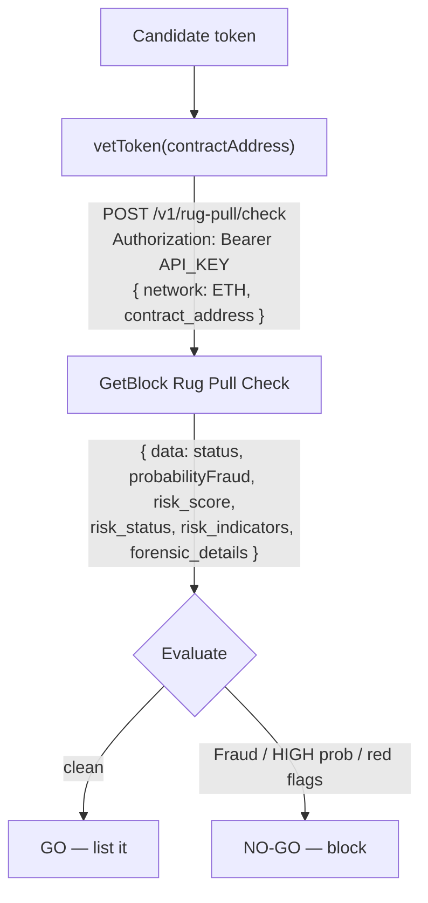

# How to Check Tokens For Rug Pull Risk Before Listing with GetBlock  Rug Pull Checker API

Listing a token is a promise to your users: "we vetted this." But a contract can hide a honeypot that lets people buy and never sell, a mint function that dilutes holders overnight, or a 40% sell tax buried in the code — and the creator's wallet may have rugged three tokens already.&#x20;

The **GetBlock Rug Pull Check API** runs both analyses at once: an AI-based probability assessment using the creator's and liquidity providers' on-chain history, _and_ a contract-level scan of taxes, owner privileges, honeypot traps, and holder concentration.

In this guide, you'll build a **token-vetting gate that returns a clear GO/NO-GO verdict before you list a token (or before a user imports it), along** with the specific red flags that drove the decision.&#x20;

| Eyeballing the contract                     | Rug Pull Check gate                                 |
| ------------------------------------------- | --------------------------------------------------- |
| You can't see the creator's history         | AI probability from creator + LP behavior           |
| Honeypots look like normal tokens           | `is_honeypot`, `cannot_sell_all` flagged explicitly |
| Hidden taxes / mint rights are easy to miss | Taxes and owner privileges returned as fields       |
| "Who holds this?" — manual digging          | Top-10 holders with % concentration                 |

### What you'll build

A `vetToken(contractAddress, network)` function that:

1. Sends the contract to the Rug Pull Check endpoint.
2. Reads the AI rug-pull probability and the API's `Fraud` verdict.
3. Collects concrete red flags — honeypot, mint rights, high taxes, holder concentration.
4. Returns **GO** (safe to list) or **NO-GO** (block) with the reasons.

### How it works




The Rug Pull endpoint uses a **different request format** from the other Compliance APIs: the network code is **uppercase** (`ETH`, `BNB`, `BASE`) and the field is **`contract_address`** (snake\_case), not `address`. Get this wrong and you'll see a 400.



This endpoint is for **contracts only** — passing a wallet (EOA) returns empty results. The AI probability is behavioral (creator/LP history) and does **not** read the contract code; the `risk_indicators` block is the code-level scan. Use both together.


### Prerequisites

* **Node.js 18+**&#x20;
* A [**GetBlock account** ](https://account.getblock.io)
* A [**Risk & Compliance API key**](https://www.account.getblock.io/products/address-audit#api-keys)
* Basic JavaScript / TypeScript knowledge.

### Project Setup



#### Set up the project

```bash
mkdir token-vetter && cd token-vetter
npm init -y
npm pkg set type=module
npm install dotenv
```



#### Get your API key

1. Log in to [account.getblock.io](https://account.getblock.io/).
2. Open **Address Audit → API keys.**
3. Copy your key and save it in an `.env` file

```bash
GETBLOCK_KEY="your_api_key_here"
```


Never commit your key. Use an environment variable or secrets manager, and rotate from the dashboard if it leaks.




Vet a known contract (USDT) to confirm your key and the endpoint:

```bash
curl -s -X POST https://services.getblock.io/v1/rug-pull/check \
  -H "Authorization: Bearer $GETBLOCK_KEY" \
  -H "Content-Type: application/json" \
  -d '{
    "network": "ETH",
    "contract_address": "0xdac17f958d2ee523a2206206994597c13d831ec7"
  }'
```

| Field              | Value          | Notes                                                  |
| ------------------ | -------------- | ------------------------------------------------------ |
| `Authorization`    | `Bearer <key>` | Your Risk & Compliance API key.                        |
| `network`          | `ETH`          | **Uppercase**: `ETH`, `BNB`, or `BASE`.                |
| `contract_address` | token contract | **snake\_case** field name. EOAs return empty results. |

A successful response (trimmed):


```json
{
  "data": {
    "contractAddress": "0xdac17f958d2ee523a2206206994597c13d831ec7",
    "chain": "ETH",
    "status": "Not Fraud",
    "probabilityFraud": "0.12",
    "risk_score": 18,
    "risk_status": "Low Risk",
    "risk_indicators": {
      "token_name": "Tether USD",
      "token_symbol": "USDT",
      "is_honeypot": 0,
      "cannot_sell_all": 0,
      "is_mintable": 1,
      "buy_tax": 0,
      "sell_tax": 0,
      "is_open_source": 1,
      "holder_count": "5500000",
      "liquidity": 12000000,
      "market_cap": 95000000000,
      "is_in_dex": 1,
      "holders": [
        { "address": "0x5754…", "tag": "Binance", "percent": "0.18", "is_locked": 0 }
      ]
    },
    "forensic_details": {
      "contract_name": "TetherToken",
      "is_open_source": 1,
      "selfdestruct": 0
    }
  }
}
```



Numeric flags are `0` (clean) or `1` (detected). `buy_tax`/`sell_tax` are fractions (multiply by 100 for a percentage). `holder_count`, holder `percent`, and `probabilityFraud` come back as **strings**.




#### Write the API caller

Create `rugpull.js`. Note the network is normalized to uppercase here so callers can pass `eth`, `ETH`, or `ethereum`.


```js
const BASE_URL = "https://services.getblock.io/v1";

// Rug Pull uses its own uppercase codes and a different alphabet (BNB, not BSC).
const NETWORK_CODE = { eth: "ETH", ethereum: "ETH", bsc: "BNB", bnb: "BNB", base: "BASE" };

/** Call the Rug Pull Check endpoint and return the unwrapped result. */
export async function checkRugPull(contractAddress, network = "eth") {
  const apiKey = process.env.GETBLOCK_KEY;
  if (!apiKey) throw new Error("Set GETBLOCK_KEY in your environment");

  const code = NETWORK_CODE[network.trim().toLowerCase()];
  if (!code) throw new Error(`Rug Pull supports eth, bsc, base — got "${network}"`);

  const res = await fetch(`${BASE_URL}/rug-pull/check`, {
    method: "POST",
    headers: {
      Authorization: `Bearer ${apiKey}`,
      "Content-Type": "application/json",
    },
    body: JSON.stringify({ network: code, contract_address: contractAddress }),
  });

  if (!res.ok) {
    const text = await res.text();
    throw new Error(`Rug Pull check failed (HTTP ${res.status}): ${text}`);
  }

  const { data } = await res.json(); // unwrap { data: ... }
  return data;
}
```




#### Collect the red flags

The API gives you dozens of indicators. Create `flags.js` to turn them into a human-readable list, grouped by severity. Tune the thresholds to your own policy.


```js
const MAX_BUY_TAX = 10;            // percent
const MAX_SELL_TAX = 10;           // percent
const MAX_HOLDER_CONCENTRATION = 50; // percent held by the top holder

export function collectRedFlags(r) {
  const ind = r.risk_indicators;
  const flags = [];

  // Hard traps — disqualifying on their own.
  if (ind.is_honeypot) flags.push("honeypot: buyers cannot sell");
  if (ind.cannot_sell_all) flags.push("cannot sell all tokens");
  if (ind.cannot_buy) flags.push("buying is disabled");
  if (ind.selfdestruct) flags.push("contract can self-destruct");
  if (ind.honeypot_with_same_creator) flags.push("creator deployed other honeypots");

  // Owner privileges — centralization / soft-rug risk.
  if (ind.is_mintable) flags.push("owner can mint new supply");
  if (ind.can_take_back_ownership) flags.push("ownership can be reclaimed");
  if (ind.hidden_owner) flags.push("hidden owner");
  if (ind.owner_change_balance) flags.push("owner can change balances");
  if (ind.transfer_pausable) flags.push("transfers can be paused");
  if (ind.slippage_modifiable) flags.push("slippage/tax is modifiable");
  if (ind.is_blacklisted) flags.push("contract can blacklist addresses");

  // Extractive taxes (stored as fractions).
  if (ind.buy_tax * 100 > MAX_BUY_TAX) flags.push(`buy tax ${(ind.buy_tax * 100).toFixed(1)}%`);
  if (ind.sell_tax * 100 > MAX_SELL_TAX) flags.push(`sell tax ${(ind.sell_tax * 100).toFixed(1)}%`);

  // Transparency.
  if (!ind.is_open_source) flags.push("source code not verified");

  // Holder concentration — top holder controls too much.
  const top = ind.holders?.[0];
  if (top) {
    const pct = Number.parseFloat(top.percent) * 100;
    if (Number.isFinite(pct) && pct > MAX_HOLDER_CONCENTRATION) {
      flags.push(`top holder controls ${pct.toFixed(1)}% (${top.tag || "unlabeled"})`);
    }
  }

  return flags;
}
```




#### Make the GO / NO-GO decision

Create `vet.js`. It blocks on the API's own `Fraud` verdict, a HIGH AI probability, **or** any disqualifying red flag.


```js
import { checkRugPull } from "./rugpull.js";
import { collectRedFlags } from "./flags.js";

function riskLevel(probabilityFraud) {
  const p = Number.parseFloat(probabilityFraud);
  if (!Number.isFinite(p)) return "LOW";
  if (p >= 0.7) return "HIGH";
  if (p >= 0.3) return "MEDIUM";
  return "LOW";
}

export async function vetToken(contractAddress, network = "eth") {
  try {
    const r = await checkRugPull(contractAddress, network);
    const ind = r.risk_indicators;

    console.log(`Token:    ${ind.token_name} (${ind.token_symbol})`);
    console.log(`Contract: ${r.contractAddress} [${r.chain}]`);

    console.log("\n── Risk model ────────────────────────────");
    console.log(`Verdict:     ${r.status}`);
    console.log(`Risk status: ${r.risk_status} (score ${r.risk_score})`);
    console.log(`AI rug prob: ${r.probabilityFraud} (${riskLevel(r.probabilityFraud)})`);

    console.log("\n── Market ────────────────────────────────");
    console.log(`Holders:   ${ind.holder_count}`);
    console.log(`Liquidity: $${Number(ind.liquidity).toLocaleString()}`);
    console.log(`Market cap: $${Number(ind.market_cap).toLocaleString()}`);

    const redFlags = collectRedFlags(r);
    console.log("\n── Red flags ─────────────────────────────");
    if (redFlags.length) for (const f of redFlags) console.log(`  ✗ ${f}`);
    else console.log("  none detected");

    const block =
      r.status === "Fraud" || riskLevel(r.probabilityFraud) === "HIGH" || redFlags.length > 0;

    console.log(`\n→ ${block ? "NO-GO — do not list" : "GO — safe to list"}`);
    return { go: !block, redFlags };
  } catch (err) {
    console.error("Vetting failed:", err.message);
    // Fail closed: if we can't vet it, we don't list it.
    return { go: false, redFlags: ["vetting failed"] };
  }
}
```




#### Run it

Create `index.js`:


```js
import { vetToken } from "./vet.js";

const TOKEN = "0xdac17f958d2ee523a2206206994597c13d831ec7"; // candidate token
await vetToken(TOKEN, "eth");
```



```bash
node index.js
```


Expected output for a clean token:

```bash
Token:    Tether USD (USDT)
Contract: 0xdac17f958d2ee523a2206206994597c13d831ec7 [ETH]

── Risk model ────────────────────────────
Verdict:     Not Fraud
Risk status: Low Risk (score 18)
AI rug prob: 0.12 (LOW)

── Market ────────────────────────────────
Holders:   5500000
Liquidity: $12,000,000
Market cap: $95,000,000,000

── Red flags ─────────────────────────────
  ✗ owner can mint new supply

→ NO-GO — do not list
```


Notice the verdict is **NO-GO** even though the AI probability is LOW — the `is_mintable` flag tripped your policy. The two analyses are independent: a clean AI score does **not** cancel out a dangerous contract privilege. Tune `flags.js` to decide which privileges are dealbreakers for your platform.




### Understanding the response

| Field                        | Type                       | What it tells you                                                                  |
| ---------------------------- | -------------------------- | ---------------------------------------------------------------------------------- |
| `status`                     | `"Fraud"` \| `"Not Fraud"` | Top-level verdict.                                                                 |
| `probabilityFraud`           | string `0–1`               | AI rug-pull probability (creator/LP behavior).                                     |
| `risk_score` / `risk_status` | number / label             | Combined score and human label (e.g. "High Risk").                                 |
| `risk_indicators`            | object                     | Code-level scan: taxes, honeypot, mint/owner rights, liquidity, `holders[]`.       |
| `forensic_details`           | object                     | Contract findings: `is_open_source`, `selfdestruct`, `approval_abuse`, owner type. |

### Troubleshooting

| Symptom                   | Likely cause                        | Fix                                                      |
| ------------------------- | ----------------------------------- | -------------------------------------------------------- |
| `HTTP 400`                | Wrong network case or field name    | Use uppercase `ETH`/`BNB`/`BASE` and `contract_address`. |
| Empty / null result       | You passed a wallet, not a contract | Rug Pull works on **contracts only**.                    |
| Unsupported network error | Polygon / Tron not covered          | Rug Pull supports `ETH`, `BNB`, `BASE` only.             |
| `HTTP 401` / `403`        | Bad key / no Address Audit access   | Re-check `GETBLOCK_KEY` and your plan.                   |
| `HTTP 402` / `429`        | Out of quota / rate limited         | Free tier is 5/day; back off or top up.                  |

### Conclusion

You built a token-vetting gate that calls the GetBlock Rug Pull Check API directly, combines AI behavioral probability with a code-level contract scan, and returns a GO/NO-GO verdict along with the exact red flags behind it. Drop `vetToken` into your listing pipeline, a "before you import this token" warning in a wallet, or a CLI your team runs against a candidate list — and fail closed whenever a check can't complete.

### Resources

* [Rug Pull Checker docs](https://docs.getblock.io/crypto-address-audit/rug-pull-checker)
* [Risk & Compliance APIs overview](https://docs.getblock.io/crypto-address-audit/crypto-address-audit-risk-and-compliance-apis)
* [Get an API key](https://account.getblock.io/products/address-audit#api-keys)
