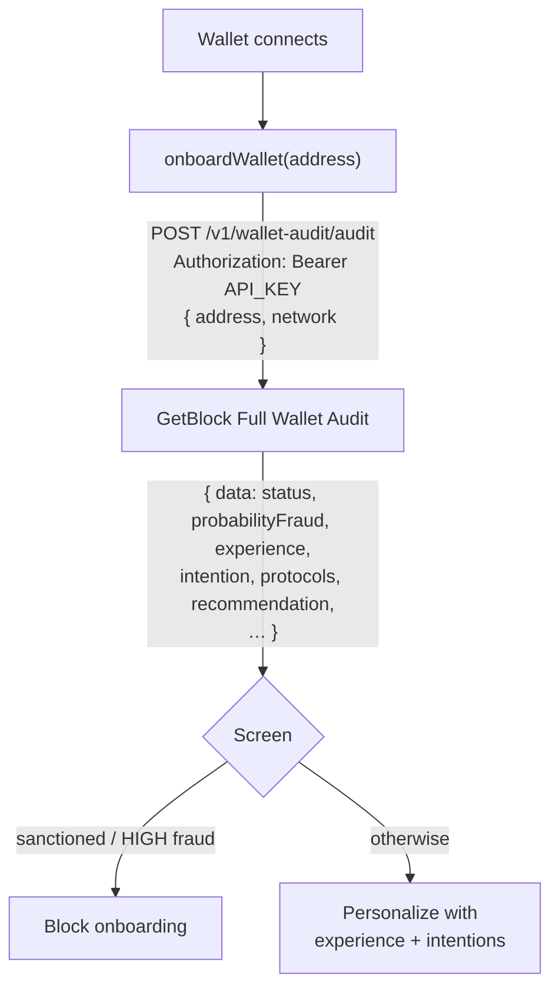

# How to Personalize DeFi onboarding with GetBlock Full Wallet Audit API

When a new user connects their wallet to your dApp, you already know more about them than any sign-up form could ask — it's all on-chain. Are they a cautious newcomer or a seasoned LP? Do they lend, trade, farm, or bridge? Have they ever touched a sanctioned address?&#x20;

The **GetBlock Full Wallet Audit API** reads a wallet's entire history and returns a behavioral profile: an experience score, predicted intentions, protocols used, AML screening, and tailored recommendations — all in one request.

In this guide, you'll build a **smart onboarding flow** that does two jobs at once:&#x20;

1. It AML-screens the connecting wallet (and blocks it if it's fraudulent or sanctioned).
2. Personalizes the experience based on who the wallet actually belongs to.&#x20;

| Generic onboarding                   | Audit-driven onboarding                              |
| ------------------------------------ | ---------------------------------------------------- |
| Same welcome flow for everyone       | Tailored to the wallet's experience level            |
| AML check bolted on separately       | Screening and personalization in one call            |
| "What are you here to do?" — you ask | Predicted intentions come back from the model        |
| No idea what protocols they use      | Top protocols returned, ready for "import positions" |

### What you'll build

An `onboardWallet(address, network)` function that:

1. Runs a Full Wallet Audit on the connecting wallet.
2. **Gates** onboarding on fraud probability and sanctions hits (fail closed).
3. Reads the **behavioral profile** — experience score, balance, age, risk capacity.
4. Reads **predicted intentions** — lend / trade / farm likelihoods.
5. Surfaces **protocols already used** and the model's **recommendations**.

## How it works




The audit is a **deep** profile, not a quick screen. It works only with EOA wallets (contract addresses are rejected), and a wallet needs roughly 10–15 transactions to achieve a reliable score. For a fast pre-transaction fraud check, use the Wallet Risk Check endpoint instead.


### Prerequisites

* **Node.js 18+**&#x20;
* A [**GetBlock account**](https://www.acount.getblock.io)
* A [**Risk & Compliance API key** ](https://account.getblock.io/products/address-audit#api-keys)
* Basic JavaScript / TypeScript knowledge.

### Project Setup



#### Set up the project

```bash
mkdir smart-onboarding && cd smart-onboarding
npm init -y
npm pkg set type=module
npm i dotenv
```



#### Get your API key

1. Log in to [account.getblock.io](https://account.getblock.io/).
2. Open **Address Audit → API keys**.
3. Copy your key and save it in an `.env` file

```bash
GETBLOCK_KEY="your_api_key_here"
```


Keep your key in an environment variable or secrets manager — never commit it. Rotate it from the dashboard if it leaks.




#### Write the API caller

Create `audit.js`:


```js
import 'dotenv/config';

/** Call the Full Wallet Audit endpoint and return the unwrapped result. */
export async function auditWallet(address, network = "eth") {
  const apiKey = process.env.GETBLOCK_KEY;
  if (!apiKey) throw new Error("Set GETBLOCK_KEY in your environment");

  const res = await fetch('https://services.getblock.io/v1/wallet-audit/audit', {
    method: "POST",
    headers: {
      Authorization: `Bearer ${apiKey}`,
      "Content-Type": "application/json",
    },
    body: JSON.stringify({ address, network }),
  });

  if (!res.ok) {
    const text = await res.text();
    throw new Error(`GetBlock audit failed (HTTP ${res.status}): ${text}`);
  }

  const { data } = await res.json(); // unwrap { data: ... }
  return data;
}
```




#### Build the onboarding decision

Create `onboard.js`. It screens first, then personalizes. The `riskLevel` helper is the same one used for the Risk Check.


```js
import { auditWallet } from "./audit.js";

function riskLevel(probabilityFraud) {
  const p = Number.parseFloat(probabilityFraud);
  if (!Number.isFinite(p)) return "LOW";
  if (p >= 0.7) return "HIGH";
  if (p >= 0.3) return "MEDIUM";
  return "LOW";
}

export async function onboardWallet(address, network = "eth") {
  try {
    const a = await auditWallet(address, network);

    // 1. AML / fraud gate — runs before any personalization.
    const level = riskLevel(a.probabilityFraud);
    const sanctioned = a.sanctionData?.some((s) => s.isSanctioned) ?? false;
    const flags = Object.entries(a.forensic_details)
      .filter(([key, v]) => v === "1" && key !== "data_source")
      .map(([key]) => key);

    console.log("── AML screening ─────────────────────────");
    console.log(`Status:     ${a.status}`);
    console.log(`Fraud prob: ${a.probabilityFraud} (${level})`);
    console.log(`Sanctioned: ${sanctioned ? "YES" : "no"}`);
    console.log(`Flags:      ${flags.join(", ") || "none"}`);

    if (sanctioned || level === "HIGH" || a.status === "Fraud") {
      return {
        allow: false,
        reason: sanctioned ? "wallet appears on a sanctions list" : `fraud risk is ${level}`,
      };
    }

    // 2. Behavioral profile — drives the personalized flow.
    const { wallet_age_days, total_balance_usd, transaction_count, wallet_rank } = a.userDetails;
    console.log("\n── Behavioral profile ────────────────────");
    console.log(`Wallet age:    ${wallet_age_days} days`);
    console.log(`Balance:       $${total_balance_usd.toLocaleString()}`);
    console.log(`Tx count:      ${transaction_count}`);
    console.log(`Wallet rank:   ${wallet_rank}`);
    console.log(`Experience:    ${a.experience.Value}/10`);
    console.log(`Risk capacity: ${a.riskCapability}/10`);

    // 3. Predicted intentions — what is this wallet likely to do?
    console.log("\n── Predicted intentions ──────────────────");
    for (const [activity, likelihood] of Object.entries(a.intention.Value)) {
      console.log(`  ${activity.padEnd(16)} ${likelihood}`);
    }

    // 4. Protocols already used — power an "import your positions" step.
    if (a.protocols?.length) {
      const top = [...a.protocols]
        .sort((x, y) => y.Count - x.Count)
        .slice(0, 5)
        .map((p) => `${p.Protocol} (${p.Count})`);
      console.log(`\nTop protocols: ${top.join(", ")}`);
    }

    // 5. Model recommendations — feed your UI directly.
    if (a.recommendation?.Value?.length) {
      console.log("\n── Recommended for this user ─────────────");
      for (const rec of a.recommendation.Value) console.log(`  • ${rec}`);
    }

    return { allow: true, reason: "passed AML screening", experience: a.experience.Value };
  } catch (err) {
    console.error("Audit failed:", err.message);
    //Fail-closed Fail closed: if we can't audit, we don't onboard.
    return { allow: false, reason: "audit failed — could not verify wallet" };
  }
}
```



Screen **before** you personalize. A sanctioned or high-fraud wallet should never reach the "welcome" path — the gate returns early, before any profile is read.




#### Choose an onboarding track from the profile

The experience score makes branching trivial. Create `index.js`:


```js
import { onboardWallet } from "./onboard.js";

const NEW_USER = "0xd8dA6BF26964aF9D7eEd9e03E53415D37aA96045";

const decision = await onboardWallet(NEW_USER, "eth");

if (!decision.allow) {
  console.log(`\n→ Onboarding BLOCKED: ${decision.reason}`);
} else {
  const track =
    decision.experience >= 7 ? "pro"
    : decision.experience >= 3 ? "intermediate"
    : "beginner";
  console.log(`\n→ Onboarding ALLOWED — show the "${track}" track`);
}
```




#### Run it

```bash
node index.js
```

Expected output (for an experienced, clean wallet):


```bash
── AML screening ─────────────────────────
Status:     Not Fraud
Fraud prob: 0.0421858616 (LOW)
Sanctioned: no
Flags:      none

── Behavioral profile ────────────────────
Wallet age:    3730 days
Balance:       $95,320.79
Tx count:      19972
Wallet rank:   20338
Experience:    10/10
Risk capacity: 5/10

── Predicted intentions ──────────────────
  Prob_Lend        High
  Prob_Trade       High
  Prob_Stake_ETH   High
  Prob_Game        Medium
  Prob_NFT         Medium
  Prob_Stake       Medium
  Prob_Yield_Farm  Medium
  Prob_Borrow      Medium
  Prob_Leveraged_Stake Medium
  Prob_Leveraged_Stake_ETH Medium
  Prob_Leveraged_Lend Medium
  Prob_Leverage_Long_ETH Medium
  Prob_Leverage_Long Medium
  Prob_Gamble      Low

Top protocols: sushiswap (72), uniswap (25), wrapped ether (11), 1inch (9), makerdao (8)

── Recommended for this user ─────────────
  • WBTC holding
  • ETH holding
  • Stablecoin lending
  • Stablecoin lending with FIFs (SmartCredit.io)
  • Leveraged fixed rate ETH staking (SmartCredit.io)

→ Onboarding ALLOWED — show the "pro" track
```




### Understanding the response

| Field                         | What it tells you            | How to use it                                         |
| ----------------------------- | ---------------------------- | ----------------------------------------------------- |
| `status` / `probabilityFraud` | Fraud verdict + score        | Gate onboarding before personalizing.                 |
| `sanctionData`                | Sanctions-list matches       | Hard block on any `isSanctioned: true`.               |
| `experience.Value`            | Sophistication, `0–10`       | Branch the onboarding track.                          |
| `riskCapability`              | Risk capacity, `0–10`        | Tune default leverage / product surfacing.            |
| `intention.Value`             | Predicted activities         | Lead with the user's likely intent (lend/trade/farm). |
| `protocols`                   | Protocols used + counts      | Power "import your existing positions".               |
| `recommendation.Value`        | Model suggestions            | Feed straight into your UI copy.                      |
| `userDetails`                 | Age, balance, tx count, rank | Segment users; spot whales / newcomers.               |

### Troubleshooting

| Symptom                             | Likely cause                      | Fix                                                   |
| ----------------------------------- | --------------------------------- | ----------------------------------------------------- |
| `HTTP 400` "contract not supported" | You passed a contract address     | Audit accepts **EOA wallets only**.                   |
| Sparse / low-confidence profile     | Wallet has too few transactions   | Needs \~10–15 txns; treat thin wallets as "beginner". |
| `HTTP 400` unsupported network      | Network not covered by Audit      | Use `eth`, `bsc`, or `base` only.                     |
| `HTTP 401` / `403`                  | Bad key / no Address Audit access | Re-check `GETBLOCK_KEY` and your plan.                |
| `HTTP 402` / `429`                  | Out of quota / rate limited       | Free tier is 5/day; back off or top up.               |

### Conclusion

You built an onboarding flow that screens a connecting wallet for fraud and sanctions, then personalizes the experience from its on-chain behavior — experience level, predicted intentions, protocols, and model recommendations — all from a single Full Wallet Audit call. From here, you can store the segment, drive feature flags, or A/B test onboarding tracks per experience tier.

### Resources

* [Full Wallet Audit docs](https://docs.getblock.io/crypto-address-audit/wallet-audit)
* [Risk & Compliance APIs overview](https://docs.getblock.io/crypto-address-audit/crypto-address-audit-risk-and-compliance-apis)
* [Get an API key](https://account.getblock.io/products/address-audit#api-keys)
