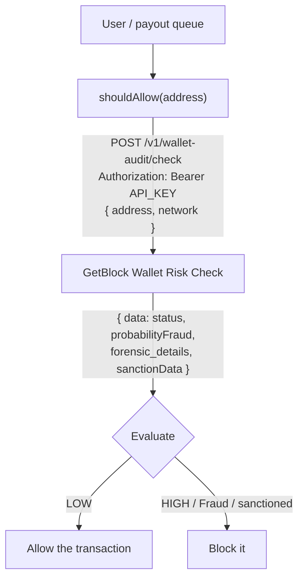

# How To Screen Wallets For Fraud and Sanctions With Wallet Risk Check API

Before a bank wires money, it runs the recipient against a sanctions list. Before a payout API releases crypto, it should do the same — except on-chain you don't have a name to check, only an address. The **GetBlock Wallet Risk Check API** turns that address into a verdict:&#x20;

1. a fraud probability
2. a list of forensic red flags (mixer, phishing, theft attacks, fake KYC…),&#x20;
3. a direct sanctions list match — all in a single HTTP request.

In this guide, you'll build a **pre-transaction screening gate**: a small Node.js function that screens a wallet _before_ you let a swap, withdrawal, or payout go through, and blocks anything that looks like fraud or lands on a sanctions list.&#x20;

| Without screening                           | With a Wallet Risk Check gate                 |
| ------------------------------------------- | --------------------------------------------- |
| You sign first and find out later           | You get a verdict before you sign             |
| Sanctions exposure is invisible             | OFAC / sanctions hits are returned explicitly |
| "Was that wallet a mixer?" — you can't tell | 19 forensic categories, flagged 0/1           |
| Manual, after-the-fact review               | One API call in your transaction path         |


#### Limitation

* The service only works with regular wallets (EOA — Externally Owned Accounts). **Contract addresses are not supported.**
* A minimum of 10–15 transactions is required to calculate an accurate predictive score. Wallets with less history lack sufficient data for a reliable assessment


## What you'll build

A `shouldAllow(address, network)` function that:

1. Sends the wallet to the Wallet Risk Check endpoint.
2. Reads back a fraud probability and converts it to a `LOW` / `MEDIUM` / `HIGH` level.
3. Collects the forensic flags that were triggered.
4. Checks the sanctions data.
5. Returns a clear **allow / block** decision — and **fails closed** (blocks) if the check itself errors out.

By the end you'll be able to drop this straight into a payout queue, a swap confirmation flow, or an Express route.

## How it works



The endpoint is **fast**: pre-calculated results return instantly, and a fresh recalculation takes about 3–4 seconds. That makes it safe to call inline, in the transaction path.

## Prerequisites

* **Node.js 18+**&#x20;
* A [**GetBlock account**](https://account.getblock.io/)
* A **Risk & Compliance API key.** Create one at [account.getblock.io/products/address-audit#api-keys](https://account.getblock.io/products/address-audit#api-keys).
* Basic JavaScript / TypeScript knowledge.


The free tier gives you **5 requests per day**, which is plenty to follow this guide. See [Pricing and limits](https://docs.getblock.io/crypto-address-audit/crypto-address-audit-risk-and-compliance-apis#pricing-and-limits) before you go to production.


## Project Setup



#### Set up the project

```bash
mkdir wallet-risk-gate && cd wallet-risk-gate
npm init -y
npm pkg set type=module
npm install dotenv
```

Setting `type=module` lets us use `import`/top-level `await`. We add **no dependencies** — `fetch` is built into Node 18+.



#### Get your API key

1. Log in to [account.getblock.io](https://account.getblock.io/).
2. Open the **Address Audit** product and go to the **API keys** tab.
3. Copy your key and save it in an `.env` file

```bash
GETBLOCK_KEY="your_api_key_here"
```


Never commit your API key. Read it from an environment variable (as above) or a secrets manager. If a key leaks, rotate it from the dashboard.




#### Write the API caller

Create `screen.js`. This is the only function that talks to GetBlock; everything else builds on it.


```js
import 'dotenv/config'

/**
 * Call the Wallet Risk Check endpoint and return the unwrapped result.
 * Throws on auth failure (401/403) and other non-OK responses.
 */
export async function checkWallet(address, network = "eth") {
  const apiKey = process.env.GETBLOCK_KEY;
  if (!apiKey) throw new Error("Set GETBLOCK_KEY in your environment");

  const res = await fetch("https://services.getblock.io/v1/wallet-audit/check", {
    method: "POST",
    headers: {
      Authorization: `Bearer ${apiKey}`,
      "Content-Type": "application/json",
    },
    body: JSON.stringify({ address, network }),
  });

  if (!res.ok) {
    const text = await res.text();
    throw new Error(`GetBlock request failed (HTTP ${res.status}): ${text}`);
  }

  const { data } = await res.json(); // unwrap the { data: ... } envelope
  return data;
}

```




#### Turn the response into a decision

The API gives you raw signals. Your _policy_ decides what to do with them. Add a small helper to bucket the probability, then a gate that combines probability, the explicit `status`, and sanctions.


```js
import { checkWallet } from "./screen.js";

/** Map probabilityFraud (string 0–1) onto a categorical level. */
export function riskLevel(probabilityFraud) {
  const p = Number.parseFloat(probabilityFraud);
  if (!Number.isFinite(p)) return "LOW";
  if (p >= 0.7) return "HIGH";   // tune these thresholds to your risk appetite
  if (p >= 0.3) return "MEDIUM";
  return "LOW";
}

/** Decide whether a wallet may transact. Fails CLOSED on any error. */
export async function shouldAllow(address, network = "eth") {
  try {
    const r = await checkWallet(address, network);

    const level = riskLevel(r.probabilityFraud);
    const sanctioned = r.sanctionData?.some((s) => s.isSanctioned) ?? false;
    const flags = Object.entries(r.forensic_details)
      .filter(([key, v]) => v === "1" && key !== "data_source")
      .map(([key]) => key);

    console.log(`Status:     ${r.status}`);
    console.log(`Fraud prob: ${r.probabilityFraud} (${level})`);
    console.log(`Sanctioned: ${sanctioned ? "YES" : "no"}`);
    console.log(`Flags:      ${flags.join(", ") || "none"}`);

    const block = sanctioned || level === "HIGH" || r.status === "Fraud";
    return { allow: !block, level, sanctioned, flags };
  } catch (err) {
    console.error("Screening failed:", err.message);
    // If we can't verify the wallet, we don't let it through.
    return { allow: false, level: "ERROR", sanctioned: false, flags: [] };
  }
}
```



**Always fail closed.** If the screening call errors (network blip, rate limit, bad key), the safe default is to _block_ the transaction rather than wave it through. The `catch` block above does exactly that.




#### Wire it into your transaction flow

Create `index.js` to run the gate:


```js
import { shouldAllow } from "./gate.js";

//using Vitalik address
const COUNTERPARTY = "0xd8dA6BF26964aF9D7eEd9e03E53415D37aA96045";

const decision = await shouldAllow(COUNTERPARTY, "eth");
console.log(decision.allow ? "→ Transaction ALLOWED" : "→ Transaction BLOCKED");
```


In a real service, the gate slots in right before you sign or release funds — for example in an Express route:

```js
// inside your withdrawal / swap handler
const { allow, level, flags } = await shouldAllow(req.body.to, "eth");
if (!allow) {
  return res.status(403).json({
    error: "Recipient failed risk screening",
    level,
    flags,
  });
}
// …proceed to sign and broadcast the transaction
```



#### Run it

```bash
node index.js
```

Expected output for a clean wallet:

```bash
Status:     Not Fraud
Fraud prob: 0.0421858616 (LOW)
Sanctioned: no
Flags:      none
→ Transaction ALLOWED
```

For a flagged wallet you'd instead see something like:

```bash
Status:     Fraud
Fraud prob: 0.91 (HIGH)
Sanctioned: YES
Flags:      money_laundering, sanctioned, mixer
→ Transaction BLOCKED
```



### Understanding the response

The fields you'll lean on most:

| Field              | Type                       | What it tells you                                                                                                                                     |
| ------------------ | -------------------------- | ----------------------------------------------------------------------------------------------------------------------------------------------------- |
| `status`           | `"Fraud"` \| `"Not Fraud"` | The API's binary verdict — use it as a hard block.                                                                                                    |
| `probabilityFraud` | string `0–1`               | Continuous fraud score. Bucket it with `riskLevel()`.                                                                                                 |
| `forensic_details` | object of `"0"`/`"1"`      | 19 categories: `mixer`, `phishing_activities`, `money_laundering`, `sanctioned`, `stealing_attack`, `fake_kyc`, `honeypot_related_address`, and more. |
| `sanctionData`     | array                      | Sanctions-list matches. `isSanctioned: false` with null fields means _checked and cleared_.                                                           |

### Troubleshooting

| Symptom                                    | Likely cause                                                | Fix                                                                                          |
| ------------------------------------------ | ----------------------------------------------------------- | -------------------------------------------------------------------------------------------- |
| `HTTP 401` / `403`                         | Bad or missing key, or your plan lacks Address Audit access | Re-check `GETBLOCK_KEY`; confirm the key is from the Address Audit product.                  |
| `HTTP 402`                                 | Out of requests / insufficient balance                      | You've hit the free-tier limit (5/day) — top up or wait.                                     |
| `HTTP 429`                                 | Rate limited                                                | Back off and retry; respect the `Retry-After` header.                                        |
| `HTTP 400`                                 | Bad address or unsupported network                          | Verify the address and use a supported lowercase code (`eth`/`bsc`/`base`/`polygon`/`tron`). |
| `probabilityFraud` looks like `"0"` always | You're comparing a string to a number                       | `parseFloat` it before comparing.                                                            |

### Conclusion

You built a pre-transaction screening gate that calls the GetBlock Wallet Risk Check API directly, turns the response into a `LOW`/`MEDIUM`/`HIGH` decision, surfaces sanctions and forensic flags, and fails closed when in doubt. The same `checkWallet` function scales to a batch job — screen a payout queue concurrently and exit non-zero if anything needs manual review.

### Resources

* [Wallet Risk Check docs](https://docs.getblock.io/crypto-address-audit/wallet-risk)
* [Risk & Compliance APIs overview](https://app.gitbook.com/s/FOeg95CadVyFvyLi70Bh/crypto-address-audit)
* [Get an API key](https://account.getblock.io/products/address-audit#api-keys)
* [Screen Wallets For Fraud and Sanctions Repo](https://github.com/GetBlock-io/guides/tree/main/wallet-risk-gate)
