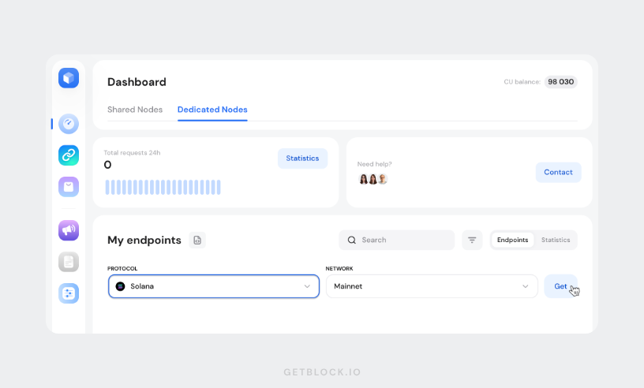

# Monitoring Liquidity Pools on Solana DEXes with GetBlock's Yellowstone gRPC

Monitoring liquidity pools on Solana decentralised exchanges (DEXes) in real-time is crucial for traders and developers who want to stay updated with the latest market conditions and make informed decisions.&#x20;

&#x20;GetBlock's Yellowstone gRPC service allows developers to fetch data directly from Solana validators easily with low latency - appropriately \~400ms latency.&#x20;

In this guide, you'll build a monitor that tracks every swap happening on a specific Solana DEX liquidity pool, regardless of which platform (Jupiter, Raydium, Phantom Wallet, etc.) the user is trading with.

You'll learn how to:

* Connect to GetBlock's Yellowstone gRPC service for ultra-low latency blockchain data streaming
* Subscribe to transactions involving specific liquidity pool addresses
* Filter out failed transactions to show only successful swaps
* Identify which DEX or aggregator initiated each swap (Jupiter, Raydium, etc.)
* Display real-time swap alerts with formatted output and explorer links
* Track comprehensive statistics about trading activity

### Prerequisites

Before you begin, ensure you have:

* [Node.js ](https://nodejs.org/en) and npm installed
* Basic knowledge of JavaScript&#x20;
* A [GetBlock’s account](https://account.getblock.io/)
* A Dedicated Solana Node subscription on GetBlock - Required for Yellowstone gRPC access

#### Technology Stack:

* Node.js
* [@triton-one/yellowstone-grpc](https://www.npmjs.com/package/@triton-one/yellowstone-grpc) - Official Yellowstone gRPC client
* [bs58](https://www.npmjs.com/package/bs58) - Base58 encoding for Solana addresses
* GetBlock’s Dedicated Solana Node with Yellowstone gRPC add-on

### Step 1: Set Up Your GetBlock’s Yellowstone Endpoint

#### Deploy Your Dedicated Solana Node

First, you need to deploy a dedicated Solana node on GetBlock with the Yellowstone gRPC add-on enabled.

1\. **Sign up or log in**

* Go to[ GetBlock](https://getblock.io/)
* Create an account or log in to your existing account

2\. **Deploy your dedicated node**

* Navigate to your user Dashboard
* Switch to the "**Dedicated nodes**" tab
* Scroll down to "**My endpoints"**
* Under "**Protocol**", select Solana
* Set the network to **Mainnet**
* Click **Get**



3\. **Enable the Yellowstone gRPC add-on**

In Step 3 of your node setup (Select API and Add-ons):

* Check the box for **Yellowstone gRPC** under Add-ons
* Complete payout and finalize the setup

.png>)

#### Generate a Yellowstone gRPC Access Token

Once your node is live, you'll create an access token to authenticate your gRPC connections.

1\. **Return to your dashboard**

* Under your dedicated node dashboard, click on  "**My endpoints".**&#x20;
* Select **Yellowstone gRPC**
* Click on **Add** to generate an access token

.png>)

2\. **Your endpoint URL**

You'll receive an HTTPS-style gRPC endpoint URL based on your chosen region:



```css
https://go.getblock.io/YOUR_ACCESS_TOKEN/
```



```css
https://go.getblock.us/YOUR_ACCESS_TOKEN/
```



```css
https://go.getblock.asia/YOUR_ACCESS_TOKEN/
```




Ensure you securely store both the base endpoint and the access token. You'll need them in your code to authenticate with GetBlock's Yellowstone service.


### Step 2: Set up Development Environment

1. Create a directory for your project

```javascript
mkdir pool-monitor
cd pool-monitor
npm init-y
```

2. Install Dependencies:

```javascript
npm install @triton-one/yellowstone-grpc bs58@5.0.0
```

What these packages do:

* [@triton-one/yellowstone-grpc](https://www.npmjs.com/package/@triton-one/yellowstone-grpc) - Official client for connecting to Yellowstone gRPC services (works with GetBlock)
* [bs58@5.0.0 ](https://www.npmjs.com/package/bs58)- Encodes binary data to base58 format (Solana's address format). Version 5.0.0 supports vanilla js.


`bs58@5.0.0`  because version 6.x + uses ES modules only, which don't work with vanilla js - `require()` statements.


3. Configure `Package.json`

<pre class="language-json"><code class="lang-json">{
  "name": "pool-monitor",
  "version": "1.0.0",
  "description": "",
  "main": "index.js",
  "scripts": {
    "test": "echo \"Error: no test specified\" &#x26;&#x26; exit 1",
    "start": "node pool-monitor.js"
  },
  "keywords": [],
  "author": "",
  "license": "ISC",
  "type": "module",
<strong>  "dependencies": {
</strong>    "@triton-one/yellowstone-grpc": "^4.0.2",
    "bs58": "^5.0.0",
    "dotenv": "^17.2.3"
  }
}

</code></pre>

* `"type": "module"` - Enables ES6 import/export syntax&#x20;
* `"scripts"` - Defines shortcuts like `npm start`

#### Project Structure

Create the following files to have a basic structure for your project:

```bash
├── pool-monitor.js.          // Main application
└── .env                // Environment variables
└── .gitignore          // Git ignore file
```

### Step 3: Start Building Your Monitor


You'll build everything in a single file called `pool-monitor.js`. Let's start creating it piece by piece.


#### Import Dependencies

Create a new file pool-monitor.js and add:

```javascript
import Client from "@triton-one/yellowstone-grpc";
import { CommitmentLevel } from "@triton-one/yellowstone-grpc";
import bs58 from "bs58";
import { config } from "dotenv";

// Load environment variables from .env
config();
```

What this does:

* `Client`- The main class you'll use to connect to GetBlock's Yellowstone gRPC service and create a streaming connection
* `CommitmentLevel` - Solana has different levels of transaction finality (how "confirmed" a transaction is). You'll use this to choose how finalised you want transactions to be before receiving them
* `bs58` - A library that converts Solana's binary address data (which is just bytes) into the readable base58 format you see on block explorers (like 8sLbNZ...)
* `config()` - To load the `.env`  variables.

#### Add Your GetBlock Configuration

```javascript
// GetBlock Configuration
const ENDPOINT = "https://go.getblock.io";  // Your region's endpoint
const TOKEN = process.env.GETBLOCK_TOKEN; ;           // Your generated token
```

What this does:&#x20;

* Stores your GetBlock credentials that you created in [Step 1.](monitoring-liquidity-pools-on-solana-dexes-with-getblocks-yellowstone-grpc.md#step-1-set-up-your-getblocks-yellowstone-endpoint) Replace YOUR\_ACCESS\_TOKEN with the actual token you generated. If you chose a different region, use that endpoint instead (e.g., `https://go.getblock.us` or `https://go.getblock.asia`).

#### Add Pool Configuration

```javascript
// Pool Configuration
const TARGET_POOL = "8sLbNZoA1cfnvMJLPfp98ZLAnFSYCFApfJKMbiXNLwxj"; // SOL/USDC CLMM
const POOL_NAME = "SOL/USDC";
```

**What this does:**

* `TARGET_POOL` - The unique address of the liquidity pool you're monitoring. This is the SOL/USDC Concentrated Liquidity pool on Raydium, one of the most active trading pools on Solana, with over 140,000 transactions per day
* `POOL_NAME` - A human-readable name for display purposes

#### Add DEX Program IDs

```javascript
// Common Solana DEX Program IDs
const RAYDIUM_AMM = "675kPX9MHTjS2zt1qfr1NYHuzeLXfQM9H24wFSUt1Mp8";
const RAYDIUM_CLMM = "CAMMCzo5YL8w4VFF8KVHrK22GGUsp5VTaW7grrKgrWqK";
const JUPITER_V6 = "JUP6LkbZbjS1jKKwapdHNy74zcZ3tLUZoi5QNyVTaV4";
```

**What this does:**&#x20;

* Stores the unique program IDs for major Solana DEX platforms. These are like **addresses** for the programs (smart contracts) themselves. When someone makes a swap, their transaction calls one of these programs. By checking which program was called, you can identify if the swap came from:
  * `Raydium_AMM` - Raydium's standard automated market maker
  * `Raydium_CLMM` - Raydium's concentrated liquidity pools (like Uniswap V3)
  * `JUPITER_V6` - Jupiter's DEX aggregator (finds best prices across multiple DEXes)

#### Add Statistics Tracker

```javascript
// Statistics
let stats = {
  startTime: Date.now(),
  totalSwaps: 0
};
```

**What this does:**&#x20;

* It creates a simple object to track two key pieces of information: when the monitor was started (`startTime`) and the total number of successful swaps detected (`totalSwaps`).&#x20;
* This allows you to view cumulative statistics when you stop the program.

### Step 4: Build the Swap Source Identifier

Now you'll add a function to identify which platform initiated each swap.

```javascript
function identifySwapSource(instructions, accountKeys) {
  for (const instruction of instructions) {
    const programIdx = instruction.programIdIndex;
    const programId = bs58.encode(accountKeys[programIdx]);
    
    if (programId === JUPITER_V6) {
      return "Jupiter";
    } else if (programId === RAYDIUM_CLMM) {
      return "Raydium CLMM";
    } else if (programId === RAYDIUM_AMM) {
      return "Raydium AMM";
    }
  }
  
  return "Other";
}
```

**What this does:**&#x20;

* This function examines all the instructions in a transaction to figure out where the swap came from.

**Understanding how this works:**

* Every Solana transaction contains one or more "instructions" - think of these as individual commands or steps
* Each instruction calls a specific program (smart contract)
* The programIdIndex points to which program being called
* We look up that program's address using `accountKeys[programIdx]` and convert it from binary to a readable format using `bs58.encode()`
* Then we check if it matches any of our known DEX programs (`Jupiter`, `Raydium CLMM`, or `Raydium AMM`)
* If none match, you label it as "Other" (could be another DEX or aggregator like Orca, Phantom Swap, etc.)


**Why this matters:**&#x20;

* Users don't always trade directly on Raydium. They might use Jupiter (which finds the best price by checking multiple DEXes) or their wallet's built-in swap feature. This function shows you the actual entry point the user used, which is interesting for understanding trading patterns.


### Step 5: Add Display Function

```javascript
function displaySwap(swapData) {
  stats.totalSwaps++;
  
  console.log("\n" + "=".repeat(80));
  console.log(`✅ SWAP #${stats.totalSwaps} on ${POOL_NAME}`);
  console.log("=".repeat(80));
  
  console.log(`\n🔀 SOURCE:      ${swapData.source}`);
  console.log(`👤 TRADER:      ${swapData.trader}`);
  console.log(`📜 SIGNATURE:   ${swapData.signature}`);
  console.log(`🎰 SLOT:        ${swapData.slot}`);
  console.log(`⏰ TIME:        ${swapData.time}`);
  
  console.log(`\n🔍 EXPLORE:`);
  console.log(`   TX:   https://solscan.io/tx/${swapData.signature}`);
  console.log(`   Pool: https://solscan.io/account/${TARGET_POOL}`);
  
  console.log("\n" + "=".repeat(80) + "\n");
}
```

**What this does:**&#x20;

* Formats and displays each swap in a readable way to your terminal.

**Break down:**

* `stats.totalSwaps++` - Increments the counter every time we display a swap
* `"=".repeat(80)` - Creates a visual separator line (80 equal signs)
* `SOURCE` - Shows which platform was used (Jupiter, Raydium, etc.)
* `TRADER` - The Solana wallet address that initiated the swap
* `SIGNATURE` - A unique identifier for this transaction (like a transaction hash)
* `SLOT` - Solana's equivalent of a block number - tells you exactly when this happened on the blockchain
* `TIME` - The local time when you received this swap notification
* `EXPLORE` section - Provides clickable links to:
  * View the full transaction details on Solscan (a Solana block explorer)
  * View the pool itself and all its activity


Why formatted output matters:&#x20;

* Raw blockchain data is hard to read. This function turns binary data and hex strings into useful information that helps you understand what's happening.


### Step 6: Build the Main Monitor Function

Now you'll create the core function that connects to GetBlock and processes blockchain data.&#x20;


This is broken into smaller parts for clarity.


#### Part A: Start the Function and Connect

```javascript
async function monitorPoolSwaps() {
  console.log("🚀 Starting Liquidity Pool Swap Monitor");
  console.log(`🎯 Pool: ${POOL_NAME}`);
  console.log(`📍 Address: ${TARGET_POOL}\n`);
  console.log("Waiting for swaps...\n");
  
  return new Promise(async (resolve, reject) => {
    try {
      const client = new Client(ENDPOINT, TOKEN, undefined);
      const stream = await client.subscribe();
```

**What this does:**

* Prints a startup message so you know the monitor is launching
* Creates a Promise so this function can run asynchronously and handle errors properly
* `new Client(ENDPOINT, TOKEN, undefined)`- Creates a connection client using your GetBlock credentials.
* `await client.subscribe()` - Opens a bidirectional streaming connection to GetBlock's Yellowstone service. This is the "pipe" through which blockchain data will flow to your application


Unlike making individual API requests (like asking "what's new?" every few seconds), this creates a persistent stream. GetBlock will push data to you immediately as it happens on the blockchain.


#### Part B: Configure Subscription

```javascript
const request = {
        accounts: {},
        slots: {},
        transactions: {
          pool_swaps: {
            accountInclude: [TARGET_POOL],
            accountExclude: [],
            accountRequired: []
          }
        },
        transactionsStatus: {},
        entry: {},
        blocks: {},
        blocksMeta: {},
        commitment: CommitmentLevel.CONFIRMED,
        accountsDataSlice: [],
        ping: undefined
      };
```

**What this does:**&#x20;

* Tells GetBlock exactly what data you want to receive

#### Part C: Handle Incoming Data

```javascript
stream.on("data", (message) => {
try {
  if (message.pong) {
    stream.write({ ping: { id: message.pong.id } });
    return;
  }
  
  if (message.transaction && message.filters && 
      message.filters.includes('pool_swaps')) {
    
    const tx = message.transaction.transaction;
    const signature = bs58.encode(tx.signature);
    const slot = message.transaction.slot.toString();
    
    const txMessage = tx.transaction.message;
    const accountKeys = txMessage.accountKeys;
    const instructions = txMessage.instructions;
```

**What this does:**&#x20;

* Sets up an event listener that processes each message GetBlock sends you.

#### Part D: Process and Display Swaps

```javascript
// Skip failed transactions
    const txMeta = message.transaction.meta;
    if (txMeta && txMeta.err) return;
    
    // Identify swap source
    const source = identifySwapSource(instructions, accountKeys);
    
    // Get trader (signer)
    const trader = accountKeys.length > 0 
      ? bs58.encode(Buffer.from(accountKeys[0])) 
      : "Unknown";
    
    displaySwap({
      source: source,
      trader: trader,
      signature: signature,
      slot: slot,
      time: new Date().toLocaleTimeString()
    });
  }
} catch (error) {
  console.error(`Error processing transaction: ${error.message}`);
}
});

```

**What this does:**&#x20;

* processes each transaction and:&#x20;
  * Checks if the transaction failed - txMeta.err will be present if the transaction failed. We skip these because failed swaps aren't useful to track (they might be due to slippage, insufficient balance, etc.)
  * Identifies the source - Calls our identifySwapSource() function to determine if it came from Jupiter, Raydium, or elsewhere
  * Gets the trader - In Solana, the first account in accountKeys is always the signer (the person who initiated the transaction). We convert it from binary to a readable format
  * Display severything - Calls our displaySwap() function with all the collected information

#### Part E: Handle Stream Events

<pre class="language-javascript"><code class="lang-javascript">stream.on("error", (error) => {
<strong>  console.error(`Stream error: ${error.message}`);
</strong>  reject(error);
});

stream.on("end", () => resolve());
stream.on("close", () => resolve());
</code></pre>

**What this does:**&#x20;

* Handles different connection states such as:&#x20;
  * `error` - If something goes wrong with the connection (network issue, GetBlock problem, etc.), we log the error and reject the Promise. This will trigger our auto-reconnect logic later
  * `end` - The stream ended gracefully (normal shutdown)
  * `close` - The connection closed (either normally or due to an error)

Both `end` and `close` resolve the Promise, which allows the program to shut down cleanly or restart if needed.

#### Part F: Send Subscription Request

```javascript
stream.write(request, (err) => {
        if (err) {
          reject(err);
        } else {
          console.log("✅ Subscription active - monitoring pool swaps...\n");
        }
      });
      
    } catch (error) {
      reject(error);
    }
  });
}
```

**What this does:**&#x20;

* Sends your subscription configuration to GetBlock and confirms the connection is active.


At this stage,  your monitor is fully connected, subscribed, and waiting for swaps. Every time someone trades on the SOL/USDC pool through any platform, you'll receive the data within \~400ms and display it.


### Step 7: Add Auto-Restart Functionality

Add the code to run your monitor with automatic restart on errors:

```javascript
async function main() {
  try {
    await monitorPoolSwaps();
  } catch (error) {
    console.error("Monitor crashed:", error.message);
    console.log("Restarting in 5 seconds...");
    setTimeout(main, 5000);
  }
}
```

**What this does:**&#x20;

* Provides resilience by automatically restarting if something goes wrong.


This ensures your monitor keeps running even if there's a temporary problem. In production, you'd want to add limits (don't restart forever if there's a permanent issue), but this is great for getting started.


### Step 8: Add Shutdown

Finally, add the code to handle Ctrl+C successfully:

```javascript
process.on('SIGINT', () => {
  console.log("\n\n🛑 Shutting down...");
  console.log(`Total swaps detected: ${stats.totalSwaps}\n`);
  process.exit(0);
});


main();
```

#### Step 9: Test Your Monitor

1. Run  the Monitor

```javascript
node pool-monitor.js
```

2. Expected output:&#x20;

You'll see:

```javascript
🚀 Starting Liquidity Pool Swap Monitor
🎯 Pool: SOL/USDC
📍 Address: 8sLbNZoA1cfnvMJLPfp98ZLAnFSYCFApfJKMbiXNLwxj

Waiting for swaps...

✅ Subscription active - monitoring pool swaps...

This means you're connected to GetBlock and monitoring is active!
When a Swap Appears
================================================================================
✅ SWAP #1 on SOL/USDC
================================================================================
🔀 SOURCE:      Jupiter
👤 TRADER:      9wFFyRfZBsuAha4YcuxcXLKwMxJR43S7fPfQLusDBzvT
📜 SIGNATURE:   5TYqzsc8kGY7vMGDZxEbBFWGnEUPTQQMpk9kRvx3H8p2
🎰 SLOT:        376205017
⏰ TIME:        14:32:18
🔍 EXPLORE:
   TX:   https://solscan.io/tx/5TYqzsc8kGY7vMGDZxEbBFWGnEUPTQQMpk9kRvx3H8p2
   Pool: https://solscan.io/account/8sLbNZoA1cfnvMJLPfp98ZLAnFSYCFApfJKMbiXNLwxj
================================================================================
```

What you see:

* `SOURCE`- This swap came through Jupiter's aggregator
* `TRADER` - The wallet address that made the swap
* `SIGNATURE` - Unique transaction ID (click the link to see full details on Solscan)
* `SLOT` - Happened at blockchain slot 376,205,017
* `TIME`- Your local time when you received this notification

The **SOL/USDC** pool typically has 140,000+ swaps per day, so you should see activity within seconds of starting the monitor.&#x20;

### Troubleshooting

1. Connection Issues:

```javascript
"Connection refused"
```

* Verify your ENDPOINT and TOKEN in pool-monitor.js
* Check your GetBlock dashboard, confirm the node is active
* Test your internet connection

2. No Swaps Showing:

If you don't see any swaps after a minute:

* The SOL/USDC pool is extremely active, so this is unusual
* Try visiting[ the pool on Solscan](https://solscan.io/account/8sLbNZoA1cfnvMJLPfp98ZLAnFSYCFApfJKMbiXNLwxj) to verify it's active
* Check that your subscription was successful (you should see "✅ Subscription active")
* Try `CommitmentLevel.PROCESSED` for faster updates

3. Processing Errors:&#x20;

```javascript
Error processing transaction warnings
```

* These are normal. Occasionally, some transactions have non-standard formats
* Your monitor will skip these and continue running
* Failed transactions are automatically filtered out

### Conclusion

In this guide, you've learn how to build a monitor that fetches liquidity pools on Solana DEXes with GetBlock's Yellowstone gRPC. This guide exposes you to the importance of using GetBlock's Yellowstone gRPC and how to set up the project effectively.&#x20;

#### Resources:

1. [Pool monitor repo](https://github.com/GetBlock-io/guides/tree/main/pool-monitor)
2. [GetBlock Yellowstone gRPC](../add-ons/yellowstone-grpc-api/)<br>
