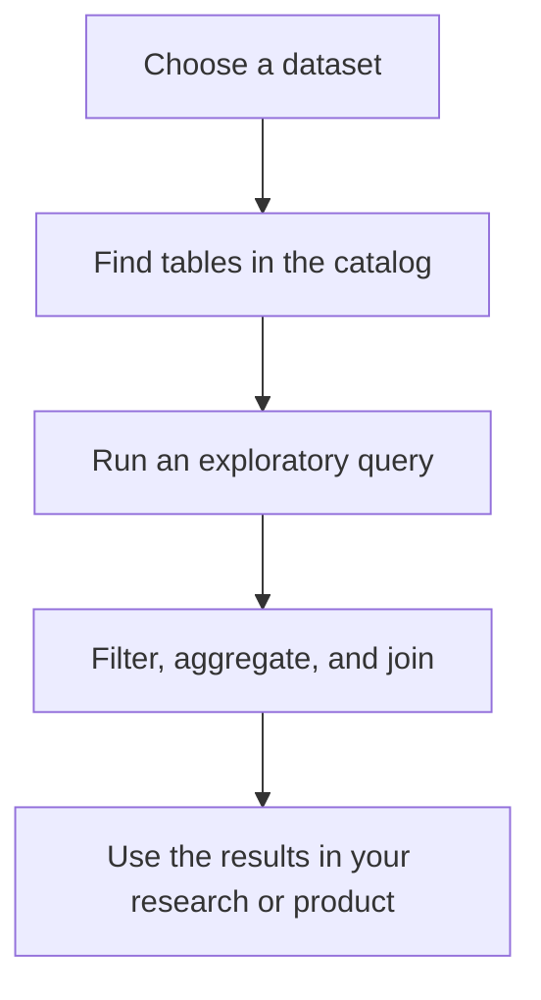

# Getting Started

### 1. Activate Market SQL

1. Log in to your [GetBlock account](https://account.getblock.io/)
2. Under **Products**, select **Market SQL**
3. Open the **Pricing** tab and choose an access plan for one dataset:

* **Free trial** — $0 for 2 hours
* **24-hour trial** — $29 for 24 hours
* **Monthly** — $299 per dataset per month
* **Custom** — contact sales

4. Once access is active, the dataset appears under **Your Market SQL access** on the **Overview** tab, with its status and end date.


Each plan covers **one dataset**. To query more than one dataset, activate each one separately.


### 2. Get your credentials

Market SQL uses **HTTP Basic Auth** with your existing GetBlock credentials. Both values are shown on the **API Docs** tab.

<table data-search="false"><thead><tr><th>Field</th><th>Value</th></tr></thead><tbody><tr><td><strong>Username</strong></td><td>Your GetBlock user ID</td></tr><tr><td><strong>Password</strong></td><td>A GetBlock API key in <code>gb_…</code> format</td></tr></tbody></table>

The user ID must belong to the account that owns the API key.


Need an API key? You can create one with **Create API key** on the [**API Docs**](https://account.getblock.io/products/sql#api-docs) tab.



Keep your API key secret. Store it in an environment variable or a secrets manager and never commit it to source control.


### 3. Choose a dataset

Each dataset is a separate database. Pass its name in the `database` parameter:

<table data-search="false"><thead><tr><th>Dataset</th><th>Database name</th></tr></thead><tbody><tr><td>Solana</td><td><code>solana</code></td></tr><tr><td>Polymarket</td><td><code>polymarket</code></td></tr><tr><td>Hyperliquid</td><td><code>hyperliquid</code></td></tr><tr><td>Robinhood Chain</td><td><code>robinhood</code></td></tr></tbody></table>

### 4. Run your first query

Market SQL exposes the **ClickHouse HTTP interface** over HTTPS, so you can connect with the tools you already use such as Python or Javascript

Start by inspecting real PumpSwap trades on Solana:




```bash
curl --fail-with-body \
  --user "<USER-ID>:<API-KEY>" \
  "https://market-sql.eu-central-1.getblock.io?database=solana&default_format=JSONEachRow" \
  --data-binary "SELECT block_time, direction, base_token, quote_token FROM pumpswap_all_swaps LIMIT 5"
```




```javascript
// npm install @clickhouse/client

import { createClient } from '@clickhouse/client'

const client = createClient({
  host: 'https://market-sql.eu-central-1.getblock.io',
  username: process.env.GETBLOCK_USER_ID,
  password: process.env.GETBLOCK_API_KEY,
  database: 'solana'
})

const rows = await client.query({
  query: `
    SELECT block_time, direction, base_token, quote_token
    FROM pumpswap_all_swaps
    LIMIT 5
  `,
  format: 'JSONEachRow'
})

console.log(await rows.json())
```



```python
# pip install clickhouse-connect

import os
import clickhouse_connect

client = clickhouse_connect.get_client(
    host='market-sql.eu-central-1.getblock.io',
    port=443,
    username=os.environ['GETBLOCK_USER_ID'],
    password=os.environ['GETBLOCK_API_KEY'],
    database='solana',
    secure=True,
)

df = client.query_df("""
    SELECT block_time, direction, base_token, quote_token
    FROM pumpswap_all_swaps
    LIMIT 5
""")
print(df)
```



From there, you can filter, aggregate, and join tables to test a hypothesis without waiting for a new endpoint to be built.

### Explore the catalog in the dashboard

The easiest way to find the right table before writing code is the **Datasets** tab.

Use it to:

1. choose a dataset;
2. search tables by keyword, such as `swaps`, `wallet`, or `token creation`;
3. read each table's description;
4. copy the table name into your query.

### 5. Integrate it into your application

Once you know which tables you need, query them from your application, notebook, or data pipeline.

A typical workflow looks like this:



You can track request volume, latency, data transfer, and dataset usage in the **Analytics** tab.

For endpoint details, parameters, and plan limits, continue to [**Querying Market SQL**](querying-market-sql.md) or see the [**API Reference**](api-reference/).
