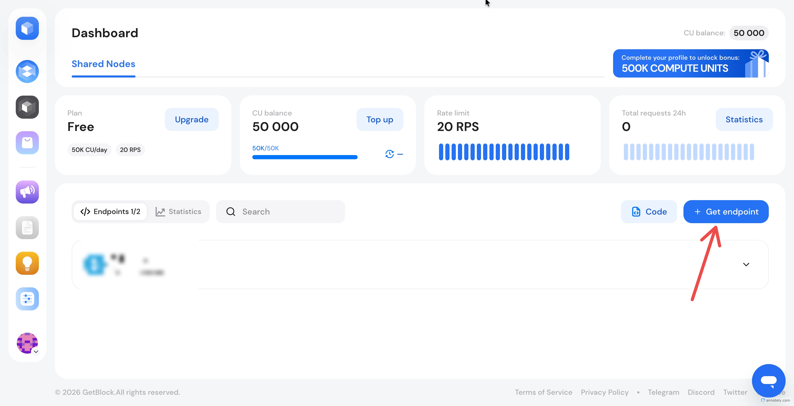

# How to Get an Ethereum RPC Endpoint

An Ethereum RPC (Remote Procedure Call) endpoint is a URL that your application uses to send requests to an Ethereum node. When your dApp needs to:

* Check a wallet balance (`eth_getBalance`)
* Read a smart contract (`eth_call`)
* Send a transaction (`eth_sendRawTransaction`)
* Get block data (`eth_getBlockByNumber`)
* Fetch transaction receipts (`eth_getTransactionReceipt`)

It sends a JSON-RPC request to an Ethereum node through an RPC endpoint. The node processes the request and returns the data.

**For example:**




```json
{
    "jsonrpc": "2.0",
    "method": "eth_blockNumber",
    "params": [],
    "id": "getblock.io"
  }
```





```json
{
  "jsonrpc": "2.0",
  "id": "getblock.io",
  "result": "0x134A5B2"
}
// The result field contains the latest block number in hexadecimal.
```





```ruby
message = "hello world"
puts message
```




### Step-by-Step: Get Your Ethereum RPC Endpoint



#### Create a GetBlock Account

Go to [GetBlock Dashboard](https://account.getblock.io) and sign up. You can register with email or via Google/GitHub OAuth.&#x20;



#### Create an Ethereum Endpoint

Once logged in:

1. Click **"Shared Nodes"** in the left sidebar
2. Click **"Create New Endpoint"** or the **"+"** button

<figure><figcaption></figcaption></figure>

3. Configure your endpoint:

* **Protocol:** Ethereum (ETH)
* **Network:** Mainnet (or Sepolia/Holesky for testing)
* **API Interface:** JSON-RPC (most common), WebSocket, or Beacon API
* **Region:** Choose the closest — Frankfurt (EU), New York (US), or Singapore (APAC)

<figure><figcaption></figcaption></figure>

4. Click **"Create":** Your endpoint URL will be generated immediately.



#### Copy Your Endpoint URL

Your endpoint URL looks like this:

```
https://go.getblock.io/a1b2c3d4e5f6789012345678abcdef01/
```


The long string after `go.getblock.io/` is your **access token** — keep it private.




#### Test the Connection



```bash
curl -X POST https://go.getblock.io/<YOUR-ACCESS-TOKEN>/ \
  -H "Content-Type: application/json" \
  -d '{
    "jsonrpc": "2.0",
    "method": "eth_blockNumber",
    "params": [],
    "id": "getblock.io"
  }'
```



```json
{
  "jsonrpc": "2.0",
  "id": "getblock.io",
  "result": "0x134A5B2"
}
// The result field contains the latest block number in hexadecimal.
```





### Using Your Endpoint with Popular Libraries




```javascript
import { JsonRpcProvider } from "ethers";

const provider = new JsonRpcProvider(
  "https://go.getblock.io/<YOUR-ACCESS-TOKEN>/"
);

// Get latest block number
const blockNumber = await provider.getBlockNumber();
console.log("Latest block:", blockNumber);

// Get ETH balance
const balance = await provider.getBalance("0xd8dA6BF26964aF9D7eEd9e03E53415D37aA96045");
console.log("Balance:", balance.toString(), "wei");
```




```python
from web3 import Web3

w3 = Web3(Web3.HTTPProvider("https://go.getblock.io/<YOUR-ACCESS-TOKEN>/"))

# Check connection
print("Connected:", w3.is_connected())

# Get latest block
block_number = w3.eth.block_number
print(f"Latest block: {block_number}")

# Get balance
balance = w3.eth.get_balance("0xd8dA6BF26964aF9D7eEd9e03E53415D37aA96045")
print(f"Balance: {w3.from_wei(balance, 'ether')} ETH")
```



```python
import requests

url = "https://go.getblock.io/<YOUR-ACCESS-TOKEN>/"
headers = {"Content-Type": "application/json"}

# Get gas price
payload = {
    "jsonrpc": "2.0",
    "method": "eth_gasPrice",
    "params": [],
    "id": "getblock.io"
}

response = requests.post(url, headers=headers, json=payload)
gas_price = int(response.json()["result"], 16)
print(f"Gas price: {gas_price / 1e9:.2f} Gwei")
```



### WebSocket Endpoint for Real-Time Data

For real-time events (new blocks, pending transactions, log subscriptions), use a WebSocket connection:

**WebSocket endpoint format:**

```
wss://go.getblock.io/<YOUR-ACCESS-TOKEN>/
```

#### Subscribe to new blocks



```javascript
import { WebSocketProvider } from "ethers";

const provider = new WebSocketProvider(
  "wss://go.getblock.io/<YOUR-ACCESS-TOKEN>/"
);

provider.on("block", (blockNumber) => {
  console.log("New block:", blockNumber);
});
```



```python
import asyncio
import websockets
import json

async def listen_blocks():
    uri = "wss://go.getblock.io/<YOUR-ACCESS-TOKEN>/"
    async with websockets.connect(uri) as ws:
        # Subscribe to new block headers
        await ws.send(json.dumps({
            "jsonrpc": "2.0",
            "method": "eth_subscribe",
            "params": ["newHeads"],
            "id": 1
        }))
        
        print("Subscribed to new blocks")
        
        while True:
            response = json.loads(await ws.recv())
            if "params" in response:
                block = response["params"]["result"]
                print(f"Block {int(block['number'], 16)}: {block['hash']}")

asyncio.run(listen_blocks())
```



### Ethereum Testnet Endpoints

For development and testing, use testnet endpoints. GetBlock supports:

| Testnet     | Purpose                  | How to Get Tokens                              |
| ----------- | ------------------------ | ---------------------------------------------- |
| **Sepolia** | Primary Ethereum testnet | [Sepolia faucets](https://getblock.io/faucet/) |

### Archive Data Access

Need to query the historical state at any past block? Enable **archive mode** on your endpoint.

Archive data lets you:

* Call `eth_getBalance` at any historical block
* Execute `eth_call` against old contract state
* Run `debug_traceTransaction` for any past transaction
* Use `trace_block` and `trace_call` for deep analysis

Archive mode is available on all paid plans and Dedicated Nodes.

**Example — get balance at a specific historical block:**

```bash
curl -X POST https://go.getblock.io/<YOUR-ACCESS-TOKEN>/ \
  -H "Content-Type: application/json" \
  -d '{
    "jsonrpc": "2.0",
    "method": "eth_getBalance",
    "params": ["0xd8dA6BF26964aF9D7eEd9e03E53415D37aA96045", "0xE8D4A5"],
    "id": "getblock.io"
  }'
```

### What's Next?

* [Full Ethereum API Reference](https://docs.getblock.io/api-reference/ethereum-eth)
* [Using Ethers.js with GetBlock](https://docs.getblock.io/guides/using-web3-libraries/ethers.js-integration)

_Need help choosing the right setup for your Ethereum project?_ [_Contact our team_](mailto:support@getblock.io)_, and we'll help you find the best configuration._
