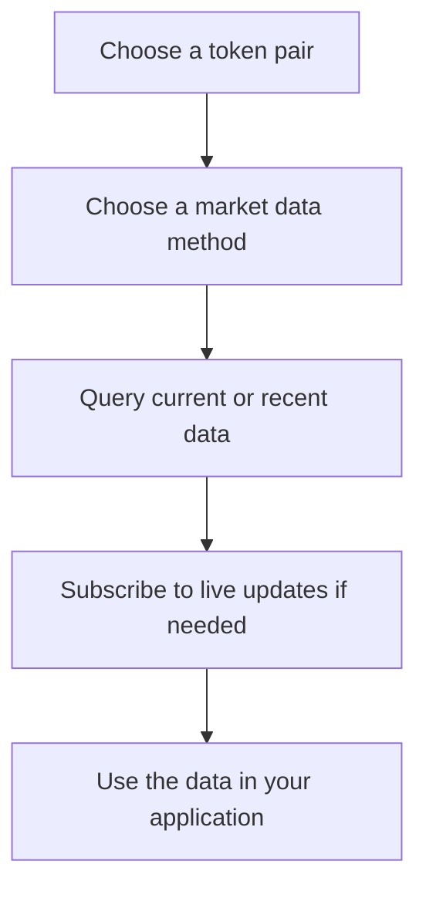

# Getting Started

### 1. Activate Solana Market Data

Choose **Solana Market Data** in your GetBlock account and activate a subscription. You can pay using whichever option works best for you:

* **Card**
* **Crypto**
* **Prepaid credits**

Select your preferred payment method in the **side drawer** and complete the purchase.

Once the subscription is active, your API key will be enabled for **Solana Market Data**.


Need an API key? You can create one in **Settings → API Keys** in your GetBlock account.


### 2. Select a token pair

Solana Market Data returns market information for a specific token pair.

To choose the market you want to track, provide the mint addresses for:

* **Base Mint** — the asset you want to analyze
* **Quote Mint** — the asset used to price it

For example, to receive market data for **SOL/USDC**, select the corresponding **SOL** and **USDC** mint addresses as your base and quote assets.

The selected pair is then used across the available methods, such as **Trades, Blocks, VWAP, TWAP, Volume, and Candles**.


You can select the Base Mint and Quote Mint directly in the **Playground** to explore the data for a specific pair before integrating it into your application.


### 3. Choose the data you need

**Solana Market Data** provides several levels of processed market information.

Choose the method that best matches your use case:

| Method                | Best for                                  |
| --------------------- | ----------------------------------------- |
| **Trades**            | Individual normalized trades              |
| **Blocks**            | Market activity aggregated by Solana slot |
| **VWAP**              | Volume-weighted market price              |
| **TWAP**              | Time-weighted market price                |
| **Volume**            | Trading activity and traded volume        |
| **Candles**           | OHLCV charts and price visualization      |
| **Buy/Sell Activity** | Comparing buying and selling activity     |

### 4. Select how you want to consume the data

You can access **Solana Market Data** through several protocols.

#### HTTP

Use HTTP when you need a single response or want to retrieve the latest available data.

Typical use cases include:

* getting the current VWAP;
* retrieving recent trades;
* loading data when your application starts.

#### WebSocket

Use WebSocket when you need continuous live updates.

It is suitable for:

* live dashboards;
* trading interfaces;
* continuously updated charts;
* real-time market monitoring.

#### gRPC

Use the gRPC interface for server-side streaming and integrations that already use a Yellowstone-style workflow.

It provides processed Solana market data while allowing you to keep a familiar streaming integration model.

### 5. Configure your request

The parameters depend on the selected method, but most requests start with a few common choices:

* the **base token**;
* the **quote token**;
* the market data method you want to use;
* a **time window** for methods such as VWAP, TWAP, Volume, or Candles.

For example, you can request market data for:

```
SOL / USDC
```

and then choose whether you want Trades, VWAP, Candles, or another available metric.

### Try it in the Playground

The easiest way to explore Solana Market Data before writing code is through the **Playground**.

Use it to:

1. choose a method;
2. select a token pair;
3. configure the available parameters;
4. send a query or start a stream;
5. inspect the returned data.

The Playground uses the same concepts exposed through the API, making it useful for understanding a method before integrating it into your application.

### 6. Integrate it into your application

Once you know which data you need, use the corresponding API method from your application.

A typical integration looks like this:



For exact request parameters, response fields, and streaming behavior, continue to the documentation for the specific **Market Data method** or see the **API Reference**.
